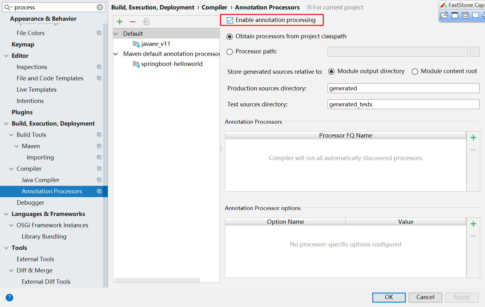

# 1. SpringBoot概述

 SpringBoot提供了一种快速使用Spring的方式，基于约定优于配置的思想，可以让开发人员不必在配置与逻辑业务之间进行思维的切换，全身心的投入到逻辑业务的代码编写中，从而大大提高了开发的效率，一定程度上缩短了开发周期。

## 1.1 Spring的缺点

### 1） 配置繁琐

虽然**Spring的组件代码是轻量级的，但它的配置却是重量级的**。一开始，Spring用XML配置，而且是很多 XML配置。Spring 2.5引入了基于注解的组件扫描，这消除了大量针对应用程序自身组件的显式XML配置。 Spring 3.0引入了基于Java的配置，这是一种类型安全的可重构配置方式，可以代替XML。 

所有这些配置都代表了开发时的损耗。因为在思考Spring特性配置和解决业务问题之间需要进行思维切换，所以编写配置挤占了编写应用程序逻辑的时间。和所有框架一样，Spring实用，但它要求的回报也不少。 

### 2）依赖繁琐

项目的依赖管理也是一件耗时耗力的事情。在环境搭建时，需要分析要导入哪些库的坐标，而且还需要分析导 入与之有依赖关系的其他库的坐标，一旦选错了依赖的版本，随之而来的不兼容问题就会严重阻碍项目的开发进度。

## 1.2 SpringBoot的功能

### 1） 自动配置

​		Spring Boot的自动配置是一个运行时（更准确地说，是应用程序启动时）的过程，考虑了众多因素，才决定Spring配置应该用哪个Bean，不该用哪个Bean。该过程是SpringBoot自动完成的。

​		==该功能解决了Spring配置繁琐的问题。==

### 2） 起步依赖

​		起步依赖本质上是一个Maven项目对象模型（Project Object Model，POM），定义了对其他库的传递依赖，这些东西加在一起即支持某项功能。简单的说，起步依赖就是将具备某种功能的坐标打包到一起，并提供一些默认的功能。

​		==该功能解决了配置繁琐的问题==

### 3） 辅助功能

​		提供了一些大型项目中常见的非功能性特性，如嵌入式服务器、安全、指标，健康检测、外部配置等。

==小结：Spring Boot 并不是对 Spring 功能上的增强，而是提供了一种简化使用 Spring 的方式。==

# 2. SpringBoot快速入门

## 2.1 需求 

搭建SpringBoot工程，定义HelloController.hello()方法，返回”Hello SpringBoot!”

## 2.2 实现步骤

### 1）创建Maven项目

### 2）导入起步依赖

```xml
<!--springboot工程需要继承的父工程-->
<parent>
    <groupId>org.springframework.boot</groupId>
    <artifactId>spring-boot-starter-parent</artifactId>
    <version>2.1.8.RELEASE</version>
</parent>

<dependencies>
    <!--web开发的起步依赖-->
    <dependency>
        <groupId>org.springframework.boot</groupId>
        <artifactId>spring-boot-starter-web</artifactId>
    </dependency>
</dependencies>
```

### 3）定义Controller

```java
@RestController
public class HelloController {

    @RequestMapping("/hello")
    public String hello(){
        return " hello Spring Boot !";
    }
}

```

### 4）编写引导类

```java
/**
 * 引导类。 SpringBoot项目的入口
 */
@SpringBootApplication
public class HelloApplication {

    public static void main(String[] args) {
        SpringApplication.run(HelloApplication.class,args);
    }
}
```

### 5）启动测试

访问：http://localhost:8080/hello

## 2.3 小结

*   SpringBoot在创建maven项目时，使用jar的打包方式。
*   SpringBoot的引导类是项目入口，运行main方法就可以启动项目。
*   使用SpringBoot构建的项目，业务代码编写方式与Spring构建的项目完全一样。

# 3. 快速构建SpringBoot工程

## 2.1 选择Spring Initializr


## 3.2 输入项目坐标信息


## 3.3 选择起步依赖


# 4. 起步依赖原理分析

## 4.1 版本锁定

*   在spring-boot-starter-parent中定义了各种技术的版本信息，组合了一套最优搭配的技术版本。

## 4.2 依赖传递

- 在各种starter中，定义了完成该功能需要的坐标合集，其中大部分版本信息来自于父工程。

- 我们的工程继承parent，引入starter后，通过依赖传递，就可以简单方便获得需要的jar包，并且不会存在版本冲突等问题。

# 5. SpringBoot配置文件

SpringBoot是基于约定的，所以很多配置都有默认值，但如果想使用自己的配置替换默认配置的话，就可以使用application.properties或者application.yml（application.yaml）进行配置。

## 5.1 配置文件分类

1. 默认配置文件名称：application

2. 文件类型有3种，分别是properties、yml 、yaml，在同一级目录下==优先级为：properties>yml > yaml==

配置文件的使用，例如：配置内置Tomcat的端口

properties：

```properties
server.port=8080
```

yml:

```yaml
server: 
	port: 8080
```

## 5.2 yaml基本语法

- 大小写敏感
- 数据值前边必须有空格，作为分隔符
- 使用缩进表示层级关系
- 缩进时不允许使用Tab键，只允许使用空格（各个系统 Tab对应的 空格数目可能不同，导致层次混乱）。
- 缩进的空格数目不重要，只要相同层级的元素左侧对齐即可
- ''#" 表示注释，从这个字符一直到行尾，都会被解析器忽略。

```yaml
server: 
	port: 8080
    address: 127.0.0.1
name: abc
```

## 5.3 yaml数据格式

*   **对象(map)**：键值对的集合。

```yaml
person:  
   name: zhangsan
# 行内写法
person: {name: zhangsan}
```

*    **数组**：一组按次序排列的值

```
address:
  - beijing
  - shanghai
# 行内写法
address: [beijing,shanghai]
```

*   **纯量**：单个的、不可再分的值

```yaml
msg1: 'hello \n world'  # 单引忽略转义字符
msg2: "hello \n world"  # 双引识别转义字符
```

*   **参数引用**

```yaml
name: lisi 
person:
  name: ${name} # 引用上边定义的name值
```

## 5.4 获取配置数据

### @Value

```java
#获取普通配置
@Value("${name}")
private String name;
#获取对象属性
@Value("${person.name}")
private String name2;
#获取数组
@Value("${address[0]}")
private String address1;
#获取纯量
@Value("${msg1}")
private String msg1;
```

### Evironment

```java
@Autowired
private Environment env;
System.out.println(env.getProperty("person.name"));
System.out.println(env.getProperty("address[0]"));
```

### @ConfigurationProperties 

**注意**：prefix一定要写

```java
@Component
@ConfigurationProperties(prefix = "person")
public class Person {

    private String name;
    private int age;
    private String[] address;

    public String getName() {
        return name;
    }

    public void setName(String name) {
        this.name = name;
    }

    public int getAge() {
        return age;
    }

    public void setAge(int age) {
        this.age = age;
    }

    public String[] getAddress() {
        return address;
    }

    public void setAddress(String[] address) {
        this.address = address;
    }

    @Override
    public String toString() {
        return "Person{" +
                "name='" + name + '\'' +
                ", age=" + age +
                '}';
    }
}
```

#### 常见问题

添加了如下注解后，如果依然报错

```xml
<dependency>
     <groupId>org.springframework.boot</groupId>
     <artifactId>spring-boot-configuration-processor</artifactId>
     <optional>true</optional>
</dependency>
```

则需要更改IDEA的配置，开启```processor```支持




# 6. SpringBoot的profile配置

## 6.1 profile的作用

profile是用来完成springboot程序在==不同环境下动态切换配置==信息的功能。

## 6.2 profile的配置

### 1）多profile文件方式

提供多个配置文件，每个代表一种环境。

* application-dev.properties/yml 开发环境
* application-test.properties/yml 测试环境
* application-pro.properties/yml 生产环境

### 2）yml多文档方式

在yml中使用  --- 分隔不同配置

```yaml
spring:
  profiles:
    active: dev
---
# 开发环境
server:
  port: 8081
spring:
  profiles: dev
---
# 生产环境
server:
  port: 8082
spring:
  profiles: pro
---
# 测试环境
server:
  port: 8083
spring:
  profiles: test
---
```

## 6.3 profile激活方式

- 配置文件： 在配置文件中配置：spring.profiles.active=dev
- 虚拟机参数：在VM options 指定：-Dspring.profiles.active=dev
- 命令行参数：java –jar xxx.jar  --spring.profiles.active=dev

# 7. 配置文件加载顺序

## 7.1 内部文件加载顺序

 加载顺序为下面的排列顺序，高优先级配置的属性会生效

1. 【file】./config/：当前项目下的/config目录下

2. 【file】./：当前项目的根目录

3. 【classpath】/config/：classpath的/config目录

4. 【classpath】./：classpath的根目录

## 7.2 外部文件加载顺序

 外部配置文件的使用是为了能很内部配置文件进行配合。

1.命令行

```cmd
java -jar app.jar --name="Spring“ --server.port=9000
```

2.指定配置文件位置

```cmd
 java -jar myproject.jar --spring.config.location=e://application.properties
```

3.外部不带profile的properties文件

```java
classpath:/config/application.properties
classpath:/application.properties
```

[参考文档]( https://docs.spring.io/spring-boot/docs/current/reference/html/spring-boot-features.html#boot-features-external-config)


# 8. springBoot整合第三方技术

## 8.1 SpringBoot整合Junit

① 搭建SpringBoot工程

② 引入starter-test起步依赖


```xml
<dependencies>
    <dependency>
        <groupId>org.springframework.boot</groupId>
        <artifactId>spring-boot-starter</artifactId>
    </dependency>
    <dependency>
        <groupId>org.springframework.boot</groupId>
        <artifactId>spring-boot-starter-test</artifactId>
        <scope>test</scope>
    </dependency>
</dependencies>
```

③ 编写测试类

```

/**
 * 测试类
 */

@RunWith(SpringRunner.class)
@SpringBootTest(classes = SpringbootJunitApplication.class )
public class UserServiceTest {

    @Test
    public void test(){
        System.out.println(111);
    }
}
```

④ 测试

> 注意：如果test测试包和src下的包名相同（或结构在src包的子包下），则不需要指定```@SpringBootTest(classes = DemoApplication.class)```

## 8.2 SpringBoot整合mybatis

① 搭建SpringBoot工程

② 引入mybatis起步依赖，添加mysql驱动

```xml
<dependencies>
    <dependency>
        <groupId>org.mybatis.spring.boot</groupId>
        <artifactId>mybatis-spring-boot-starter</artifactId>
        <version>2.1.0</version>
    </dependency>

    <dependency>
        <groupId>mysql</groupId>
        <artifactId>mysql-connector-java</artifactId>
        <!--<scope>runtime</scope>-->
    </dependency>
    
    <dependency>
        <groupId>org.springframework.boot</groupId>
        <artifactId>spring-boot-starter-test</artifactId>
        <scope>test</scope>
    </dependency>
</dependencies>
```

③ 编写DataSource和MyBatis相关配置

application.yml

```yaml
# datasource
spring:
  datasource:
    url: jdbc:mysql:///springboot?serverTimezone=UTC
    username: root
    password: root
    driver-class-name: com.mysql.cj.jdbc.Driver


# mybatis
mybatis:
  mapper-locations: classpath:mapper/*Mapper.xml # mapper映射文件路径
  type-aliases-package: com.itheima.springbootmybatis.domain

  # config-location:  # 指定mybatis的核心配置文件
```

④ 定义表和实体类

```java
public class User {
    private int id;
    private String username;
    private String password;


    public int getId() {
        return id;
    }

    public void setId(int id) {
        this.id = id;
    }

    public String getUsername() {
        return username;
    }

    public void setUsername(String username) {
        this.username = username;
    }

    public String getPassword() {
        return password;
    }

    public void setPassword(String password) {
        this.password = password;
    }

    @Override
    public String toString() {
        return "User{" +
                "id=" + id +
                ", username='" + username + '\'' +
                ", password='" + password + '\'' +
                '}';
    }
}
```

⑤ 编写dao和mapper文件/纯注解开发

编写dao

```java
@Mapper
@Repository
public interface UserXmlMapper {

    public List<User> findAll();
}
```

mapper.xml

```xml
<?xml version="1.0" encoding="UTF-8" ?>
<!DOCTYPE mapper PUBLIC "-//mybatis.org//DTD Mapper 3.0//EN" "http://mybatis.org/dtd/mybatis-3-mapper.dtd">
<mapper namespace="com.itheima.springbootmybatis.mapper.UserXmlMapper">
    <select id="findAll" resultType="user">
        select * from t_user
    </select>
</mapper>
```

纯注解开发

```java
@Mapper
@Repository
public interface UserMapper {

    @Select("select * from t_user")
    public List<User> findAll();
}
```

⑥ 测试

## 8.3 SpringBoot整合redis

① 搭建SpringBoot工程

② 引入redis起步依赖

```xml
<dependencies>
    <dependency>
        <groupId>org.springframework.boot</groupId>
        <artifactId>spring-boot-starter-data-redis</artifactId>
    </dependency>

    <dependency>
        <groupId>org.springframework.boot</groupId>
        <artifactId>spring-boot-starter-test</artifactId>
        <scope>test</scope>
    </dependency>
</dependencies>
```

③ 配置redis相关属性

```yaml
spring:
  redis:
    host: 127.0.0.1 # redis的主机ip
    port: 6379
```

④ 注入RedisTemplate模板

⑤ 编写测试方法，测试

```java
@RunWith(SpringRunner.class)
@SpringBootTest
public class SpringbootRedisApplicationTests {

    @Autowired
    private RedisTemplate redisTemplate;

    @Test
    public void testSet() {
        //存入数据
        redisTemplate.boundValueOps("name").set("zhangsan");
    }

    @Test
    public void testGet() {
        //获取数据
        Object name = redisTemplate.boundValueOps("name").get();
        System.out.println(name);
    }

}

```
