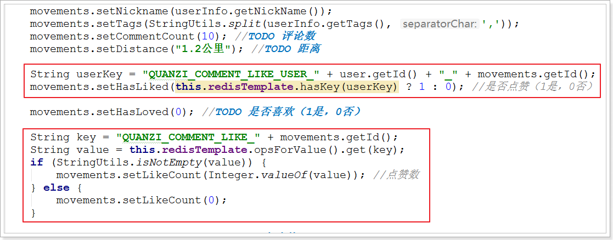
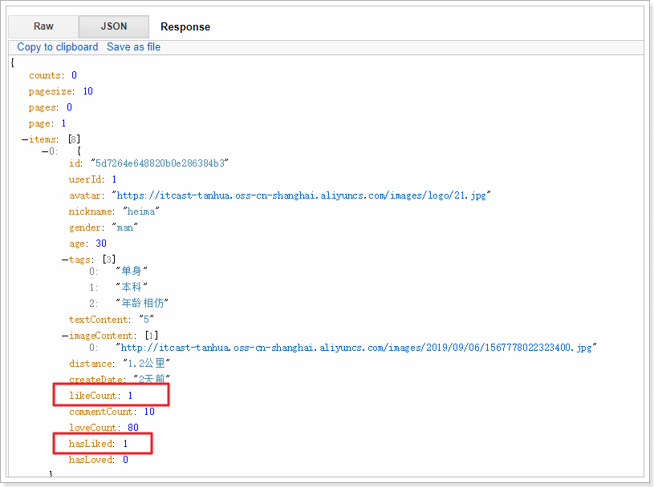
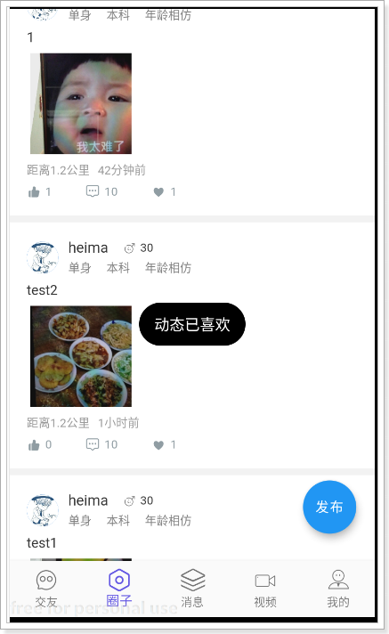
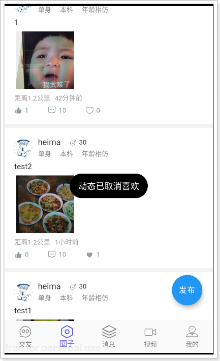
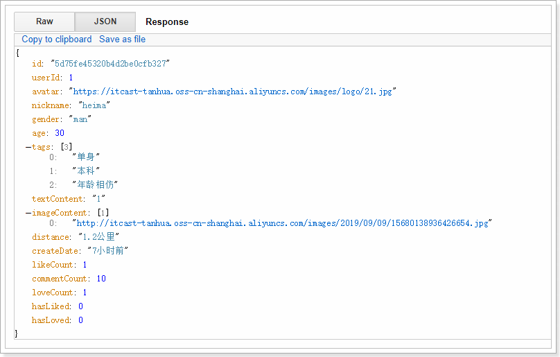
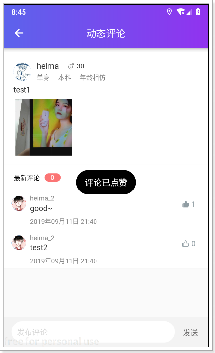
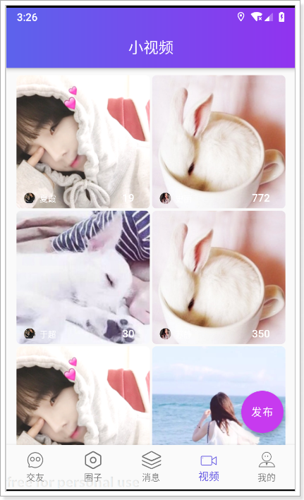
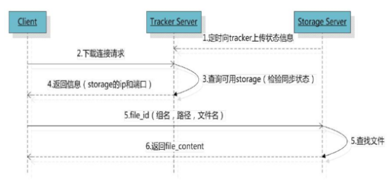
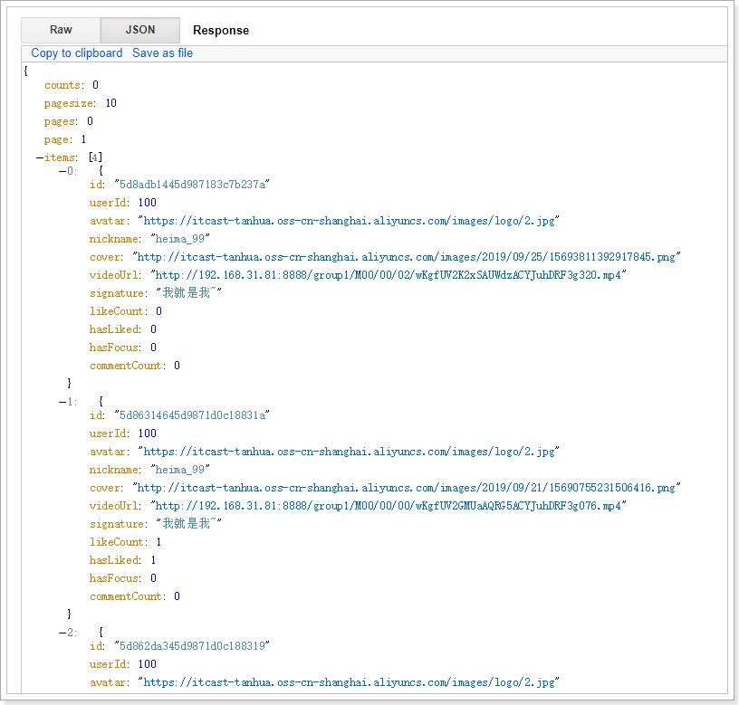
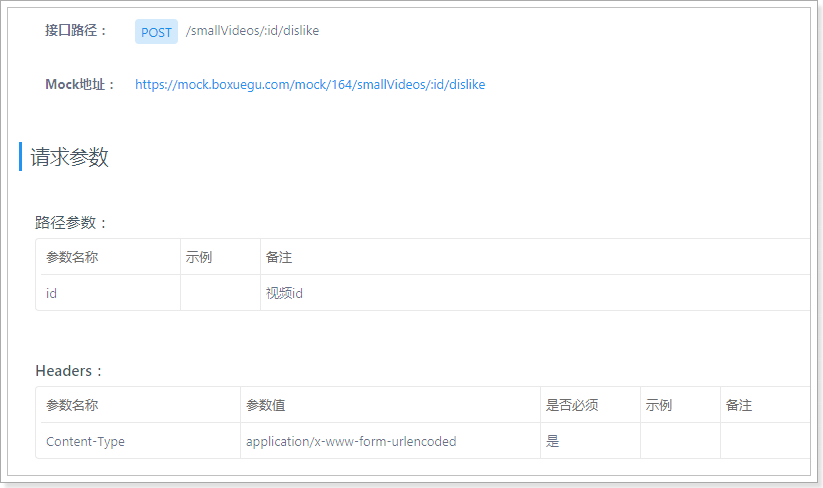

## 课程说明

- 圈子实现点赞、喜欢功能
- 圈子实现评论
- 圈子实现评论的点赞
- 小视频功能说明
- FastDFS环境搭建
- 小视频的功能实现

## 1. 评论

点赞、喜欢、评论等均可理解为用户对动态的评论。

### 1.1 点赞

#### 1.1.1 定义dubbo接口

~~~java
package com.tanhua.dubbo.server.api;

import com.tanhua.dubbo.server.pojo.Pu blish;
import com.tanhua.dubbo.server.vo.PageInfo;

public interface QuanZiApi {

    /**
     * 发布动态
     *
     * @param publish
     * @return
     */
    boolean savePublish(Publish publish);

    /**
     * 查询动态
     *
     * @return
     */
    PageInfo<Publish> queryPublishList(Long userId, Integer page, Integer pageSize);

    /**
     * 点赞
     *
     * @param userId
     * @param publishId
     * @return
     */
    boolean saveLikeComment(Long userId, String publishId);

    /**
     * 取消点赞、喜欢等
     *
     * @param userId
     * @param publishId
     * @return
     */
    boolean removeComment(Long userId, String publishId, Integer commentType);

    /**
     * 喜欢
     *
     * @param userId
     * @param publishId
     * @return
     */
    boolean saveLoveComment(Long userId, String publishId);

    /**
     * 发表评论
     *
     * @param userId
     * @param publishId
     * @param type
     * @param content
     * @return
     */
    boolean saveComment(Long userId, String publishId, Integer type, String content);

    /**
     * 查询评论数
     *
     * @param publishId
     * @param type
     * @return
     */
    Long queryCommentCount(String publishId, Integer type);

}

~~~

#### 1.1.2 编写实现

~~~java
package com.tanhua.dubbo.server.api;

import com.alibaba.dubbo.config.annotation.Service;
import com.mongodb.client.result.DeleteResult;
import com.tanhua.dubbo.server.pojo.*;
import com.tanhua.dubbo.server.vo.PageInfo;
import org.apache.commons.lang3.StringUtils;
import org.bson.types.ObjectId;
import org.springframework.beans.factory.annotation.Autowired;
import org.springframework.data.domain.PageRequest;
import org.springframework.data.domain.Sort;
import org.springframework.data.mongodb.core.MongoTemplate;
import org.springframework.data.mongodb.core.query.Criteria;
import org.springframework.data.mongodb.core.query.Query;

import java.util.ArrayList;
import java.util.Date;
import java.util.List;

@Service(version = "1.0.0")
public class QuanZiApiImpl implements QuanZiApi {

    @Autowired
    private MongoTemplate mongoTemplate;

    /**
     * 点赞
     *
     * @param userId
     * @param publishId
     */
    public boolean saveLikeComment(Long userId, String publishId) {
        Query query = Query.query(Criteria
                .where("publishId").is(new ObjectId(publishId))
                .and("userId").is(userId)
                .and("commentType").is(1));
        long count = this.mongoTemplate.count(query, Comment.class);
        if (count > 0) {
            return false;
        }
        return this.saveComment(userId, publishId, 1, null);
    }

    /**
     * 取消点赞、喜欢等
     *
     * @return
     */
    public boolean removeComment(Long userId, String publishId, Integer commentType) {
        Query query = Query.query(Criteria
                .where("publishId").is(new ObjectId(publishId))
                .and("userId").is(userId)
                .and("commentType").is(commentType));
        DeleteResult remove = this.mongoTemplate.remove(query, Comment.class);
        return remove.getDeletedCount() > 0;
    }

    /**
     * 喜欢
     *
     * @param userId
     * @param publishId
     */
    public boolean saveLoveComment(Long userId, String publishId) {
        Query query = Query.query(Criteria
                .where("publishId").is(new ObjectId(publishId))
                .and("userId").is(userId)
                .and("commentType").is(3));
        long count = this.mongoTemplate.count(query, Comment.class);
        if (count > 0) {
            return false;
        }
        return this.saveComment(userId, publishId, 3, null);
    }

    /**
     * 保存评论
     *
     * @param userId
     * @param publishId
     * @param type
     * @return
     */
    public boolean saveComment(Long userId, String publishId, Integer type, String content) {
        try {
            Comment comment = new Comment();
            comment.setId(ObjectId.get());
            comment.setUserId(userId);
            comment.setContent(content);
            comment.setPublishId(new ObjectId(publishId));
            comment.setCommentType(type);
            comment.setCreated(System.currentTimeMillis());
            this.mongoTemplate.save(comment);
            return true;
        } catch (Exception e) {
            e.printStackTrace();
        }
        return false;
    }

    @Override
    public Long queryCommentCount(String publishId, Integer type) {
        Query query = Query.query(Criteria.where("publishId").is(new ObjectId(publishId)).and("commentType").is(type));
        return this.mongoTemplate.count(query, Comment.class);
    }
}

~~~

#### 1.1.3 编写接口服务

MovementsController：

~~~java
/**
     * 点赞
     *
     * @param publishId
     * @return
     */
    @GetMapping("/{id}/like")
    public ResponseEntity<Long> likeComment(@PathVariable("id") String publishId) {
        try {
            Long likeCount = this.movementsService.likeComment(publishId);
            if (likeCount != null) {
                return ResponseEntity.ok(likeCount);
            }
        } catch (Exception e) {
            e.printStackTrace();
        }
        return ResponseEntity.status(HttpStatus.INTERNAL_SERVER_ERROR).build();
    }

    /**
     * 取消点赞
     *
     * @param publishId
     * @return
     */
    @GetMapping("/{id}/dislike")
    public ResponseEntity<Long> disLikeComment(@PathVariable("id") String publishId) {
        try {
            Long likeCount = this.movementsService.cancelLikeComment(publishId);
            if (null != likeCount) {
                return ResponseEntity.ok(likeCount);
            }
        } catch (Exception e) {
            e.printStackTrace();
        }
        return ResponseEntity.status(HttpStatus.INTERNAL_SERVER_ERROR).build();
    }
~~~

#### 1.1.4 编写服务实现

~~~java
package com.tanhua.server.service;

import com.alibaba.dubbo.common.utils.CollectionUtils;
import com.alibaba.dubbo.config.annotation.Reference;
import com.baomidou.mybatisplus.core.conditions.query.QueryWrapper;
import com.tanhua.dubbo.server.api.QuanZiApi;
import com.tanhua.dubbo.server.pojo.Publish;
import com.tanhua.dubbo.server.vo.PageInfo;
import com.tanhua.server.pojo.User;
import com.tanhua.server.pojo.UserInfo;
import com.tanhua.server.utils.RelativeDateFormat;
import com.tanhua.server.utils.UserThreadLocal;
import com.tanhua.server.vo.Movements;
import com.tanhua.server.vo.PageResult;
import com.tanhua.server.vo.PicUploadResult;
import org.apache.commons.lang3.StringUtils;
import org.springframework.beans.factory.annotation.Autowired;
import org.springframework.data.redis.core.RedisTemplate;
import org.springframework.stereotype.Service;
import org.springframework.web.multipart.MultipartFile;

import java.util.ArrayList;
import java.util.Date;
import java.util.List;

@Service
public class MovementsService {

    @Reference(version = "1.0.0")
    private QuanZiApi quanZiApi;

    @Autowired
    private PicUploadService picUploadService;

    @Autowired
    private UserInfoService userInfoService;

    @Autowired
    private RedisTemplate<String, String> redisTemplate;

  /**
     * 点赞
     *
     * @param publishId
     * @return
     */
    public Long likeComment(String publishId) {
        User user = UserThreadLocal.get();
        boolean bool = this.quanZiApi.saveLikeComment(user.getId(), publishId);
        if (!bool) {
            return null;
        }

        Long likeCount = 0L;

        //保存点赞数到redis
        String key = "QUANZI_COMMENT_LIKE_" + publishId;
        if (!this.redisTemplate.hasKey(key)) {
            Long count = this.quanZiApi.queryCommentCount(publishId, 1);
            likeCount = count;
            this.redisTemplate.opsForValue().set(key, String.valueOf(likeCount));
        } else {
            likeCount = this.redisTemplate.opsForValue().increment(key);
        }

        //记录已点赞
        String userKey = "QUANZI_COMMENT_LIKE_USER_" + user.getId() + "_" + publishId;
        this.redisTemplate.opsForValue().set(userKey, "1");

        return likeCount;
    }

    /**
     * 取消点赞
     *
     * @return
     */
    public Long cancelLikeComment(String publishId) {
        User user = UserThreadLocal.get();
        boolean bool = this.quanZiApi.removeComment(user.getId(), publishId, 1);
        if (bool) {
            String key = "QUANZI_COMMENT_LIKE_" + publishId;
            //数量递减
            Long likeCount = this.redisTemplate.opsForValue().decrement(key);

            //删除已点赞
            String userKey = "QUANZI_COMMENT_LIKE_USER_" + user.getId() + "_" + publishId;
            this.redisTemplate.delete(userKey);

            return likeCount;
        }
        return null;
    }
}

~~~

#### 1.1.5 修改查询动态点赞数

#### 1.1.6 测试

 

### 1.2 喜欢

#### 1.2.1 MovementsController

~~~java
/**
     * 喜欢
     *
     * @param publishId
     * @return
     */
    @GetMapping("/{id}/love")
    public ResponseEntity<Long> loveComment(@PathVariable("id") String publishId) {
        try {
            Long loveCount = this.movementsService.loveComment(publishId);
            if (null != loveCount) {
                return ResponseEntity.ok(loveCount);
            }
        } catch (Exception e) {
            e.printStackTrace();
        }
        return ResponseEntity.status(HttpStatus.INTERNAL_SERVER_ERROR).build();
    }

    /**
     * 取消喜欢
     *
     * @param publishId
     * @return
     */
    @GetMapping("/{id}/unlove")
    public ResponseEntity<Long> disLoveComment(@PathVariable("id") String publishId) {
        try {
            Long loveCount = this.movementsService.cancelLoveComment(publishId);
            if (null != loveCount) {
                return ResponseEntity.ok(loveCount);
            }
        } catch (Exception e) {
            e.printStackTrace();
        }
        return ResponseEntity.status(HttpStatus.INTERNAL_SERVER_ERROR).build();
    }
~~~

#### 1.2.2 MovementsService

~~~java
/**
     * 喜欢
     *
     * @param publishId
     * @return
     */
    public Long loveComment(String publishId) {
        User user = UserThreadLocal.get();
        boolean bool = this.quanZiApi.saveLoveComment(user.getId(), publishId);
        if (!bool) {
            return null;
        }

        Long loveCount = 0L;

        //保存喜欢数到redis
        String key = "QUANZI_COMMENT_LOVE_" + publishId;
        if (!this.redisTemplate.hasKey(key)) {
            Long count = this.quanZiApi.queryCommentCount(publishId, 3);
            loveCount = count ;
            this.redisTemplate.opsForValue().set(key, String.valueOf(loveCount));
        } else {
            loveCount = this.redisTemplate.opsForValue().increment(key);
        }

        //记录已喜欢
        String userKey = "QUANZI_COMMENT_LOVE_USER_" + user.getId() + "_" + publishId;
        this.redisTemplate.opsForValue().set(userKey, "1");

        return loveCount;
    }

    /**
     * 取消喜欢
     *
     * @return
     */
    public Long cancelLoveComment(String publishId) {
        User user = UserThreadLocal.get();
        boolean bool = this.quanZiApi.removeComment(user.getId(), publishId, 3);
        if (bool) {
            String key = "QUANZI_COMMENT_LOVE_" + publishId;
            //数量递减
            Long loveCount = this.redisTemplate.opsForValue().decrement(key);

            //删除已点赞
            String userKey = "QUANZI_COMMENT_LOVE_USER_" + user.getId() + "_" + publishId;
            this.redisTemplate.delete(userKey);

            return loveCount;
        }
        return null;
    }
~~~

#### 1.2.3 测试

 

 

### 1.3 查询单条动态

#### 1.3.1 定义dubbo接口

QuanZiApi：

~~~java
/**
 * 根据id查询动态
 *
 * @param id
 * @return
 */
Publish queryPublishById(String id);
~~~

#### 1.3.2 dubbo接口实现

QuanZiApiImpl：

~~~java
@Override
public Publish queryPublishById(String id) {
    return this.mongoTemplate.findById(new ObjectId(id), Publish.class);
}
~~~

#### 1.3.3 定义服务接口

~~~java
    /**
     * 查询单条动态信息
     *
     * @param publishId
     * @return
     */
    @GetMapping("/{id}")
    public ResponseEntity<Movements> queryById(@PathVariable("id") String publishId) {
        try {
            Movements movements = this.movementsService.queryById(publishId);
            if(null != movements){
                return ResponseEntity.ok(movements);
            }
        } catch (Exception e) {
            e.printStackTrace();
        }
        return ResponseEntity.status(HttpStatus.INTERNAL_SERVER_ERROR).build();
    }
~~~

#### 1.3.4 服务实现

~~~java
	public Movements queryById(String publishId) {
        Publish publish = this.quanZiApi.queryPublishById(publishId);
        if (null == publish) {
            return null;
        }

        Movements movements = new Movements();

        movements.setId(publish.getId().toHexString());
        movements.setImageContent(publish.getMedias().toArray(new String[]{}));
        movements.setTextContent(publish.getText());
        movements.setUserId(publish.getUserId());
        movements.setCreateDate(RelativeDateFormat.format(new Date(publish.getCreated())));

        UserInfo userInfo = this.userInfoService.queryById(publish.getUserId());
        if (null == userInfo) {
            return null;
        }
        this.fillValueToMovements(movements, userInfo);

        return movements;

    }

    private void fillValueToMovements(Movements movements, UserInfo userInfo) {
        User user = UserThreadLocal.get();
        movements.setAge(userInfo.getAge());
        movements.setAvatar(userInfo.getLogo());
        movements.setGender(userInfo.getSex().name().toLowerCase());
        movements.setNickname(userInfo.getNickName());
        movements.setTags(StringUtils.split(userInfo.getTags(), ','));
        
        Long commentCount = this.quanZiApi.queryCommentCount(movements.getId(), 2);
        if(null == commentCount){
            movements.setCommentCount(0); //评论数
        }else{
            movements.setCommentCount(commentCount.intValue()); //评论数
        }
        
        movements.setDistance("1.2公里"); //TODO 距离

        String userKey = "QUANZI_COMMENT_LIKE_USER_" + user.getId() + "_" + movements.getId();
        movements.setHasLiked(this.redisTemplate.hasKey(userKey) ? 1 : 0); //是否点赞（1是，0否）

        String key = "QUANZI_COMMENT_LIKE_" + movements.getId();
        String value = this.redisTemplate.opsForValue().get(key);
        if (StringUtils.isNotEmpty(value)) {
            movements.setLikeCount(Integer.valueOf(value)); //点赞数
        } else {
            movements.setLikeCount(0);
        }

        String userLoveKey = "QUANZI_COMMENT_LOVE_USER_" + user.getId() + "_" + movements.getId();
        movements.setHasLoved(this.redisTemplate.hasKey(userLoveKey) ? 1 : 0); //是否喜欢（1是，0否）

        key = "QUANZI_COMMENT_LOVE_" + movements.getId();
        value = this.redisTemplate.opsForValue().get(key);
        if (StringUtils.isNotEmpty(value)) {
            movements.setLoveCount(Integer.valueOf(value)); //喜欢数
        } else {
            movements.setLoveCount(0);
        }
    }
~~~

#### 1.3.5 测试

### 1.4 单条动态评论

功能包括：查询评论列表，评论点赞、取消点赞。

#### 1.4.1 定义dubbo接口

~~~java
/**
 * 查询评论
 *
 * @return
 */
PageInfo<Comment> queryCommentList(String publishId, Integer page, Integer pageSize);
~~~

#### 1.4.2 编写实现

~~~java
@Override
public PageInfo<Comment> queryCommentList(String publishId, Integer page, Integer pageSize) {
    PageRequest pageRequest = PageRequest.of(page - 1, pageSize, Sort.by(Sort.Order.asc("created")));
    Query query = new Query(Criteria
            .where("publishId").is(new ObjectId(publishId))
            .and("commentType").is(2)).with(pageRequest);

    //查询评论表
    List<Comment> commentList = this.mongoTemplate.find(query, Comment.class);

    PageInfo<Comment> pageInfo = new PageInfo<>();
    pageInfo.setPageNum(page);
    pageInfo.setPageSize(pageSize);
    pageInfo.setRecords(commentList);
    pageInfo.setTotal(0); //不提供总数
    return pageInfo;
}
~~~

#### 1.4.3 服务接口实现

~~~java
package com.tanhua.server.vo;

import lombok.AllArgsConstructor;
import lombok.Data;
import lombok.NoArgsConstructor;

/**
 * 评论
 */
@Data
@NoArgsConstructor
@AllArgsConstructor
public class Comments {

    private String id; //评论id
    private String avatar; //头像
    private String nickname; //昵称
    private String content; //评论
    private String createDate; //评论时间: 08:27
    private Integer likeCount; //点赞数
    private Integer hasLiked; //是否点赞（1是，0否）

}

~~~

~~~java
package com.tanhua.server.controller;

import com.tanhua.server.service.CommentsService;
import com.tanhua.server.service.MovementsService;
import com.tanhua.server.vo.Comments;
import com.tanhua.server.vo.PageResult;
import org.springframework.beans.factory.annotation.Autowired;
import org.springframework.http.HttpStatus;
import org.springframework.http.ResponseEntity;
import org.springframework.web.bind.annotation.*;

import java.util.Map;

@RestController
@RequestMapping("comments")
public class CommentsController {

    @Autowired
    private CommentsService commentsService;

    @Autowired
    private MovementsService movementsService;

    /**
     * 查询评论列表
     *
     * @param publishId
     * @param page
     * @param pagesize
     * @return
     */
    @GetMapping
    public ResponseEntity<PageResult> queryCommentsList(@RequestParam("movementId") String publishId,
                                                        @RequestParam(value = "page", defaultValue = "1") Integer page,
                                                        @RequestParam(value = "pagesize", defaultValue = "10") Integer pagesize) {
        try {
            PageResult pageResult = this.commentsService.queryCommentsList(publishId, page, pagesize);
            return ResponseEntity.ok(pageResult);
        } catch (Exception e) {
            e.printStackTrace();
        }
        return ResponseEntity.status(HttpStatus.INTERNAL_SERVER_ERROR).build();

    }

    /**
     * 保存评论
     */
    @PostMapping
    public ResponseEntity<Void> saveComments(@RequestBody Map<String,String> param) {
        try {
            String publishId = param.get("movementId");
            String content = param.get("comment");
            Boolean result = this.commentsService.saveComments(publishId, content);
            if (result) {
                return ResponseEntity.ok(null);
            }
        } catch (Exception e) {
            e.printStackTrace();
        }
        return ResponseEntity.status(HttpStatus.INTERNAL_SERVER_ERROR).build();
    }

    /**
     * 点赞
     *
     * @param publishId
     * @return
     */
    @GetMapping("/{id}/like")
    public ResponseEntity<Long> likeComment(@PathVariable("id") String publishId) {
        try {
            Long likeCount = this.movementsService.likeComment(publishId);
            if (likeCount != null) {
                return ResponseEntity.ok(likeCount);
            }
        } catch (Exception e) {
            e.printStackTrace();
        }
        return ResponseEntity.status(HttpStatus.INTERNAL_SERVER_ERROR).build();
    }

    /**
     * 取消点赞
     *
     * @param publishId
     * @return
     */
    @GetMapping("/{id}/dislike")
    public ResponseEntity<Long> disLikeComment(@PathVariable("id") String publishId) {
        try {
            Long likeCount = this.movementsService.cancelLikeComment(publishId);
            if (null != likeCount) {
                return ResponseEntity.ok(likeCount);
            }
        } catch (Exception e) {
            e.printStackTrace();
        }
        return ResponseEntity.status(HttpStatus.INTERNAL_SERVER_ERROR).build();
    }

}

~~~

~~~java
package com.tanhua.server.service;

import com.alibaba.dubbo.config.annotation.Reference;
import com.baomidou.mybatisplus.core.conditions.query.QueryWrapper;
import com.tanhua.dubbo.server.api.QuanZiApi;
import com.tanhua.dubbo.server.pojo.Comment;
import com.tanhua.dubbo.server.vo.PageInfo;
import com.tanhua.server.pojo.User;
import com.tanhua.server.pojo.UserInfo;
import com.tanhua.server.utils.UserThreadLocal;
import com.tanhua.server.vo.Comments;
import com.tanhua.server.vo.PageResult;
import org.apache.commons.lang3.StringUtils;
import org.joda.time.DateTime;
import org.springframework.beans.factory.annotation.Autowired;
import org.springframework.data.redis.core.RedisTemplate;
import org.springframework.stereotype.Service;

import java.util.ArrayList;
import java.util.List;

@Service
public class CommentsService {

    @Reference(version = "1.0.0")
    private QuanZiApi quanZiApi;

    @Autowired
    private UserInfoService userInfoService;

    @Autowired
    private RedisTemplate<String, String> redisTemplate;

    public PageResult queryCommentsList(String publishId, Integer page, Integer pagesize) {

        User user = UserThreadLocal.get();

        PageInfo<Comment> pageInfo = this.quanZiApi.queryCommentList(publishId, page, pagesize);

        List<Comment> records = pageInfo.getRecords();

        if (records.isEmpty()) {
            PageResult pageResult = new PageResult();
            pageResult.setPage(page);
            pageResult.setPagesize(pagesize);
            pageResult.setPages(0);
            pageResult.setCounts(0);
            return pageResult;
        }

        List<Long> userIds = new ArrayList<>();
        for (Comment comment : records) {
            if (!userIds.contains(comment.getUserId())) {
                userIds.add(comment.getUserId());
            }

        }

        QueryWrapper<UserInfo> queryWrapper = new QueryWrapper<>();
        queryWrapper.in("user_id", userIds);
        List<UserInfo> userInfos = this.userInfoService.queryList(queryWrapper);

        List<Comments> result = new ArrayList<>();
        for (Comment record : records) {
            Comments comments = new Comments();
            comments.setContent(record.getContent());
            comments.setCreateDate(new DateTime(record.getCreated()).toString("yyyy年MM月dd日 HH:mm"));
            comments.setId(record.getId().toHexString());

            for (UserInfo userInfo : userInfos) {
                if (record.getUserId().longValue() == userInfo.getUserId().longValue()) {
                    comments.setAvatar(userInfo.getLogo());
                    comments.setNickname(userInfo.getNickName());
                    break;
                }
            }

            String key = "QUANZI_COMMENT_LIKE_" + comments.getId();
            String value = this.redisTemplate.opsForValue().get(key);
            if (StringUtils.isNotEmpty(value)) {
                comments.setLikeCount(Integer.valueOf(value)); //点赞数
            } else {
                comments.setLikeCount(0);
            }

            String userKey = "QUANZI_COMMENT_LIKE_USER_" + user.getId() + "_" + comments.getId();
            comments.setHasLiked(this.redisTemplate.hasKey(userKey) ? 1 : 0); //是否点赞（1是，0否）

            result.add(comments);
        }

        PageResult pageResult = new PageResult();
        pageResult.setItems(result);
        pageResult.setPage(page);
        pageResult.setPagesize(pagesize);
        pageResult.setPages(0);
        pageResult.setCounts(0);

        return pageResult;

    }

    /**
     * 保存评论
     *
     * @param publishId
     * @param content
     * @return
     */
    public Boolean saveComments(String publishId, String content) {
        User user = UserThreadLocal.get();
        return this.quanZiApi.saveComment(user.getId(), publishId, 2, content);
    }
}

~~~

#### 1.4.4 测试

 

 

## 2. 小视频功能说明

小视频功能类似于抖音、快手小视频的应用，用户可以上传小视频进行分享，也可以浏览查看别人分享的视频，并且可以对视频评论和点赞操作。

效果：

 

查看详情：

 

评论：

 

点赞：

 

## 3. 技术方案

对于小视频的功能的开发，核心点就是：存储 + 推荐 + 加载速度 。

- 对于存储而言，小视频的存储量以及容量都是非常巨大的
  - 所以我们选择自己搭建分布式存储系统 FastDFS进行存储
- 对于推荐算法，我们将采用多种权重的计算方式进行计算
- 对于加载速度，除了提升服务器带宽外可以通过CDN的方式进行加速，当然了这需要额外购买CDN服务

### 3.1. FastDFS

#### 3.1.1. FastDFS是什么？

FastDFS是分布式文件系统。使用 FastDFS很容易搭建一套高性能的文件服务器集群提供文件上传、下载等服务。

#### 3.1.2 工作原理

FastDFS 架构包括 Tracker server 和 Storage server。客户端请求 Tracker server 进行文件上传、下载，通过 Tracker server 调度最终由 Storage server 完成文件上传和下载。

Tracker server 作用是负载均衡和调度，通过 Tracker server 在文件上传时可以根据一些策略找到 Storage server 提供文件上传服务。可以将 tracker 称为追踪服务器或调度服务器。

Storage server 作用是文件存储，客户端上传的文件最终存储在 Storage 服务器上，Storage server 没有实现自己的文件系统而是利用操作系统的文件系统来管理文件。可以将storage称为存储服务器。

 

每个 tracker 节点地位平等。收集 Storage 集群的状态。

Storage 分为多个组，每个组之间保存的文件是不同的。每个组内部可以有多个成员，组成员内部保存的内容是一样的，组成员的地位是一致的，没有主从的概念。

#### 3.1.3 文件的上传

 

客户端上传文件后存储服务器将文件 ID 返回给客户端，此文件 ID 用于以后访问该文件的索引信息。文件索引信息包括：组名，虚拟磁盘路径，数据两级目录，文件名。

#### 3.1.4 文件的下载

 

客户端下载请求到Tracker服务，Tracker返回给客户端storage的信息，客户端根据这些信息进行请求storage获取到文件。

## 4. FastDFS环境搭建

### 4.1 搭建服务

我们使用docker进行搭建。

~~~shell
#拉取镜像
docker pull delron/fastdfs

#创建tracker容器
docker create --network=host --name tracker --restart=always -v fdfs-tracker:/var/fdfs delron/fastdfs tracker
#启动容器
docker start tracker

#创建storage容器
docker create --network=host --name storage --restart=always -e TRACKER_SERVER=192.168.100.100:22122 -v fdfs-storage:/var/fdfs -e GROUP_NAME=group1 delron/fastdfs storage

#启动容器
docker start storage

#进入storage容器，到storage的配置文件中配置http访问的端口，配置文件在/etc/fdfs目录下的storage.conf。
docker exec -it storage /bin/bash

#默认的http端口为8888，可以修改也可以配置
# the port of the web server on this storage server
http.server_port=8888

#配置nginx，在/usr/local/nginx目录下，修改nginx.conf文件
#默认配置如下：

    server {
        listen       8888;
        server_name  localhost;
        location ~/group[0-9]/ {
            ngx_fastdfs_module;
        }
        error_page   500 502 503 504  /50x.html;
        location = /50x.html {
            root html;
        }
    }

#默认的存储路径为/var/fdfs/data
~~~

### 4.2 java client

导入依赖：

~~~xml
<dependency>
    <groupId>com.github.tobato</groupId>
    <artifactId>fastdfs-client</artifactId>
    <version>1.26.7</version>
    <exclusions>
        <exclusion>
            <groupId>ch.qos.logback</groupId>
            <artifactId>logback-classic</artifactId>
        </exclusion>
    </exclusions>
</dependency>
~~~

#### 4.2.1 application.properties

~~~properties
# ===================================================================
# 分布式文件系统FDFS配置
# ===================================================================
fdfs.so-timeout = 1501
fdfs.connect-timeout = 601
#缩略图生成参数
fdfs.thumb-image.width= 150
fdfs.thumb-image.height= 150
#TrackerList参数,支持多个
fdfs.tracker-list=192.168.31.81:22122
#访问路径
fdfs.web-server-url=http://192.168.31.81:8888/
~~~

#### 4.2.2 测试

~~~java
package com.tanhua.server;

import com.github.tobato.fastdfs.domain.fdfs.StorePath;
import com.github.tobato.fastdfs.service.FastFileStorageClient;
import org.apache.commons.io.FileUtils;
import org.junit.Test;
import org.junit.runner.RunWith;
import org.springframework.beans.factory.annotation.Autowired;
import org.springframework.boot.test.context.SpringBootTest;
import org.springframework.test.context.junit4.SpringRunner;

import java.io.File;
import java.io.IOException;

@RunWith(SpringRunner.class)
@SpringBootTest
public class TestFastDFS {

    @Autowired
    protected FastFileStorageClient storageClient;

    @Test
    public void testUpload(){
        String path = "C:\\Users\\zhijun\\Desktop\\pics\\1.jpg";
        File file = new File(path);

        try {
            StorePath storePath = this.storageClient.uploadFile(FileUtils.openInputStream(file), file.length(), "jpg", null);

            System.out.println(storePath); //StorePath [group=group1, path=M00/00/00/wKgfUV2GJSuAOUd_AAHnjh7KpOc1.1.jpg]
            System.out.println(storePath.getFullPath());//group1/M00/00/00/wKgfUV2GJSuAOUd_AAHnjh7KpOc1.1.jpg
        } catch (IOException e) {
            e.printStackTrace();
        }
    }
}
~~~

## 5. 发布小视频

### 5.1 编写pojo

在dubbo接口工程中编写pojo：

~~~java
package com.tanhua.dubbo.server.pojo;

import lombok.AllArgsConstructor;
import lombok.Data;
import lombok.NoArgsConstructor;
import org.bson.types.ObjectId;
import org.springframework.data.mongodb.core.mapping.Document;

import java.util.List;

@Data
@NoArgsConstructor
@AllArgsConstructor
@Document(collection = "video")
public class Video implements java.io.Serializable {

    private static final long serialVersionUID = -3136732836884933873L;

    private ObjectId id; //主键id
    private Long userId;
    private String text; //文字
    private String picUrl; //视频封面文件
    private String videoUrl; //视频文件
    private Long created; //创建时间
    private Integer seeType; // 谁可以看，1-公开，2-私密，3-部分可见，4-不给谁看
    private List<Long> seeList; //部分可见的列表
    private List<Long> notSeeList; //不给谁看的列表
    private String longitude; //经度
    private String latitude; //纬度
    private String locationName; //位置名称
}

~~~

### 5.2 定义接口

~~~java
package com.tanhua.dubbo.server.api;

import com.tanhua.dubbo.server.pojo.Video;

public interface VideoApi {

    /**
     * 保存小视频
     *
     * @param video
     * @return
     */
    Boolean saveVideo(Video video);

}

~~~

### 5.3 实现

~~~java
package com.tanhua.dubbo.server.api;

import com.alibaba.dubbo.config.annotation.Service;
import com.tanhua.dubbo.server.pojo.Video;
import org.bson.types.ObjectId;
import org.springframework.beans.factory.annotation.Autowired;
import org.springframework.data.mongodb.core.MongoTemplate;

@Service(version = "1.0.0")
public class VideoApiImpl implements VideoApi {

    @Autowired
    private MongoTemplate mongoTemplate;

    @Override
    public Boolean saveVideo(Video video) {
        if(video.getUserId() == null){
            return false;
        }

        video.setId(ObjectId.get());
        video.setCreated(System.currentTimeMillis());

        this.mongoTemplate.save(video);
        return true;
    }
}

~~~

### 5.4 接口服务

#### 5.4.1 VideoController

~~~java
package com.tanhua.server.controller;

import com.tanhua.server.service.VideoService;
import org.springframework.beans.factory.annotation.Autowired;
import org.springframework.http.HttpStatus;
import org.springframework.http.ResponseEntity;
import org.springframework.web.bind.annotation.PostMapping;
import org.springframework.web.bind.annotation.RequestMapping;
import org.springframework.web.bind.annotation.RequestParam;
import org.springframework.web.bind.annotation.RestController;
import org.springframework.web.multipart.MultipartFile;

@RestController
@RequestMapping("smallVideos")
public class VideoController {

    @Autowired
    private VideoService videoService;

    @PostMapping
    public ResponseEntity<Void> saveVideo(@RequestParam(value = "videoThumbnail", required = false) MultipartFile picFile,
                                          @RequestParam(value = "videoFile", required = false) MultipartFile videoFile) {
        try {
            Boolean bool = this.videoService.saveVideo(picFile, videoFile);
            if(bool){
                return ResponseEntity.ok(null);
            }
        } catch (Exception e) {
            e.printStackTrace();
        }
        return ResponseEntity.status(HttpStatus.INTERNAL_SERVER_ERROR).build();
    }
}

~~~

#### 5.4.2 VideoService

~~~java
package com.tanhua.server.service;

import com.alibaba.dubbo.config.annotation.Reference;
import com.github.tobato.fastdfs.domain.conn.FdfsWebServer;
import com.github.tobato.fastdfs.domain.fdfs.StorePath;
import com.github.tobato.fastdfs.service.FastFileStorageClient;
import com.tanhua.dubbo.server.api.VideoApi;
import com.tanhua.dubbo.server.pojo.Video;
import com.tanhua.server.pojo.User;
import com.tanhua.server.utils.UserThreadLocal;
import com.tanhua.server.vo.PicUploadResult;
import org.apache.commons.lang3.StringUtils;
import org.springframework.beans.factory.annotation.Autowired;
import org.springframework.stereotype.Service;
import org.springframework.web.multipart.MultipartFile;

@Service
public class VideoService {

    @Autowired
    private PicUploadService picUploadService;

    @Autowired
    protected FastFileStorageClient storageClient;

    @Autowired
    private FdfsWebServer fdfsWebServer;

    @Reference(version = "1.0.0")
    private VideoApi videoApi;

    public Boolean saveVideo(MultipartFile picFile, MultipartFile videoFile) {
        User user = UserThreadLocal.get();
        Video video = new Video();
        video.setUserId(user.getId());
        video.setSeeType(1);
        try {
            //上传封面图片
            PicUploadResult picUploadResult = this.picUploadService.upload(picFile);
            video.setPicUrl(picUploadResult.getName()); //图片路径

            //上传视频
            StorePath storePath = storageClient.uploadFile(videoFile.getInputStream(),
                    videoFile.getSize(),
                    StringUtils.substringAfter(videoFile.getOriginalFilename(), "."),
                    null);
            video.setVideoUrl(fdfsWebServer.getWebServerUrl() + "/" + storePath.getFullPath());

            this.videoApi.saveVideo(video);

            return true;
        } catch (Exception e) {
            e.printStackTrace();
        }

        return false;
    }
}

~~~

#### 5.4.3 测试

如果上传视频，会导致异常，是因为请求太大的缘故：

解决：application.properties

~~~properties
spring.servlet.multipart.max-file-size=30MB
spring.servlet.multipart.max-request-size=30MB
~~~

问题解决：

## 6. 小视频列表

### 6.1 定义dubbo服务

~~~java
package com.tanhua.dubbo.server.api;

import com.tanhua.dubbo.server.pojo.Video;
import com.tanhua.dubbo.server.vo.PageInfo;

public interface VideoApi {

    /**
     * 保存小视频
     *
     * @param video
     * @return
     */
    Boolean saveVideo(Video video);

    /**
     * 分页查询小视频列表，按照时间倒序排序
     *
     * @param page
     * @param pageSize
     * @return
     */
    PageInfo<Video> queryVideoList(Integer page, Integer pageSize);

}

~~~

### 6.2 实现dubbo服务

~~~java
package com.tanhua.dubbo.server.api;

import com.alibaba.dubbo.config.annotation.Service;
import com.tanhua.dubbo.server.pojo.Video;
import com.tanhua.dubbo.server.vo.PageInfo;
import org.bson.types.ObjectId;
import org.springframework.beans.factory.annotation.Autowired;
import org.springframework.data.domain.PageRequest;
import org.springframework.data.domain.Pageable;
import org.springframework.data.domain.Sort;
import org.springframework.data.mongodb.core.MongoTemplate;
import org.springframework.data.mongodb.core.query.Query;

import java.util.List;

@Service(version = "1.0.0")
public class VideoApiImpl implements VideoApi {

    @Autowired
    private MongoTemplate mongoTemplate;

    @Override
    public Boolean saveVideo(Video video) {
        if (video.getUserId() == null) {
            return false;
        }

        video.setId(ObjectId.get());
        video.setCreated(System.currentTimeMillis());

        this.mongoTemplate.save(video);
        return null;
    }

    @Override
    public PageInfo<Video> queryVideoList(Integer page, Integer pageSize) {
        Pageable pageable = PageRequest.of(page - 1, pageSize, Sort.by(Sort.Order.desc("created")));
        Query query = new Query().with(pageable);
        List<Video> videos = this.mongoTemplate.find(query, Video.class);
        PageInfo<Video> pageInfo = new PageInfo<>();
        pageInfo.setRecords(videos);
        pageInfo.setPageNum(page);
        pageInfo.setPageSize(pageSize);
        pageInfo.setTotal(0); //不提供总数
        return pageInfo;
    }
}

~~~

### 6.3 定义VideoVo

~~~java
package com.tanhua.server.vo;

import lombok.AllArgsConstructor;
import lombok.Data;
import lombok.NoArgsConstructor;

@Data
@NoArgsConstructor
@AllArgsConstructor
public class VideoVo {

    private String id;
    private Long userId;
    private String avatar; //头像
    private String nickname; //昵称
    private String cover; //封面
    private String videoUrl; //视频URL
    private String signature; //签名
    private Integer likeCount; //点赞数量
    private Integer hasLiked; //是否已赞（1是，0否）
    private Integer hasFocus; //是是否关注 （1是，0否）
    private Integer commentCount; //评论数量
}

~~~

### 6.4 VideoController

~~~java
@RestController
@RequestMapping("smallVideos")
public class VideoController {    
/**
     * 查询小视频列表
     *
     * @param page
     * @param pageSize
     * @return
     */
    @GetMapping
    public ResponseEntity<PageResult> queryVideoList(@RequestParam(value = "page", defaultValue = "1") Integer page,
                                                     @RequestParam(value = "pagesize", defaultValue = "10") Integer pageSize) {
        try {
            if (page <= 0) {
                page = 1;
            }
            PageResult pageResult = this.videoService.queryVideoList(page, pageSize);
            if (null != pageResult) {
                return ResponseEntity.ok(pageResult);
            }
        } catch (Exception e) {
            e.printStackTrace();
        }
        return ResponseEntity.status(HttpStatus.INTERNAL_SERVER_ERROR).build();
    }
}
~~~

### 6.5 VideoService

~~~java
public PageResult queryVideoList(Integer page, Integer pageSize) {

        User user = UserThreadLocal.get();

        PageResult pageResult = new PageResult();
        pageResult.setPage(page);
        pageResult.setPagesize(pageSize);
        pageResult.setPages(0);
        pageResult.setCounts(0);

        PageInfo<Video> pageInfo = this.videoApi.queryVideoList(page, pageSize);
        List<Video> records = pageInfo.getRecords();
        List<VideoVo> videoVoList = new ArrayList<>();
        List<Long> userIds = new ArrayList<>();
        for (Video record : records) {
            VideoVo videoVo = new VideoVo();

            videoVo.setUserId(record.getUserId());
            videoVo.setCover(record.getPicUrl());
            videoVo.setVideoUrl(record.getVideoUrl());
            videoVo.setId(record.getId().toHexString());
            videoVo.setSignature("我就是我~");

            Long commentCount = this.quanZiApi.queryCommentCount(videoVo.getId(), 2);
            videoVo.setCommentCount(commentCount == null ? 0 : commentCount.intValue()); // 评论数

            String followUserKey = "VIDEO_FOLLOW_USER_" + user.getId() + "_" + videoVo.getUserId();
            videoVo.setHasFocus(this.redisTemplate.hasKey(followUserKey) ? 1 : 0); //是否关注

            String userKey = "QUANZI_COMMENT_LIKE_USER_" + user.getId() + "_" + videoVo.getId();
            videoVo.setHasLiked(this.redisTemplate.hasKey(userKey) ? 1 : 0); //是否点赞（1是，0否）

            String key = "QUANZI_COMMENT_LIKE_" + videoVo.getId();
            String value = this.redisTemplate.opsForValue().get(key);
            if (StringUtils.isNotEmpty(value)) {
                videoVo.setLikeCount(Integer.valueOf(value)); //点赞数
            } else {
                videoVo.setLikeCount(0);
            }

            if (!userIds.contains(record.getUserId())) {
                userIds.add(record.getUserId());
            }

            videoVoList.add(videoVo);
        }

        QueryWrapper<UserInfo> queryWrapper = new QueryWrapper();
        queryWrapper.in("user_id", userIds);
        List<UserInfo> userInfos = this.userInfoService.queryList(queryWrapper);
        for (VideoVo videoVo : videoVoList) {
            for (UserInfo userInfo : userInfos) {
                if (videoVo.getUserId().longValue() == userInfo.getUserId().longValue()) {

                    videoVo.setNickname(userInfo.getNickName());
                    videoVo.setAvatar(userInfo.getLogo());

                    break;
                }
            }

        }

        pageResult.setItems(videoVoList);
        return pageResult;
    }
~~~

### 6.6 测试

 

## 7. 视频点赞

点赞逻辑与之前的圈子点赞一样，所以实现也是一样的。

mock地址：https://mock.boxuegu.com/project/164/interface/api/77987

VideoController：

~~~java
    /**
     * 视频点赞
     *
     * @param videoId 视频id
     * @return
     */
    @PostMapping("/{id}/like")
    public ResponseEntity<Long> likeComment(@PathVariable("id") String videoId) {
        return this.movementsController.likeComment(videoId);
    }

    /**
     * 取消点赞
     *
     * @param videoId
     * @return
     */
    @PostMapping("/{id}/dislike")
    public ResponseEntity<Long> disLikeComment(@PathVariable("id") String videoId) {
        return this.movementsController.disLikeComment(videoId);
    }
~~~

## 8. 小视频评论

小视频的评论与圈子的评论逻辑类似，所以也可以使用同一套逻辑进行实现。

### 8.1 评论列表

mock地址：https://mock.boxuegu.com/project/164/interface/api/72177

~~~java
 /**
  * 评论列表
  */
 @GetMapping("/{id}/comments")
 public ResponseEntity<PageResult> queryCommentsList(@PathVariable("id") String videoId,
                                                     @RequestParam(value = "page", defaultValue = "1") Integer page,
                                                     @RequestParam(value = "pagesize", defaultValue = "10") Integer pagesize) {
     return this.commentsController.queryCommentsList(videoId, page, pagesize);
 }
~~~

### 8.2 发布评论

mock地址：https://mock.boxuegu.com/project/164/interface/api/72919

~~~java
/**
 * 提交评论
 *
 * @param param
 * @param videoId
 * @return
 */
@PostMapping("/{id}/comments")
public ResponseEntity<Void> saveComments(@RequestBody Map<String, String> param,
                                         @PathVariable("id") String videoId) {
    param.put("movementId", videoId);
    return this.commentsController.saveComments(param);
}
~~~

### 8.3 评论点赞

mock地址：https://mock.boxuegu.com/project/164/interface/api/75306

~~~java
	/**
     * 评论点赞
     *
     * @param publishId
     * @return
     */
    @PostMapping("/comments/{id}/like")
    public ResponseEntity<Long> commentsLikeComment(@PathVariable("id") String publishId) {
        return this.movementsController.likeComment(publishId);
    }

    /**
     * 评论取消点赞
     *
     * @param publishId
     * @return
     */
    @PostMapping("/comments/{id}/dislike")
    public ResponseEntity<Long> disCommentsLikeComment(@PathVariable("id") String publishId) {
        return this.movementsController.disLikeComment(publishId);
    }
~~~

### 8.4 关注用户

关注用户是关注小视频发布的作者，这样我们后面计算推荐时，关注的用户将权重更重一些。

#### 8.4.1 定义dubbo服务

~~~java
package com.tanhua.dubbo.server.pojo;

import lombok.AllArgsConstructor;
import lombok.Data;
import lombok.NoArgsConstructor;
import org.bson.types.ObjectId;
import org.springframework.data.mongodb.core.mapping.Document;

@Data
@NoArgsConstructor
@AllArgsConstructor
@Document(collection = "follow_user")
public class FollowUser implements java.io.Serializable{

    private static final long serialVersionUID = 3148619072405056052L;

    private ObjectId id; //主键id
    private Long userId; //用户id
    private Long followUserId; //关注的用户id
    private Long created; //关注时间
}
~~~

~~~java
package com.tanhua.dubbo.server.api;

import com.tanhua.dubbo.server.pojo.Video;
import com.tanhua.dubbo.server.vo.PageInfo;

public interface VideoApi {

    /**
     * 保存小视频
     *
     * @param video
     * @return
     */
    Boolean saveVideo(Video video);

    /**
     * 分页查询小视频列表，按照时间倒序排序
     *
     * @param page
     * @param pageSize
     * @return
     */
    PageInfo<Video> queryVideoList(Integer page, Integer pageSize);

    /**
     * 关注用户
     *
     * @param userId
     * @param followUserId
     * @return
     */
    Boolean followUser(Long userId, Long followUserId);

    /**
     * 取消关注用户
     *
     * @param userId
     * @param followUserId
     * @return
     */
    Boolean disFollowUser(Long userId, Long followUserId);

}
~~~

接口实现：

~~~java
 //VideoApiImpl：   
 @Override
    public Boolean followUser(Long userId, Long followUserId) {
        try {
            FollowUser followUser = new FollowUser();
            followUser.setId(ObjectId.get());
            followUser.setUserId(userId);
            followUser.setFollowUserId(followUserId);
            followUser.setCreated(System.currentTimeMillis());
            this.mongoTemplate.save(followUser);
            return true;
        } catch (Exception e) {
            e.printStackTrace();
        }
        return false;
    }

    @Override
    public Boolean disFollowUser(Long userId, Long followUserId) {
        Query query = Query.query(Criteria.where("userId").is(userId).and("followUserId").is(followUserId));
        DeleteResult deleteResult = this.mongoTemplate.remove(query, FollowUser.class);
        return deleteResult.getDeletedCount() > 0;
    }
~~~

#### 8.4.2 服务实现

~~~java
//VideoController：
	/**
     * 视频用户关注
     */
    @PostMapping("/{id}/userFocus")
    public ResponseEntity<Void> saveUserFocusComments(@PathVariable("id") Long userId) {
        try {
            Boolean bool = this.videoService.followUser(userId);
            if (bool) {
                return ResponseEntity.ok(null);
            }
        } catch (Exception e) {
            e.printStackTrace();
        }
        return ResponseEntity.status(HttpStatus.INTERNAL_SERVER_ERROR).build();
    }

    /**
     * 取消视频用户关注
     */
    @PostMapping("/{id}/userUnFocus")
    public ResponseEntity<Void> saveUserUnFocusComments(@PathVariable("id") Long userId) {
        try {
            Boolean bool = this.videoService.disFollowUser(userId);
            if (bool) {
                return ResponseEntity.ok(null);
            }
        } catch (Exception e) {
            e.printStackTrace();
        }
        return ResponseEntity.status(HttpStatus.INTERNAL_SERVER_ERROR).build();
    }
~~~

~~~java
//VideoService:
	/**
     * 关注用户
     *
     * @param userId
     * @return
     */
    public Boolean followUser(Long userId) {
        User user = UserThreadLocal.get();
        this.videoApi.followUser(user.getId(), userId);

        //记录已关注
        String followUserKey = "VIDEO_FOLLOW_USER_" + user.getId() + "_" + userId;
        this.redisTemplate.opsForValue().set(followUserKey, "1");

        return true;
    }

    /**
     * 取消关注
     *
     * @param userId
     * @return
     */
    public Boolean disFollowUser(Long userId) {
        User user = UserThreadLocal.get();
        this.videoApi.disFollowUser(user.getId(), userId);

        String followUserKey = "VIDEO_FOLLOW_USER_" + user.getId() + "_" + userId;
        this.redisTemplate.delete(followUserKey);

        return true;
    }
~~~

