## 课程说明

- 了解什么是即时通信
- 了解探花交友的消息功能
- 了解即时通信的技术方案
- 了解环信的即时通讯
- 实现环信的用户体系集成
- 实现添加联系人、联系人列表功能
- 实现点赞列表
- 现评论列表
- 实现喜欢列表
- 实现公告列表

## 1. 即时通信

### 1.1 什么是即时通信？

 

### 1.2 功能说明

在探花交友项目中也提供了类似微信的聊天功能，用户可以和好友或陌生人聊天。

如果是陌生人，通过《聊一下》功能进行打招呼，如果对方同意后，就成为了好友，可以进行聊天了。

陌生人之间如果相互喜欢，那么就会成为好友，也就可以聊天了。

在消息界面中也可以查看：点赞、评论、喜欢、公告等消息信息。

 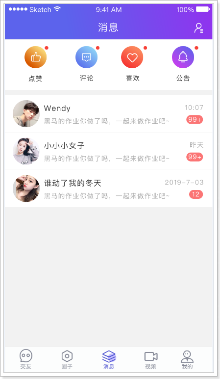

 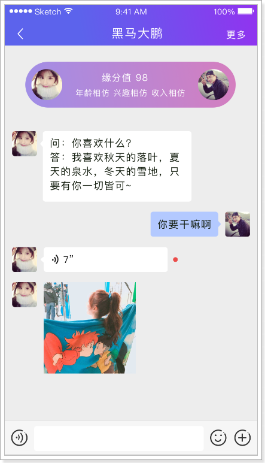

 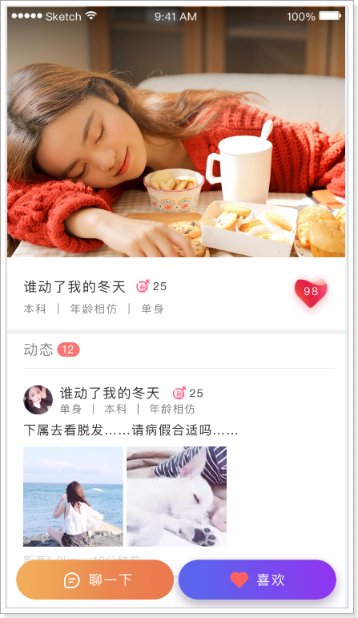

## 2. 技术方案

对于高并发的即时通讯实现，还是很有挑战的，所需要考虑的点非常多，除了要实现功能，还要考虑并发、流量、负载、服务器、容灾等等。虽然有难度也并不是高不可攀。

对于现实即时通讯往往有两种方案：

- 方案一：
  - 自主实现，从设计到架构，再到实现。
  
  - 技术方面可以采用：Netty + WebSocket + RocketMQ + MongoDB + Redis + ZooKeeper + MySQL
  
    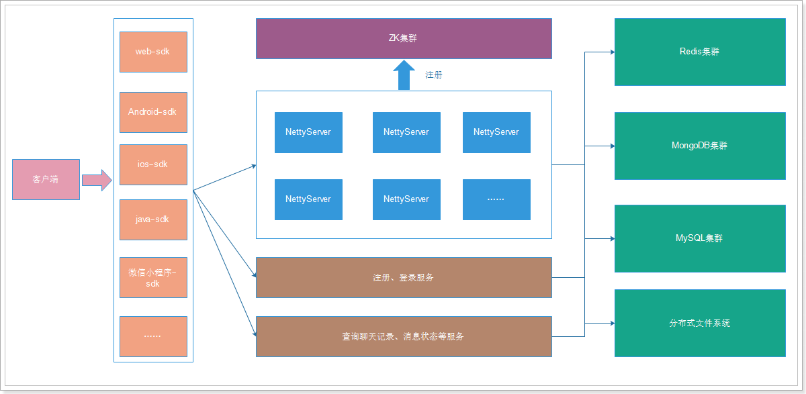
- 方案二：
  - 对接第三方服务完成。
  - 这种方式简单，只需要按照第三方的api进行对接就可以了。
  - 如：环信、网易、容联云通讯等。

如何选择呢？

如果是中大型企业做项目可以选择自主研发，如果是中小型企业研发中小型的项目，选择第二种方案即可。方案一需要有大量的人力、物力的支持，开发周期长，成本高，但可控性强。方案二，成本低，开发周期短，能够快速的集成起来进行功能的开发，只是在可控性方面来说就差了一些。

探花交友项目选择方案二进行实现。

## 3. 环信

官网：https://www.easemob.com/  稳定健壮，消息必达，亿级并发的即时通讯云

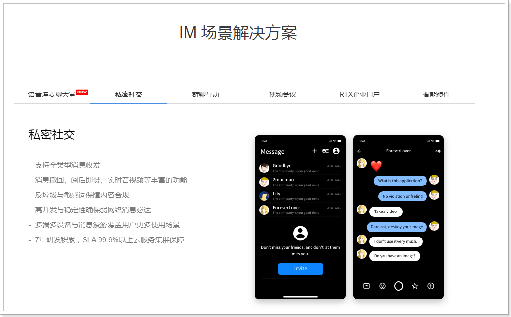

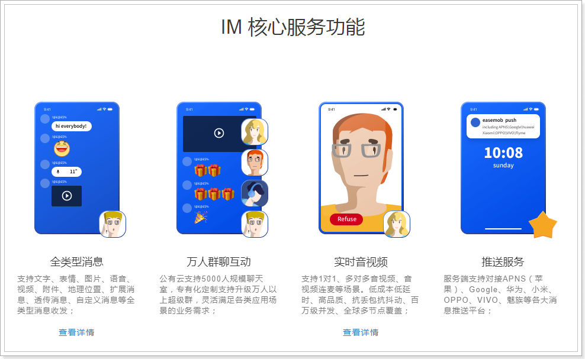

### 3.1 开发简介

平台架构：

 

集成：

环信和用户体系的集成主要发生在2个地方，服务器端集成和客户端集成。

 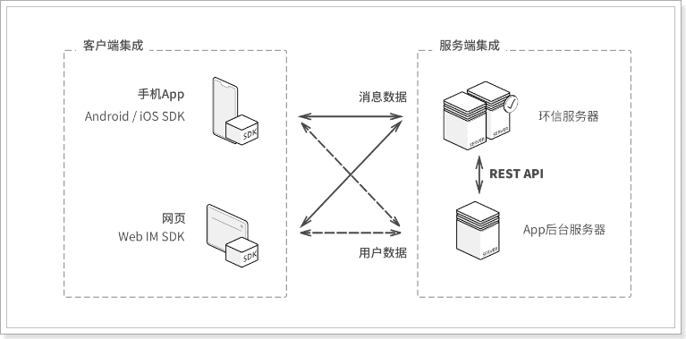

探花集成：

- 探花前端使用AndroidSDK进行集成
  - 文档：http://docs-im.easemob.com/im/android/sdk/import
- 后端集成用户体系
  - 文档：http://docs-im.easemob.com/im/server/ready/user

### 3.2 环信Console

需要使用环信平台，那么必须要进行注册，登录之后即可创建应用。环信100以内的用户免费使用，100以上就要注册企业版了。

企业版价格：

 

创建应用：

 

创建完成：

## 4. 用户体系集成

### 4.1 Appkey 数据结构

当您申请了 AppKey 后，会得到一个 **xxxx#xxxx** 格式的字符串，字符串只能由小写字母数字组成，AppKey是环信应用的唯一标识。前半部分 **org_name** 是在多租户体系下的唯一租户标识，后半部分 **app_name** 是租户下的app唯一标识（在环信后台创建一个app时填写的应用 id 即是 app_name ）。下述的 REST API 中，**/{org_name}/{app_name}**的请求，均是针对一个唯一的appkey进行的。目前环信注册的appkey暂不能由用户自己完成删除操作，如果对 APP 删除需要联系环信操作完成。

| Appkey             | xxxx     | 分隔符 | xxxx     |
| :----------------- | :------- | :----- | :------- |
| 环信应用的唯一标识 | org_name | #      | app_name |

### 4.2 环信 ID 数据结构

环信作为一个聊天通道，只需要提供环信 ID （也就是 IM 用户名）和密码就够了。

| 名称     | 字段名   | 数据类型 | 描述                           |
| :------- | :------- | :------- | :----------------------------- |
| 环信 ID  | username | String   | 在 AppKey 的范围内唯一用户名。 |
| 用户密码 | password | String   | 用户登录环信使用的密码。       |

### 4.3 环信 ID 使用规则

当 APP 和环信集成的时候，需要把 APP 系统内的已有用户和新注册的用户和环信集成，为每个已有用户创建一个环信的账号（环信 ID），并且 APP 有新用户注册的时候，需要同步的在环信中注册。

**在注册环信账户的时候，需要注意环信 ID 的规则：**

- 使用英文字母和（或）数字的组合
- 不能使用中文
- 不能使用 email 地址
- 不能使用 UUID
- 用户ID的长度在255字节以内
- 中间不能有空格或者井号（#）等特殊字符
- 允许的用户名正则 “[a-zA-Z0-9_-.]*”（a~z大小写字母/数字/下划线/横线/英文句号），其他都不允许 **如果是大写字母会自动转成小写**
- 不区分大小写。系统忽略大小写，认为 AA、Aa、aa、aA 都是一样的。如果系统已经存在了环信 ID 为 AA 的用户，再试图使用 aa 作为环信 ID 注册新用户，系统返回用户名重复，以此类推。但是请注意：环信 ID 在数据上的表现形式还是用户最初注册的形式，注册时候使用的大写就保存大写，是小写就保存小写。即：使用 AA 注册，环信保存的 ID 就是 AA；使用 Aa 注册，环信保存的 ID 就是 Aa，以此类推。

另：本文档中可能会交错使用“环信 ID”和“环信用户名”两个术语，但是请注意，这里两个的意思是一样的。

因为一个用户的环信 ID 和他的在 APP 中的用户名并不需要一致，只需要有一个明确的对应关系。例如，用户名是 example@easemob.com，当这个用户登录到 APP 的时候，可以登录成功之后，再登录环信的服务器，所以这时候，只需要能够从 example@easemob.com 推导出这个用户的环信 ID 即可。

### 4.4 获取管理员权限

环信提供的 REST API 需要权限才能访问，权限通过发送 HTTP 请求时携带 token 来体现，下面描述获取 token 的方式。说明：API 描述的时候使用到的 {APP 的 client_id} 之类的这种参数需要替换成具体的值。

**重要提醒：**获取 token 时服务器会返回 token 有效期，具体值参考接口返回的 expires_in 字段值。由于网络延迟等原因，系统不保证 token 在此值表示的有效期内绝对有效，如果发现 token 使用异常请重新获取新的 token，比如“http response code”返回 401。另外，请不要频繁向服务器发送获取 token 的请求，同一账号发送此请求超过一定频率会被服务器封号，切记，切记！！

client_id 和 client_secret 可以在环信管理后台的 [APP 详情页面](http://www.google.com/)看到。

> **HTTP Request**

|  | /**{org_name}/{app_name}/token** |
| :---------------------- | :------------------------------- |
|                         |                                  |

> **Request Headers**

| 参数         | 说明             |
| :----------- | :--------------- |
| Content-Type | application/json |

> **Request Body**

| 参数          | 说明                                                         |
| :------------ | :----------------------------------------------------------- |
| grant_type    | client_credentials                                           |
| client_id     | App的client_id，可在[app详情页找到](https://console.easemob.com/app-detail/detail) |
| client_secret | App的client_secret，可在[app详情页找到](https://console.easemob.com/app-detail/detail) |

> **Response Body**

| 参数         | 说明                                                 |
| :----------- | :--------------------------------------------------- |
| access_token | 有效的token字符串                                    |
| expires_in   | token 有效时间，以秒为单位，在有效期内不需要重复获取 |
| application  | 当前 App 的 UUID 值                                  |

 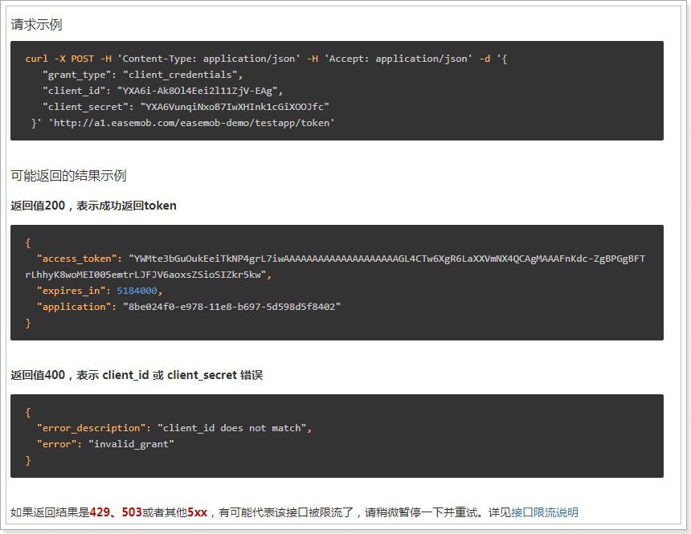

#### 4.4.1 配置

将用户体系集成的逻辑写入到sso系统中。

huanxin.properties

~~~properties
tanhua.huanxin.url=http://a1.easemob.com/
tanhua.huanxin.orgName=1105190515097562
tanhua.huanxin.appName=tanhua
tanhua.huanxin.clientId=YXA67ZofwHblEems-_Fh-17T2g
tanhua.huanxin.clientSecret=YXA60r45rNy2Ux5wQ7YYoEPwynHmUZk
~~~

> **说明：这配置在控制台可以找到。**

~~~java
package com.tanhua.sso.config;

import lombok.Data;
import org.springframework.boot.context.properties.ConfigurationProperties;
import org.springframework.context.annotation.Configuration;
import org.springframework.context.annotation.PropertySource;

@Configuration
@PropertySource("classpath:huanxin.properties")
@ConfigurationProperties(prefix = "tanhua.huanxin")
@Data
public class HuanXinConfig {

    private String url;
    private String orgName;
    private String appName;
    private String clientId;
    private String clientSecret;

}
~~~

#### 4.4.2 获取token

~~~java
package com.tanhua.sso.service;

import com.fasterxml.jackson.databind.JsonNode;
import com.fasterxml.jackson.databind.ObjectMapper;
import com.tanhua.sso.config.HuanXinConfig;
import org.apache.commons.lang3.StringUtils;
import org.springframework.beans.factory.annotation.Autowired;
import org.springframework.boot.context.properties.ConfigurationProperties;
import org.springframework.data.redis.core.RedisTemplate;
import org.springframework.http.ResponseEntity;
import org.springframework.stereotype.Service;
import org.springframework.web.client.RestTemplate;

import java.time.Duration;
import java.util.HashMap;
import java.util.Map;

@Service
public class HuanXinTokenService {

    private static final ObjectMapper MAPPER = new ObjectMapper();

    @Autowired
    private HuanXinConfig huanXinConfig;

    @Autowired
    private RestTemplate restTemplate;

    public static final String REDIS_KEY = "HX_TOKEN";

    @Autowired
    private RedisTemplate<String, String> redisTemplate;

    private String refreshToken() {
        String targetUrl = this.huanXinConfig.getUrl() + this.huanXinConfig.getOrgName() + "/" + this.huanXinConfig.getAppName() + "/token";

        Map<String, String> param = new HashMap<>();
        param.put("grant_type", "client_credentials");
        param.put("client_id", this.huanXinConfig.getClientId());
        param.put("client_secret", this.huanXinConfig.getClientSecret());

        //请求环信接口
        ResponseEntity<String> responseEntity =
                this.restTemplate.postForEntity(targetUrl, param, String.class);

        if (responseEntity.getStatusCodeValue() != 200) {
            return null;
        }
        String body = responseEntity.getBody();
        try {
            JsonNode jsonNode = MAPPER.readTree(body);
            String accessToken = jsonNode.get("access_token").asText();
            if (StringUtils.isNotBlank(accessToken)) {
                // 将token保存到redis，有效期为5天，环信接口返回的有效期为6天
                this.redisTemplate.opsForValue().set(REDIS_KEY, accessToken, Duration.ofDays(5));
                return accessToken;
            }
        } catch (Exception e) {
            e.printStackTrace();
        }

        return null;
    }

    public String getToken() {
        String token = this.redisTemplate.opsForValue().get(REDIS_KEY);
        if (StringUtils.isBlank(token)) {
            return this.refreshToken();
        }
        return token;
    }
}

~~~

### 4.5 注册环信用户

注册环信用户分为2种，开放注册、授权注册，区别在于开发注册不需要token，授权注册需要token。

我们使用的授权注册：

~~~java
package com.tanhua.sso.vo;

import lombok.AllArgsConstructor;
import lombok.Data;
import lombok.NoArgsConstructor;

@Data
@NoArgsConstructor
@AllArgsConstructor
public class HuanXinUser {

    private String username;
    private String password;

}
~~~

~~~java
package com.tanhua.sso.service;

import com.fasterxml.jackson.databind.ObjectMapper;
import com.tanhua.sso.config.HuanXinConfig;
import com.tanhua.sso.vo.HuanXinUser;
import org.apache.commons.codec.digest.DigestUtils;
import org.springframework.beans.factory.annotation.Autowired;
import org.springframework.http.HttpEntity;
import org.springframework.http.HttpHeaders;
import org.springframework.http.ResponseEntity;
import org.springframework.stereotype.Service;
import org.springframework.web.client.RestTemplate;

import java.util.Arrays;

@Service
public class HuanXinService {

    private static final ObjectMapper MAPPER = new ObjectMapper();

    @Autowired
    private HuanXinTokenService huanXinTokenService;

    @Autowired
    private RestTemplate restTemplate;

    @Autowired
    private HuanXinConfig huanXinConfig;

    /**
     * 注册环信用户
     *
     * @param userId
     * @return
     */
    public boolean register(Long userId) {
        String targetUrl = this.huanXinConfig.getUrl()
                + this.huanXinConfig.getOrgName() + "/"
                + this.huanXinConfig.getAppName() + "/users";

        String token = this.huanXinTokenService.getToken();

        try {
            // 请求体
            HuanXinUser huanXinUser = new HuanXinUser(String.valueOf(userId), DigestUtils.md5Hex(userId + "_itcast_tanhua"));
            String body = MAPPER.writeValueAsString(Arrays.asList(huanXinUser));

            // 请求头
            HttpHeaders headers = new HttpHeaders();
            headers.add("Content-Type", "application/json");
            headers.add("Authorization", "Bearer " + token);

            HttpEntity<String> httpEntity = new HttpEntity<>(body, headers);
            ResponseEntity<String> responseEntity = this.restTemplate.postForEntity(targetUrl, httpEntity, String.class);

            return responseEntity.getStatusCodeValue() == 200;
        } catch (Exception e) {
            e.printStackTrace();
        }

        // 注册失败
        return false;

    }

}

~~~

加入到登录逻辑中：

 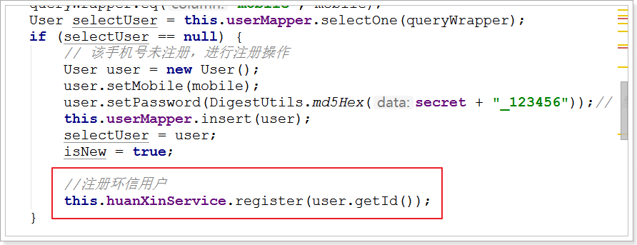

### 4.6 测试

 

可以看到已经注册到了环信。

### 4.7 查询环信用户信息

在app中，用户登录后需要根据用户名密码登录环信，由于用户名密码保存在后台，所以需要提供接口进行返回。

mock地址：  https://mock.boxuegu.com/project/164/interface/api/66955 

实现：

~~~java
package com.tanhua.server.controller;

import com.tanhua.server.pojo.User;
import com.tanhua.server.utils.UserThreadLocal;
import com.tanhua.server.vo.HuanXinUser;
import org.apache.commons.codec.digest.DigestUtils;
import org.springframework.http.ResponseEntity;
import org.springframework.web.bind.annotation.GetMapping;
import org.springframework.web.bind.annotation.RequestMapping;
import org.springframework.web.bind.annotation.RestController;

@RestController
@RequestMapping("huanxin")
public class HuanXinController {

    @GetMapping("user")
    public ResponseEntity<HuanXinUser> queryHuanXinUser(){
        User user = UserThreadLocal.get();

        HuanXinUser huanXinUser = new HuanXinUser();
        huanXinUser.setUsername(user.getId().toString());
        huanXinUser.setPassword(DigestUtils.md5Hex(user.getId() + "_itcast_tanhua"));

        return ResponseEntity.ok(huanXinUser);
    }
}

~~~

测试： 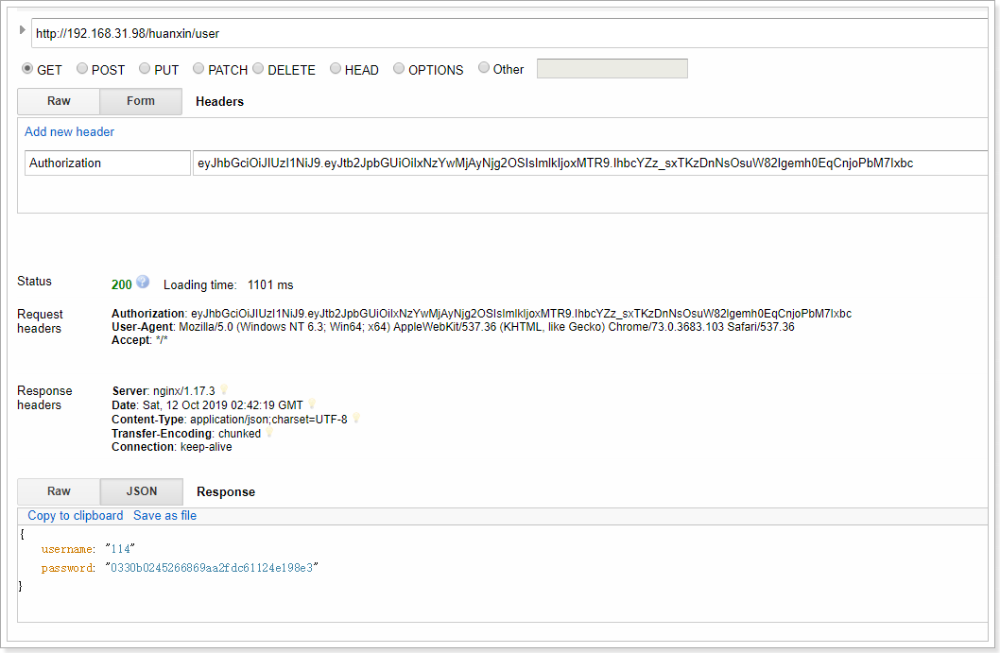

### 4.8 发送消息给客户端

目前已经完成了用户体系的对接，下面我们进行测试发送消息，场景是这样的：

 

点击“聊一下”，就会给对方发送一条陌生人信息，这个消息由系统发送完成。

我们暂时通过环信的控制台进行发送： 

消息内容：

~~~json
{
 "userId": "1",
 "nickname":"黑马小妹",
 "strangerQuestion": "你喜欢去看蔚蓝的大海还是去爬巍峨的高山？",
 "reply": "我喜欢秋天的落叶，夏天的泉水，冬天的雪地，只要有你一切皆可~"
}
~~~

 

 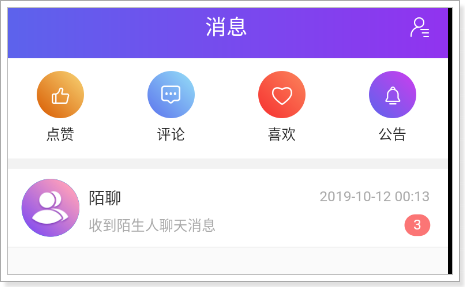

 

可以看到已经接收到了消息。

## 5. 添加联系人

点击“聊一下”，就会成为联系人（好友）。

实现：

- 将好友写入到MongoDB中
- 将好友关系注册到环信

### 5.1 mock接口

地址： https://mock.boxuegu.com/project/164/interface/api/77980 

 

### 5.2 定义dubbo服务

~~~java
package com.tanhua.dubbo.server.pojo;

import lombok.AllArgsConstructor;
import lombok.Data;
import lombok.NoArgsConstructor;
import org.bson.types.ObjectId;
import org.springframework.data.mongodb.core.mapping.Document;

import java.util.Date;

@Data
@NoArgsConstructor
@AllArgsConstructor
@Document(collection = "tanhua_users")
public class Users implements java.io.Serializable{

    private static final long serialVersionUID = 6003135946820874230L;
    private ObjectId id;
    private Long userId; //用户id
    private Long friendId; //好友id
    private Long date; //时间
}

~~~

~~~java
package com.tanhua.dubbo.server.api;

import com.tanhua.dubbo.server.pojo.Users;

public interface UsersApi {

    /**
     * 保存好友
     *
     * @param users
     * @return
     */
    String saveUsers(Users users);
    
    /**
     * 删除好友数据
     *
     * @param users
     * @return
     */
    boolean removeUsers(Users users);
}

~~~

实现：

~~~java
package com.tanhua.dubbo.server.api;

import com.alibaba.dubbo.config.annotation.Service;
import com.tanhua.dubbo.server.pojo.Users;
import org.bson.types.ObjectId;
import org.springframework.beans.factory.annotation.Autowired;
import org.springframework.data.mongodb.core.MongoTemplate;
import org.springframework.data.mongodb.core.query.Criteria;
import org.springframework.data.mongodb.core.query.Query;

@Service(version = "1.0.0")
public class UsersApiImpl implements UsersApi {

    @Autowired
    private MongoTemplate mongoTemplate;

    @Override
    public String saveUsers(Users users) {

        if (users.getFriendId() == null || users.getUserId() == null) {
            return null;
        }

        Long userId = users.getUserId();
        Long friendId = users.getFriendId();

        // 检测是否该好友关系是否存在
        Query query = Query.query(Criteria.where("userId").is(userId).and("friendId").is(friendId));
        Users oldUsers = this.mongoTemplate.findOne(query, Users.class);
        if (null != oldUsers) {
            return null;
        }

        users.setId(ObjectId.get());
        users.setDate(System.currentTimeMillis());

        //注册我与好友的关系
        this.mongoTemplate.save(users);

        //注册好友与我的关系
        users.setId(ObjectId.get());
        users.setUserId(friendId);
        users.setFriendId(userId);
        this.mongoTemplate.save(users);

        return users.getId().toHexString();
    }
    
     @Override
    public boolean removeUsers(Users users) {

        Long userId = users.getUserId();
        Long friendId = users.getFriendId();

        Query query1 = Query.query(Criteria.where("userId").is(userId)
                .and("friendId").is(friendId));

        //删除我与好友的关系数据
        long count1 = this.mongoTemplate.remove(query1, Users.class).getDeletedCount();

        Query query2 = Query.query(Criteria.where("userId").is(friendId)
                .and("friendId").is(userId));
        //删除好友与我的关系数据
        long count2 = this.mongoTemplate.remove(query2, Users.class).getDeletedCount();

        return count1 > 0 && count2 > 0;
    }
}

~~~

### 5.3 注册好友到环信

对接环信api的操作在sso工程中完成。

~~~java
package com.tanhua.sso.controller;

import com.tanhua.sso.service.HuanXinService;
import org.springframework.beans.factory.annotation.Autowired;
import org.springframework.http.HttpStatus;
import org.springframework.http.ResponseEntity;
import org.springframework.web.bind.annotation.PathVariable;
import org.springframework.web.bind.annotation.PostMapping;
import org.springframework.web.bind.annotation.RequestMapping;
import org.springframework.web.bind.annotation.RestController;

@RestController
@RequestMapping("user/huanxin")
public class HuanXinController {

    @Autowired
    private HuanXinService huanXinService;

    /**
     * 添加联系人
     *
     * @param userId
     * @param friendId
     * @return
     */
    @PostMapping("contacts/{owner_username}/{friend_username}")
    public ResponseEntity<Void> contactUsers(@PathVariable("owner_username") Long userId,
                                             @PathVariable("friend_username") Long friendId) {
        try {
            boolean result = this.huanXinService.contactUsers(userId, friendId);
            if (result) {
                return ResponseEntity.ok(null);
            }
        } catch (Exception e) {
            e.printStackTrace();
        }

        return ResponseEntity.status(HttpStatus.INTERNAL_SERVER_ERROR).build();
    }
}

~~~

~~~java
package com.tanhua.sso.service;

import com.fasterxml.jackson.databind.ObjectMapper;
import com.tanhua.sso.config.HuanXinConfig;
import com.tanhua.sso.vo.HuanXinUser;
import org.apache.commons.codec.digest.DigestUtils;
import org.springframework.beans.factory.annotation.Autowired;
import org.springframework.http.HttpEntity;
import org.springframework.http.HttpHeaders;
import org.springframework.http.ResponseEntity;
import org.springframework.stereotype.Service;
import org.springframework.web.client.RestTemplate;

import java.util.Arrays;

@Service
public class HuanXinService {

    private static final ObjectMapper MAPPER = new ObjectMapper();

    @Autowired
    private HuanXinTokenService huanXinTokenService;

    @Autowired
    private RestTemplate restTemplate;

    @Autowired
    private HuanXinConfig huanXinConfig;

    /**
     * 添加好友
     *
     * @param userId
     * @param friendId
     * @return
     */
    public boolean contactUsers(Long userId, Long friendId) {
        String targetUrl = this.huanXinConfig.getUrl()
                + this.huanXinConfig.getOrgName() + "/"
                + this.huanXinConfig.getAppName() + "/users/" +
                userId + "/contacts/users/" + friendId;
        try {
            String token = this.huanXinTokenService.getToken();
            // 请求头
            HttpHeaders headers = new HttpHeaders();
            headers.add("Authorization", "Bearer " + token);

            HttpEntity<String> httpEntity = new HttpEntity<>(headers);
            ResponseEntity<String> responseEntity = this.restTemplate.postForEntity(targetUrl, httpEntity, String.class);

            return responseEntity.getStatusCodeValue() == 200;
        } catch (Exception e) {
            e.printStackTrace();
        }

        // 添加失败
        return false;
    }
}

~~~

### 5.4 编写服务

在itcast-tanhua-server中完成。

~~~java
package com.tanhua.server.controller;

import com.tanhua.server.service.IMService;
import org.slf4j.Logger;
import org.slf4j.LoggerFactory;
import org.springframework.beans.factory.annotation.Autowired;
import org.springframework.http.HttpStatus;
import org.springframework.http.ResponseEntity;
import org.springframework.web.bind.annotation.PostMapping;
import org.springframework.web.bind.annotation.RequestBody;
import org.springframework.web.bind.annotation.RequestMapping;
import org.springframework.web.bind.annotation.RestController;

import java.util.Map;

@RestController	
@RequestMapping("messages")
public class IMController {

    private static final Logger LOGGER = LoggerFactory.getLogger(IMController.class);

    @Autowired
    private IMService imService;

    /**
     * 添加好友
     *
     * @param param
     * @return
     */
    @PostMapping("contacts")
    public ResponseEntity<Void> contactUser(@RequestBody Map<String, Object> param) {
        try {
            Long userId = Long.valueOf(param.get("userId").toString());
            boolean result = this.imService.contactUser(userId);
            if (result) {
                return ResponseEntity.ok(null);
            }
        } catch (Exception e) {
            LOGGER.error("添加联系人失败! param = " + param, e);
        }
        return ResponseEntity.status(HttpStatus.INTERNAL_SERVER_ERROR).build();
    }
}

~~~

~~~java
package com.tanhua.server.service;

import com.alibaba.dubbo.common.utils.StringUtils;
import com.alibaba.dubbo.config.annotation.Reference;
import com.tanhua.dubbo.server.api.UsersApi;
import com.tanhua.dubbo.server.pojo.Users;
import com.tanhua.server.pojo.User;
import com.tanhua.server.utils.UserThreadLocal;
import org.springframework.beans.factory.annotation.Autowired;
import org.springframework.beans.factory.annotation.Value;
import org.springframework.http.ResponseEntity;
import org.springframework.stereotype.Service;
import org.springframework.web.client.RestTemplate;

@Service
public class IMService {

    @Reference(version = "1.0.0")
    private UsersApi usersApi;

    @Autowired
    private RestTemplate restTemplate;

    @Value("${tanhua.sso.url}")
    private String url;

    /**
     * 添加好友
     *
     * @param userId
     */
    public boolean contactUser(Long userId) {
        User user = UserThreadLocal.get();

        Users users = new Users();
        users.setUserId(user.getId());
        users.setFriendId(userId);

        // 添加联系人信息到MongoDB
        String id = this.usersApi.saveUsers(users);

        if (StringUtils.isNotEmpty(id)) {
            //注册好友关系到环信
            try {
                String targetUrl = url + "/user/huanxin/contacts/" + users.getUserId() + "/" + users.getFriendId();
                ResponseEntity<Void> responseEntity = this.restTemplate.postForEntity(targetUrl, null, Void.class);
                if (responseEntity.getStatusCode().isSuccessful()) {
                    return true;
                }
            } catch (Exception e) {
                //添加好友失败，删除Mongodb中的好友数据
                this.usersApi.removeUsers(users);

                log.error("添加环信好友失败！userId = "+ user.getId()+", friendId = " + userId);
            }
            return false;
        }

        return false;
    }
}

~~~

### 5.5 测试

 

 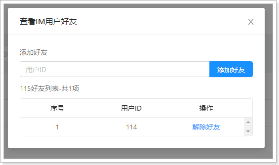

可以看到好友已经添加成功。

## 6. 联系人列表

### 6.1 mock接口

 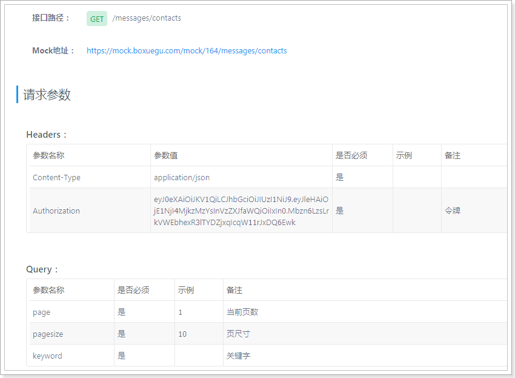

响应数据结构：

 

### 6.2 定义Contacts

~~~java
package com.tanhua.server.vo;

import lombok.AllArgsConstructor;
import lombok.Data;
import lombok.NoArgsConstructor;

@Data
@NoArgsConstructor
@AllArgsConstructor
public class Contacts {

    private Long id;
    private String userId;
    private String avatar;
    private String nickname;
    private String gender;
    private Integer age;
    private String city;

}

~~~

### 6.4 dubbo接口

~~~java
package com.tanhua.dubbo.server.api;

import com.tanhua.dubbo.server.pojo.Users;
import com.tanhua.dubbo.server.vo.PageInfo;

import java.util.List;

public interface UsersApi {

    /**
     * 保存好友
     *
     * @param users
     * @return
     */
    String saveUsers(Users users);

    /**
     * 根据用户id查询Users列表
     *
     * @param userId
     * @return
     */
    List<Users> queryAllUsersList(Long userId);

    /**
     * 根据用户id查询Users列表(分页查询)
     *
     * @param userId
     * @return
     */
    PageInfo<Users> queryUsersList(Long userId, Integer page, Integer pageSize);
}

~~~

实现：

~~~java
package com.tanhua.dubbo.server.api;

import com.alibaba.dubbo.config.annotation.Service;
import com.tanhua.dubbo.server.pojo.Publish;
import com.tanhua.dubbo.server.pojo.Users;
import com.tanhua.dubbo.server.vo.PageInfo;
import org.bson.types.ObjectId;
import org.springframework.beans.factory.annotation.Autowired;
import org.springframework.data.domain.PageRequest;
import org.springframework.data.domain.Sort;
import org.springframework.data.mongodb.core.MongoTemplate;
import org.springframework.data.mongodb.core.query.Criteria;
import org.springframework.data.mongodb.core.query.Query;

import java.util.List;

@Service(version = "1.0.0")
public class UsersApiImpl implements UsersApi {

    @Autowired
    private MongoTemplate mongoTemplate;

    @Override
    public List<Users> queryAllUsersList(Long userId) {
        Query query = Query.query(Criteria.where("userId").is(userId));
        return this.mongoTemplate.find(query, Users.class);
    }

    @Override
    public PageInfo<Users> queryUsersList(Long userId, Integer page, Integer pageSize) {
        PageRequest pageRequest = PageRequest.of(page - 1, pageSize, Sort.by(Sort.Order.desc("created")));
        Query query = Query.query(Criteria.where("userId").is(userId)).with(pageRequest);

        List<Users> usersList = this.mongoTemplate.find(query, Users.class);

        PageInfo<Users> pageInfo = new PageInfo<>();
        pageInfo.setPageNum(page);
        pageInfo.setPageSize(pageSize);
        pageInfo.setRecords(usersList);
        pageInfo.setTotal(0); //不提供总数
        return pageInfo;
    }
}

~~~

### 6.5 编写接口服务

~~~java
package com.tanhua.server.controller;

import com.tanhua.dubbo.server.vo.PageInfo;
import com.tanhua.server.service.IMService;
import com.tanhua.server.vo.Contacts;
import com.tanhua.server.vo.PageResult;
import org.slf4j.Logger;
import org.slf4j.LoggerFactory;
import org.springframework.beans.factory.annotation.Autowired;
import org.springframework.http.HttpStatus;
import org.springframework.http.ResponseEntity;
import org.springframework.web.bind.annotation.*;

import java.util.Map;

@RestController
@RequestMapping("messages")
public class IMController {

    private static final Logger LOGGER = LoggerFactory.getLogger(IMController.class);

    @Autowired
    private IMService imService;

    /**
     * 查询联系人列表
     *
     * @param page
     * @param pageSize
     * @param keyword
     * @return
     */
    @GetMapping("contacts")
    public ResponseEntity<PageResult> queryContactsList(@RequestParam(value = "page", defaultValue = "1") Integer page,
                                                                  @RequestParam(value = "pagesize", defaultValue = "10") Integer pageSize,
                                                                  @RequestParam(value = "keyword", required = false) String keyword) {
        PageResult pageResult = this.imService.queryContactsList(page, pageSize, keyword);
        return ResponseEntity.ok(pageResult);
    }
}

~~~

~~~java
package com.tanhua.server.service;

import com.alibaba.dubbo.config.annotation.Reference;
import com.baomidou.mybatisplus.core.conditions.query.QueryWrapper;
import com.tanhua.dubbo.server.api.UsersApi;
import com.tanhua.dubbo.server.pojo.Users;
import com.tanhua.dubbo.server.vo.PageInfo;
import com.tanhua.server.pojo.User;
import com.tanhua.server.pojo.UserInfo;
import com.tanhua.server.utils.UserThreadLocal;
import com.tanhua.server.vo.Contacts;
import com.tanhua.server.vo.PageResult;
import org.apache.commons.lang3.StringUtils;
import org.springframework.beans.factory.annotation.Autowired;
import org.springframework.beans.factory.annotation.Value;
import org.springframework.http.ResponseEntity;
import org.springframework.stereotype.Service;
import org.springframework.web.client.RestTemplate;

import java.util.ArrayList;
import java.util.List;

@Service
public class IMService {

    @Reference(version = "1.0.0")
    private UsersApi usersApi;

    @Autowired
    private RestTemplate restTemplate;

    @Value("${tanhua.sso.url}")
    private String url;

    @Autowired
    private UserInfoService userInfoService;

    public PageResult queryContactsList(Integer page, Integer pageSize, String keyword) {
        User user = UserThreadLocal.get();

        List<Users> usersList = null;
        if (StringUtils.isNotEmpty(keyword)) {
            //关键不为空，查询所有的好友，在后面进行关键字过滤
            usersList = this.usersApi.queryAllUsersList(user.getId());
        } else {
            //关键字为空，进行分页查询
            PageInfo<Users> usersPageInfo = this.usersApi.queryUsersList(user.getId(), page, pageSize);
            usersList = usersPageInfo.getRecords();
        }

        List<Long> userIds = new ArrayList<>();
        for (Users users : usersList) {
            userIds.add(users.getFriendId());
        }

        QueryWrapper<UserInfo> queryWrapper = new QueryWrapper<>();
        queryWrapper.in("user_id", userIds);
        if (StringUtils.isNotEmpty(keyword)) {
            queryWrapper.like("nick_name", keyword);
        }

        List<UserInfo> userInfoList = this.userInfoService.queryUserInfoList(queryWrapper);

        List<Contacts> contactsList = new ArrayList<>();

        //填充用户信息
        for (UserInfo userInfo : userInfoList) {
            Contacts contacts = new Contacts();
            contacts.setAge(userInfo.getAge());
            contacts.setAvatar(userInfo.getLogo());
            contacts.setGender(userInfo.getSex().name().toLowerCase());
            contacts.setNickname(userInfo.getNickName());
            contacts.setUserId(String.valueOf(userInfo.getUserId()));
            contacts.setCity(StringUtils.substringBefore(userInfo.getCity(), "-"));

            contactsList.add(contacts);
        }

        PageResult pageResult = new PageResult();
        pageResult.setPage(page);
        pageResult.setPages(0);
        pageResult.setCounts(0);
        pageResult.setPagesize(pageSize);
        pageResult.setItems(contactsList);

        return pageResult;
    }
}

~~~

### 6.6 测试

 

 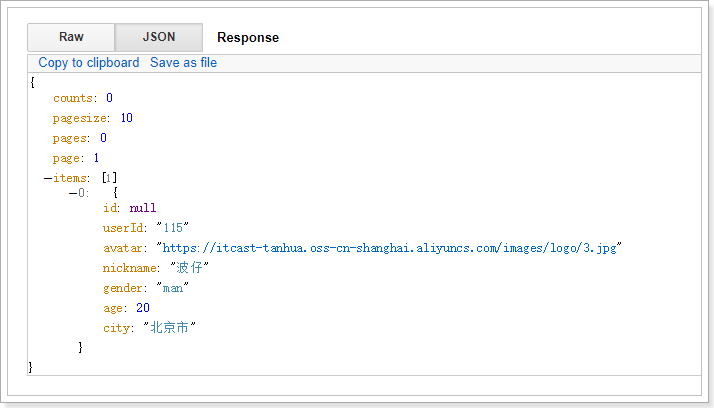

 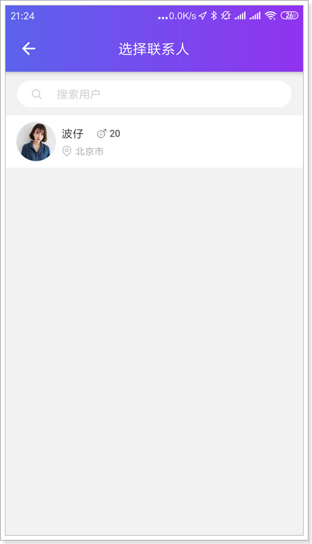

## 7. 点赞列表

### 7.1 mock接口

地址： https://mock.boxuegu.com/project/164/interface/api/63966 

 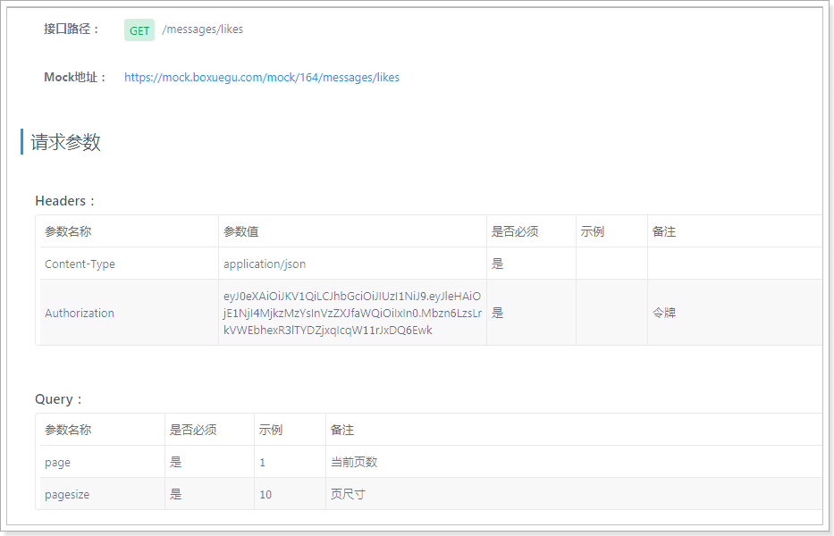

 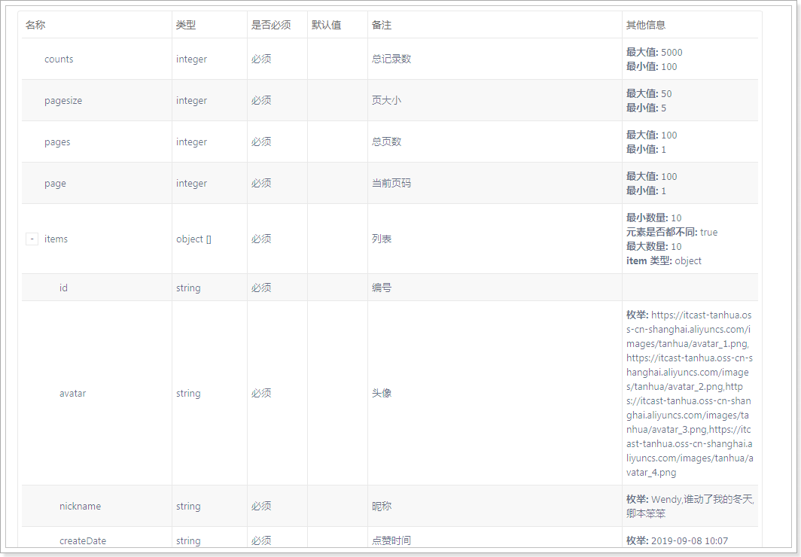

### 7.2 MessageLike

根据接口定义vo对象。

~~~java
package com.tanhua.server.vo;

import lombok.AllArgsConstructor;
import lombok.Data;
import lombok.NoArgsConstructor;

@Data
@NoArgsConstructor
@AllArgsConstructor
public class MessageLike {

    private String id;
    private String avatar;
    private String nickname;
    private String createDate;

}

~~~

### 7.3 dubbo接口

~~~java
//QuanZiApi
 /**
     * 查询用户的评论数据
     *
     * @return
     */
    PageInfo<Comment> queryCommentListByUser(Long userId, Integer type, Integer page, Integer pageSize);
~~~

实现：

~~~java
@Override
    public PageInfo<Comment> queryCommentListByUser(Long userId, Integer type, Integer page, Integer pageSize) {

        PageRequest pageRequest = PageRequest.of(page - 1, pageSize, Sort.by(Sort.Order.desc("created")));
        Query query = new Query(Criteria
                .where("userId").is(userId)
                .and("commentType").is(type)).with(pageRequest);

        List<Comment> commentList = this.mongoTemplate.find(query, Comment.class);

        PageInfo<Comment> pageInfo = new PageInfo<>();
        pageInfo.setPageNum(page);
        pageInfo.setPageSize(pageSize);
        pageInfo.setRecords(commentList);
        pageInfo.setTotal(0); //不提供总数
        return pageInfo;
    }
~~~

### 7.4 编写接口服务

~~~java
package com.tanhua.server.controller;

import com.tanhua.dubbo.server.vo.PageInfo;
import com.tanhua.server.service.IMService;
import com.tanhua.server.vo.Contacts;
import com.tanhua.server.vo.PageResult;
import org.slf4j.Logger;
import org.slf4j.LoggerFactory;
import org.springframework.beans.factory.annotation.Autowired;
import org.springframework.http.HttpStatus;
import org.springframework.http.ResponseEntity;
import org.springframework.web.bind.annotation.*;

import java.util.Map;

@RestController
@RequestMapping("messages")
public class IMController {

    private static final Logger LOGGER = LoggerFactory.getLogger(IMController.class);

    @Autowired
    private IMService imService;

 	 /**
     * 查询点赞列表
     *
     * @param page
     * @param pageSize
     * @return
     */
    @GetMapping("likes")
    public ResponseEntity<PageResult> queryMessageLikeList(@RequestParam(value = "page", defaultValue = "1") Integer page,
                                                           @RequestParam(value = "pagesize", defaultValue = "10") Integer pageSize) {
        PageResult pageResult = this.imService.queryMessageLikeList(page, pageSize);
        return ResponseEntity.ok(pageResult);
    }
}

~~~

~~~java
package com.tanhua.server.service;

import com.alibaba.dubbo.config.annotation.Reference;
import com.baomidou.mybatisplus.core.conditions.query.QueryWrapper;
import com.tanhua.dubbo.server.api.QuanZiApi;
import com.tanhua.dubbo.server.api.UsersApi;
import com.tanhua.dubbo.server.pojo.Comment;
import com.tanhua.dubbo.server.pojo.Users;
import com.tanhua.dubbo.server.vo.PageInfo;
import com.tanhua.server.pojo.User;
import com.tanhua.server.pojo.UserInfo;
import com.tanhua.server.utils.UserThreadLocal;
import com.tanhua.server.vo.Contacts;
import com.tanhua.server.vo.MessageLike;
import com.tanhua.server.vo.PageResult;
import org.apache.commons.lang3.StringUtils;
import org.joda.time.DateTime;
import org.springframework.beans.factory.annotation.Autowired;
import org.springframework.beans.factory.annotation.Value;
import org.springframework.http.ResponseEntity;
import org.springframework.stereotype.Service;
import org.springframework.web.client.RestTemplate;

import java.util.ArrayList;
import java.util.List;

@Service
public class IMService {

    @Reference(version = "1.0.0")
    private UsersApi usersApi;

    @Autowired
    private RestTemplate restTemplate;

    @Value("${tanhua.sso.url}")
    private String url;

    @Autowired
    private UserInfoService userInfoService;

    @Reference(version = "1.0.0")
    private QuanZiApi quanZiApi;

    public PageResult queryMessageLikeList(Integer page, Integer pageSize) {
        User user = UserThreadLocal.get();
        PageInfo<Comment> pageInfo = this.quanZiApi.queryCommentListByUser(user.getId(), 1, page, pageSize);

        PageResult pageResult = new PageResult();
        pageResult.setPage(page);
        pageResult.setPages(0);
        pageResult.setCounts(0);
        pageResult.setPagesize(pageSize);

        List<Comment> records = pageInfo.getRecords();

        List<Long> userIds = new ArrayList<>();
        for (Comment comment : records) {
            userIds.add(comment.getUserId());
        }

        QueryWrapper<UserInfo> queryWrapper = new QueryWrapper<>();
        queryWrapper.in("user_id", userIds);
        List<UserInfo> userInfoList = this.userInfoService.queryList(queryWrapper);

        List<MessageLike> messageLikeList = new ArrayList<>();
        for (Comment record : records) {
            for (UserInfo userInfo : userInfoList) {
                if(userInfo.getUserId().longValue() == record.getUserId().longValue()){

                    MessageLike messageLike = new MessageLike();
                    messageLike.setId(record.getId().toHexString());
                    messageLike.setAvatar(userInfo.getLogo());
                    messageLike.setNickname(userInfo.getNickName());
                    messageLike.setCreateDate(new DateTime(record.getCreated()).toString("yyyy-MM-dd HH:mm"));

                    messageLikeList.add(messageLike);
                    break;
                }
            }
        }

        pageResult.setItems(messageLikeList);
        return pageResult;
    }
}

~~~

### 7.5 测试

 

 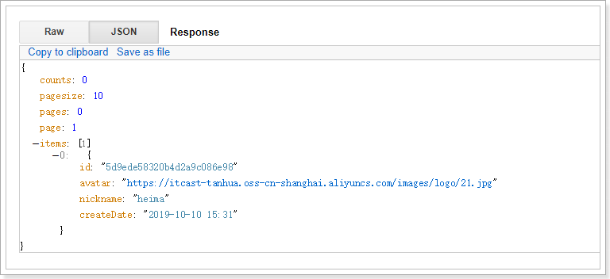

## 8. 评论、喜欢列表

### 8.1 IMController

~~~java
/**
     * 查询评论列表
     *
     * @param page
     * @param pageSize
     * @return
     */
    @GetMapping("comments")
    public ResponseEntity<PageResult> queryMessageCommentList(@RequestParam(value = "page", defaultValue = "1") Integer page,
                                                           @RequestParam(value = "pagesize", defaultValue = "10") Integer pageSize) {
        PageResult pageResult = this.imService.queryMessageCommentList(page, pageSize);
        return ResponseEntity.ok(pageResult);
    }

    /**
     * 查询喜欢列表
     *
     * @param page
     * @param pageSize
     * @return
     */
    @GetMapping("loves")
    public ResponseEntity<PageResult> queryMessageLoveList(@RequestParam(value = "page", defaultValue = "1") Integer page,
                                                              @RequestParam(value = "pagesize", defaultValue = "10") Integer pageSize) {
        PageResult pageResult = this.imService.queryMessageLoveList(page, pageSize);
        return ResponseEntity.ok(pageResult);
    }
~~~

### 8.2 IMService

~~~java
public PageResult queryMessageLikeList(Integer page, Integer pageSize) {
        return this.messageCommentList(1, page, pageSize);
    }

    public PageResult queryMessageCommentList(Integer page, Integer pageSize) {
        return this.messageCommentList(2, page, pageSize);
    }

    public PageResult queryMessageLoveList(Integer page, Integer pageSize) {
        return this.messageCommentList(3, page, pageSize);
    }

    private PageResult messageCommentList(Integer type, Integer page, Integer pageSize) {
        User user = UserThreadLocal.get();
        PageInfo<Comment> pageInfo = this.quanZiApi.queryCommentListByUser(user.getId(), type, page, pageSize);

        PageResult pageResult = new PageResult();
        pageResult.setPage(page);
        pageResult.setPages(0);
        pageResult.setCounts(0);
        pageResult.setPagesize(pageSize);

        List<Comment> records = pageInfo.getRecords();

        List<Long> userIds = new ArrayList<>();
        for (Comment comment : records) {
            userIds.add(comment.getUserId());
        }

        QueryWrapper<UserInfo> queryWrapper = new QueryWrapper<>();
        queryWrapper.in("user_id", userIds);
        List<UserInfo> userInfoList = this.userInfoService.queryList(queryWrapper);

        List<MessageLike> messageLikeList = new ArrayList<>();
        for (Comment record : records) {
            for (UserInfo userInfo : userInfoList) {
                if (userInfo.getUserId().longValue() == record.getUserId().longValue()) {

                    MessageLike messageLike = new MessageLike();
                    messageLike.setId(record.getId().toHexString());
                    messageLike.setAvatar(userInfo.getLogo());
                    messageLike.setNickname(userInfo.getNickName());
                    messageLike.setCreateDate(new DateTime(record.getCreated()).toString("yyyy-MM-dd HH:mm"));

                    messageLikeList.add(messageLike);
                    break;
                }
            }
        }

        pageResult.setItems(messageLikeList);
        return pageResult;
    }
~~~

### 8.3 解决bug

点赞、评论、喜欢列表应该是别人对我发布的信息做了操作之后显示的数据，所以查询条件是发布人的id作为查询条件。

第一步：修改Comment对象，增加 publishUserId 字段。

~~~java
package com.tanhua.dubbo.server.pojo;

import lombok.AllArgsConstructor;
import lombok.Data;
import lombok.NoArgsConstructor;
import org.bson.types.ObjectId;
import org.springframework.data.mongodb.core.mapping.Document;

import java.util.Date;

/**
 * 评论表
 */
@Data
@NoArgsConstructor
@AllArgsConstructor
@Document(collection = "quanzi_comment")
public class Comment implements java.io.Serializable{

    private static final long serialVersionUID = -291788258125767614L;

    private ObjectId id;

    private ObjectId publishId; //发布id
    private Integer commentType; //评论类型，1-点赞，2-评论，3-喜欢
    private String content; //评论内容
    private Long userId; //评论人
    private Long publishUserId; //发布人的用户id

    private Boolean isParent = false; //是否为父节点，默认是否
    private ObjectId parentId; // 父节点id

    private Long created; //发表时间

}

~~~

第二步：修改保存Comment逻辑

~~~java
@Override
    public boolean saveComment(Long userId, String publishId, Integer type, String content) {

        try {
            Comment comment = new Comment();
            comment.setContent(content);
            comment.setIsParent(true);
            comment.setCommentType(type);
            comment.setPublishId(new ObjectId(publishId));
            comment.setUserId(userId);
            comment.setId(ObjectId.get());
            comment.setCreated(System.currentTimeMillis());

            // 设置发布人的id
            Publish publish = this.mongoTemplate.findById(comment.getPublishId(), Publish.class);
            if (null != publish) {
                comment.setPublishUserId(publish.getUserId());
            } else {
                Video video = this.mongoTemplate.findById(comment.getPublishId(), Video.class);
                if (null != video) {
                    comment.setPublishUserId(video.getUserId());
                }
            }

            this.mongoTemplate.save(comment);

            return true;
        } catch (Exception e) {
            e.printStackTrace();
        }

        return false;
    }
~~~

第三步，修改查询条件

~~~java
@Override
    public PageInfo<Comment> queryCommentListByUser(Long userId, Integer type, Integer page, Integer pageSize) {

        PageRequest pageRequest = PageRequest.of(page - 1, pageSize, Sort.by(Sort.Order.desc("created")));
        Query query = new Query(Criteria
                .where("publishUserId").is(userId)
                .and("commentType").is(type)).with(pageRequest);

        List<Comment> commentList = this.mongoTemplate.find(query, Comment.class);

        PageInfo<Comment> pageInfo = new PageInfo<>();
        pageInfo.setPageNum(page);
        pageInfo.setPageSize(pageSize);
        pageInfo.setRecords(commentList);
        pageInfo.setTotal(0); //不提供总数
        return pageInfo;
    }
~~~

## 9. 公告列表

公告是后台系统对所有用户发布的公告消息。

### 9.1 表结构

~~~sql
CREATE TABLE `tb_announcement` (
  `id` bigint(20) NOT NULL AUTO_INCREMENT,
  `title` varchar(200) DEFAULT NULL COMMENT '标题',
  `description` text COMMENT '描述',
  `created` datetime DEFAULT NULL,
  `updated` datetime DEFAULT NULL,
  PRIMARY KEY (`id`),
  KEY `created` (`created`)
) ENGINE=InnoDB AUTO_INCREMENT=4 DEFAULT CHARSET=utf8 COMMENT='公告表';
~~~

~~~sql
--插入数据
INSERT INTO `tb_announcement` (`id`, `title`, `description`, `created`, `updated`) VALUES ('1', '探花新版本上线发布啦～,盛夏high趴开始了，赶紧来报名吧！', '探花App2019年7月23日起在苹果商店…,浓情夏日，清爽一聚，探花将吧大家聚…', '2019-10-14 11:06:34', '2019-10-14 11:06:37');
INSERT INTO `tb_announcement` (`id`, `title`, `description`, `created`, `updated`) VALUES ('2', '探花交友的圈子功能正式上线啦~~', '探花交友的圈子功能正式上线啦，欢迎使用~', '2019-10-14 11:09:31', '2019-10-14 11:09:33');
INSERT INTO `tb_announcement` (`id`, `title`, `description`, `created`, `updated`) VALUES ('3', '国庆放假期间，探花交友正常使用~', '国庆放假期间，探花交友正常使用~', '2019-10-14 11:10:01', '2019-10-14 11:10:04');

~~~

### 9.2 pojo

~~~java
package com.tanhua.server.pojo;

import lombok.AllArgsConstructor;
import lombok.Data;
import lombok.NoArgsConstructor;

@Data
@NoArgsConstructor
@AllArgsConstructor
public class Announcement extends BasePojo {

    private Long id;
    private String title;
    private String description;

}

~~~

### 9.3 AnnouncementMapper

~~~java
package com.tanhua.server.mapper;

import com.baomidou.mybatisplus.core.mapper.BaseMapper;
import com.tanhua.server.pojo.Announcement;

public interface AnnouncementMapper extends BaseMapper<Announcement> {
}

~~~

### 9.4 AnnouncementService

~~~java
package com.tanhua.server.service;

import com.baomidou.mybatisplus.core.conditions.query.QueryWrapper;
import com.baomidou.mybatisplus.core.metadata.IPage;
import com.baomidou.mybatisplus.extension.plugins.pagination.Page;
import com.tanhua.server.mapper.AnnouncementMapper;
import com.tanhua.server.pojo.Announcement;
import org.springframework.beans.factory.annotation.Autowired;
import org.springframework.stereotype.Service;

@Service
public class AnnouncementService {

    @Autowired
    private AnnouncementMapper announcementMapper;

    public IPage<Announcement> queryList(Integer page, Integer pageSize) {
        QueryWrapper queryWrapper = new QueryWrapper();
        queryWrapper.orderByDesc("created");
        return this.announcementMapper.selectPage(new Page<Announcement>(page, pageSize), queryWrapper);
    }
}

~~~

### 9.5 定义vo对象

~~~java
package com.tanhua.server.vo;

import lombok.AllArgsConstructor;
import lombok.Data;
import lombok.NoArgsConstructor;

@Data
@NoArgsConstructor
@AllArgsConstructor
public class MessageAnnouncement {

    private String id;
    private String title;
    private String description;
    private String createDate;

}
~~~

### 9.6 IMController

~~~java
    /**
     * 查询公告列表
     *
     * @param page
     * @param pageSize
     * @return
     */
    @GetMapping("announcements")
    @NoAuthorization  //优化，无需进行token校验
    public ResponseEntity<PageResult> queryMessageAnnouncementList(@RequestParam(value = "page", defaultValue = "1") Integer page,
                                                           @RequestParam(value = "pagesize", defaultValue = "10") Integer pageSize) {
        PageResult pageResult = this.imService.queryMessageAnnouncementList(page, pageSize);
        return ResponseEntity.ok(pageResult);
    }
~~~

### 9.7 IMService

~~~java
public PageResult queryMessageAnnouncementList(Integer page, Integer pageSize) {
        IPage<Announcement> announcementPage = this.announcementService.queryList(page, pageSize);

        List<MessageAnnouncement> messageAnnouncementList = new ArrayList<>();

        for (Announcement record : announcementPage.getRecords()) {
            MessageAnnouncement messageAnnouncement = new MessageAnnouncement();
            messageAnnouncement.setId(record.getId().toString());
            messageAnnouncement.setTitle(record.getTitle());
            messageAnnouncement.setDescription(record.getDescription());
            messageAnnouncement.setCreateDate(new DateTime(record.getCreated()).toString("yyyy-MM-dd HH:mm"));

            messageAnnouncementList.add(messageAnnouncement);
        }

        PageResult pageResult = new PageResult();
        pageResult.setPage(page);
        pageResult.setPages(0);
        pageResult.setCounts(0);
        pageResult.setPagesize(pageSize);
        pageResult.setItems(messageAnnouncementList);

        return pageResult;
    }
~~~

### 9.8 测试

 

 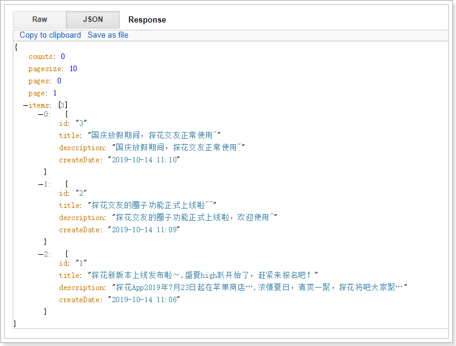

 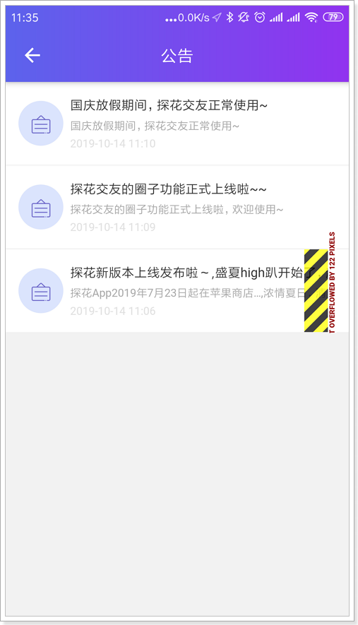

