## 课程说明

- 实现我的喜欢功能
- 实现用户通用设置
- 实现黑名单功能
- 实现修改手机号功能
- 了解CDN的原理

## 1. 我的喜欢

在我的模块中，将详细展现“喜欢”相关的数据，如下：

 

 

### 1.1 概念说明

- 喜欢
  - 我喜欢别人，如：张三喜欢李四，就是喜欢的数据，并不代表李四也喜欢张三。
- 粉丝
  - 对于李四而言，张三就是他的粉丝。
- 相互关注（喜欢）
  - 如果李四也喜欢张三，那么，张三和李四就是相互喜欢。

### 1.2 dubbo服务

#### 1.2.1 UserLikeApi

~~~java
package com.tanhua.dubbo.server.api;

public interface UserLikeApi {

    /**
     * 保存喜欢
     *
     * @param userId
     * @param likeUserId
     * @return
     */
    String saveUserLike(Long userId, Long likeUserId);

    /**
     * 相互喜欢
     *
     * @param userId
     * @param likeUserId
     * @return
     */
    Boolean isMutualLike(Long userId, Long likeUserId);

    /**
     * 删除用户喜欢
     *
     * @param userId
     * @param likeUserId
     * @return
     */
    Boolean deleteUserLike(Long userId, Long likeUserId);

    /**
     * 相互喜欢的数量
     *
     * @return
     */
    Long queryEachLikeCount(Long userId);

    /**
     * 喜欢数
     *
     * @return
     */
    Long queryLikeCount(Long userId);

    /**
     * 粉丝数
     *
     * @return
     */
    Long queryFanCount(Long userId);

}

~~~

#### 1.2.2 UserLikeApiImpl

~~~java
@Override
    public Long queryEachLikeCount(Long userId) {
        // 我喜欢的列表
        List<UserLike> userLikeList = this.mongoTemplate.find(Query.query(Criteria.where("userId").is(userId)), UserLike.class);

        // 获取到所有我喜欢的列表的用户id
        List<Long> likeUserIdList = new ArrayList<>();
        for (UserLike userLike : userLikeList) {
            likeUserIdList.add(userLike.getLikeUserId());
        }

        Query query = Query.query(Criteria.where("userId").in(likeUserIdList).and("likeUserId").is(userId));
        return this.mongoTemplate.count(query, UserLike.class);
    }

    @Override
    public Long queryLikeCount(Long userId) {
        return this.mongoTemplate.count(Query.query(Criteria.where("userId").is(userId)), UserLike.class);
    }

    @Override
    public Long queryFanCount(Long userId) {
        return this.mongoTemplate.count(Query.query(Criteria.where("likeUserId").is(userId)), UserLike.class);
    }
~~~

#### 1.2.3 单元测试

~~~java
package com.tanhua.dubbo.server.api;

import org.junit.Test;
import org.junit.runner.RunWith;
import org.springframework.beans.factory.annotation.Autowired;
import org.springframework.boot.test.context.SpringBootTest;
import org.springframework.test.context.junit4.SpringJUnit4ClassRunner;

@RunWith(SpringJUnit4ClassRunner.class)
@SpringBootTest
public class TestUserLikeApiImpl {

    @Autowired
    private UserLikeApi userLikeApi;

    @Test
    public void testSave2(){
        this.userLikeApi.saveUserLike(1L,2L);
        this.userLikeApi.saveUserLike(1L,3L);
        this.userLikeApi.saveUserLike(2L,1L);
        this.userLikeApi.saveUserLike(1L,4L);
        this.userLikeApi.saveUserLike(4L,1L);
        this.userLikeApi.saveUserLike(5L,1L);
        this.userLikeApi.saveUserLike(6L,1L);
    }

    @Test
    public void testQueryCounts(){
        System.out.println(this.userLikeApi.queryEachLikeCount(1L));
        System.out.println(this.userLikeApi.queryFanCount(1L));
        System.out.println(this.userLikeApi.queryLikeCount(1L));
    }

}

~~~

### 1.3 查询统计数据

#### 1.3.1 mock接口

 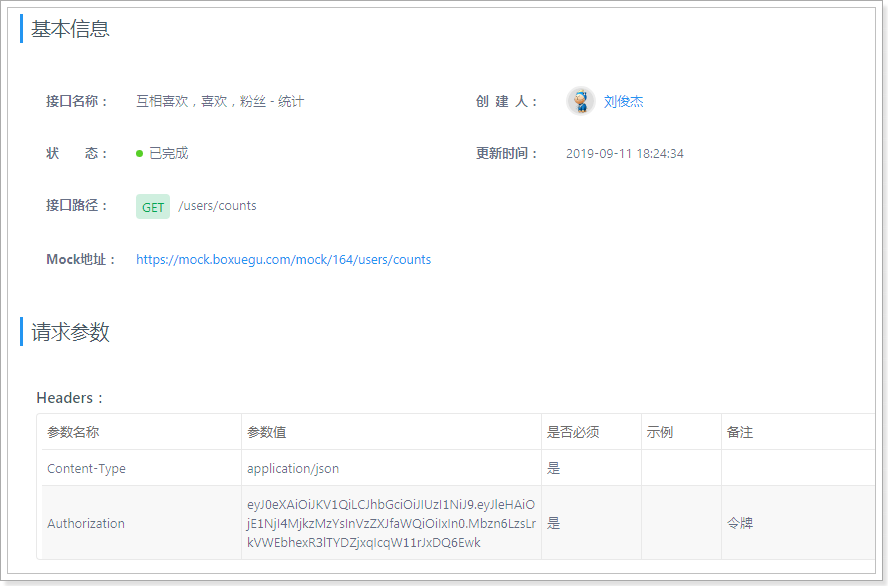

 

#### 1.3.2 CountsVo

~~~java
package com.tanhua.server.vo;

import lombok.AllArgsConstructor;
import lombok.Data;
import lombok.NoArgsConstructor;

@Data
@NoArgsConstructor
@AllArgsConstructor
public class CountsVo {

    private Long eachLoveCount; //互相喜欢
    private Long loveCount; //喜欢
    private Long fanCount; //粉丝

}

~~~

#### 1.3.3 UsersController

~~~java
    /**
     * 互相喜欢，喜欢，粉丝 - 统计
     *
     * @return
     */
    @GetMapping("counts")
    public ResponseEntity<CountsVo> queryCounts(){
        try {
            CountsVo countsVo = this.usersService.queryCounts();
            if(null != countsVo){
                return ResponseEntity.ok(countsVo);
            }
        } catch (Exception e) {
            e.printStackTrace();
        }
        return ResponseEntity.status(HttpStatus.INTERNAL_SERVER_ERROR).build();
    }

~~~

#### 1.3.4 UsersService

~~~java
    public CountsVo queryCounts() {
        User user = UserThreadLocal.get();
        CountsVo countsVo = new CountsVo();

        countsVo.setEachLoveCount(this.userLikeApi.queryEachLikeCount(user.getId()));
        countsVo.setFanCount(this.userLikeApi.queryFanCount(user.getId()));
        countsVo.setLoveCount(this.userLikeApi.queryLikeCount(user.getId()));

        return countsVo;
    }
~~~

#### 1.3.5 测试

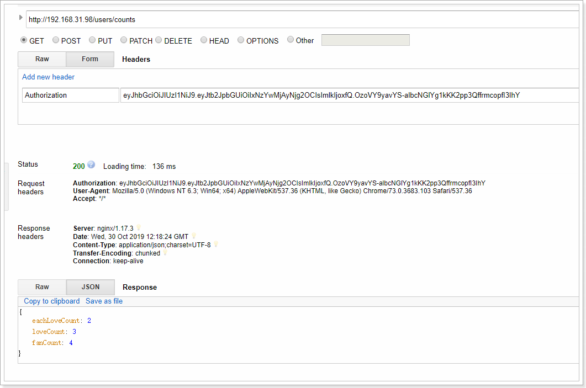

### 1.4 查询喜欢列表

#### 1.4.1 mock接口

该接口集成了4个接口，用type做了区分，如下：

 1 互相关注 2 我关注 3 粉丝 4 谁看过我

 

#### 1.4.2 UserLikeApi

在dubbo接口中定义方法：

~~~java
	/**
     * 查询相互喜欢列表
     *
     * @param userId
     * @param page
     * @param pageSize
     * @return
     */
    PageInfo<UserLike> queryEachLikeList(Long userId, Integer page, Integer pageSize);

    /**
     * 查询我喜欢的列表
     *
     * @param userId
     * @param page
     * @param pageSize
     * @return
     */
    PageInfo<UserLike> queryLikeList(Long userId, Integer page, Integer pageSize);

    /**
     * 查询粉丝列表
     *
     * @param userId
     * @param page
     * @param pageSize
     * @return
     */
    PageInfo<UserLike> queryFanList(Long userId, Integer page, Integer pageSize);
~~~

#### 1.4.3 UserLikeApiImpl

~~~java
@Override
    public PageInfo<UserLike> queryEachLikeList(Long userId, Integer page, Integer pageSize) {
        // 我喜欢的列表
        List<UserLike> userLikeList = this.mongoTemplate.find(Query.query(Criteria.where("userId").is(userId)), UserLike.class);

        // 获取到所有我喜欢的列表的用户id
        List<Long> likeUserIdList = new ArrayList<>();
        for (UserLike userLike : userLikeList) {
            likeUserIdList.add(userLike.getLikeUserId());
        }

        Query query = Query.query(Criteria.where("userId").in(likeUserIdList).and("likeUserId").is(userId));
        return this.queryList(query, page, pageSize);

    }

    @Override
    public PageInfo<UserLike> queryLikeList(Long userId, Integer page, Integer pageSize) {
        Query query = Query.query(Criteria.where("userId").is(userId));
        return this.queryList(query, page, pageSize);
    }

    @Override
    public PageInfo<UserLike> queryFanList(Long userId, Integer page, Integer pageSize) {
        return this.queryList(Query.query(Criteria.where("likeUserId").is(userId)), page, pageSize);
    }

    private PageInfo<UserLike> queryList(Query query, Integer page, Integer pageSize) {
        PageRequest pageRequest = PageRequest.of(page - 1, pageSize, Sort.by(Sort.Order.desc("created")));
        query.with(pageRequest);
        List<UserLike> userLikeList = this.mongoTemplate.find(query, UserLike.class);

        PageInfo<UserLike> pageInfo = new PageInfo<>();
        pageInfo.setRecords(userLikeList);
        pageInfo.setTotal(0);
        pageInfo.setPageSize(pageSize);
        pageInfo.setPageNum(page);
        return pageInfo;
    }
~~~

#### 1.4.4 VisitorsApi

~~~java
    /**
     * 按照时间倒序排序，查询最近的访客信息
     *
     * @param userId
     * @param page
     * @param pageSize
     * @return
     */
    List<Visitors> topVisitor(Long userId, Integer page, Integer pageSize);

~~~

#### 1.4.5 VisitorsApiImpl

~~~java
    @Override
    public List<Visitors> topVisitor(Long userId, Integer page, Integer pageSize) {
        Pageable pageable = PageRequest.of(page - 1, pageSize, Sort.by(Sort.Order.desc("date")));
        Query query = Query.query(Criteria.where("userId").is(userId)).with(pageable);
        return this.queryVisitorList(query);
    }
~~~

#### 1.4.6 UsersController

~~~java
	/**
     * 互相关注、我关注、粉丝、谁看过我 - 翻页列表
     *
     * @param type     1 互相关注 2 我关注 3 粉丝 4 谁看过我
     * @param page
     * @param pageSize
     * @param nickname
     * @return
     */
    @GetMapping("friends/{type}")
    public ResponseEntity<PageResult> queryLikeList(@PathVariable("type") String type,
                                                    @RequestParam(value = "page", defaultValue = "1") Integer page,
                                                    @RequestParam(value = "pagesize", defaultValue = "10") Integer pageSize,
                                                    @RequestParam(value = "nickname", required = false) String nickname) {
        try {
            page = Math.max(1, page);
            PageResult pageResult = this.usersService.queryLikeList(Integer.valueOf(type), page, pageSize, nickname);
            return ResponseEntity.ok(pageResult);
        } catch (Exception e) {
            e.printStackTrace();
        }
        return ResponseEntity.status(HttpStatus.INTERNAL_SERVER_ERROR).build();
    }
~~~

#### 1.4.7 UsersService

~~~java
public PageResult queryLikeList(Integer type, Integer page, Integer pageSize, String nickname) {
        User user = UserThreadLocal.get();
        PageResult pageResult = new PageResult();
        pageResult.setPagesize(pageSize);
        pageResult.setPage(page);
        pageResult.setPages(0);
        pageResult.setCounts(0);
        // type: 1 互相关注 2 我关注 3 粉丝 4 谁看过我

        List<Long> userIds = new ArrayList<>();
        switch (type) {
            case 1: {
                PageInfo<UserLike> pageInfo = this.userLikeApi.queryEachLikeList(user.getId(), page, pageSize);
                for (UserLike record : pageInfo.getRecords()) {
                    userIds.add(record.getUserId());
                }

                break;
            }
            case 2: {
                PageInfo<UserLike> pageInfo = this.userLikeApi.queryLikeList(user.getId(), page, pageSize);
                for (UserLike record : pageInfo.getRecords()) {
                    userIds.add(record.getLikeUserId());
                }

                break;
            }
            case 3: {
                PageInfo<UserLike> pageInfo = this.userLikeApi.queryFanList(user.getId(), page, pageSize);
                for (UserLike record : pageInfo.getRecords()) {
                    userIds.add(record.getUserId());
                }

                break;
            }
            case 4: {
                List<Visitors> visitors = this.visitorsApi.topVisitor(user.getId(), page, pageSize);
                for (Visitors visitor : visitors) {
                    userIds.add(visitor.getVisitorUserId());
                }
                //将当前时间写入到redis中，key："visitor_date_" + user.getId()
                String key = "visitor_date_" + user.getId();
                this.redisTemplate.opsForValue().set(key, String.valueOf(System.currentTimeMillis()));
                break;
            }
        }

        if (CollectionUtils.isEmpty(userIds)) {
            return pageResult;
        }

        QueryWrapper<UserInfo> queryWrapper = new QueryWrapper<>();
        queryWrapper.in("user_id", userIds);
    	if (StringUtils.isNotBlank(nickname)) {
            queryWrapper.like("nick_name", nickname);
        }
        List<UserInfo> userInfoList = this.userInfoService.queryList(queryWrapper);

        List<UserLikeListVo> userLikeListVos = new ArrayList<>();
        for (UserInfo userInfo : userInfoList) {
            UserLikeListVo userLikeListVo = new UserLikeListVo();
            userLikeListVo.setAge(userInfo.getAge());
            userLikeListVo.setAvatar(userInfo.getLogo());
            userLikeListVo.setCity(userInfo.getCity());
            userLikeListVo.setEducation(userInfo.getEdu());
            userLikeListVo.setGender(userInfo.getSex().name().toLowerCase());
            userLikeListVo.setId(userInfo.getUserId());
            userLikeListVo.setMarriage(StringUtils.equals(userInfo.getMarriage(), "已婚") ? 1 : 0);
            userLikeListVo.setNickname(userInfo.getNickName());

            Double score = this.recommendUserService.queryScore(user.getId(), userInfo.getUserId());
            if(score == 0){
                score = RandomUtils.nextDouble(30, 90);
            }
            userLikeListVo.setMatchRate(score.intValue());

            userLikeListVos.add(userLikeListVo);
        }

        pageResult.setItems(userLikeListVos);
        return pageResult;
    }
~~~

~~~java
package com.tanhua.server.vo;

import lombok.AllArgsConstructor;
import lombok.Data;
import lombok.NoArgsConstructor;

@Data
@NoArgsConstructor
@AllArgsConstructor
public class UserLikeListVo {

    private Long id;
    private String avatar;
    private String nickname;
    private String gender;
    private Integer age;
    private String city;
    private String education;
    private Integer marriage; //婚姻状态（0未婚，1已婚）
    private Integer matchRate; //匹配度

}

~~~

#### 1.4.8 测试

 

 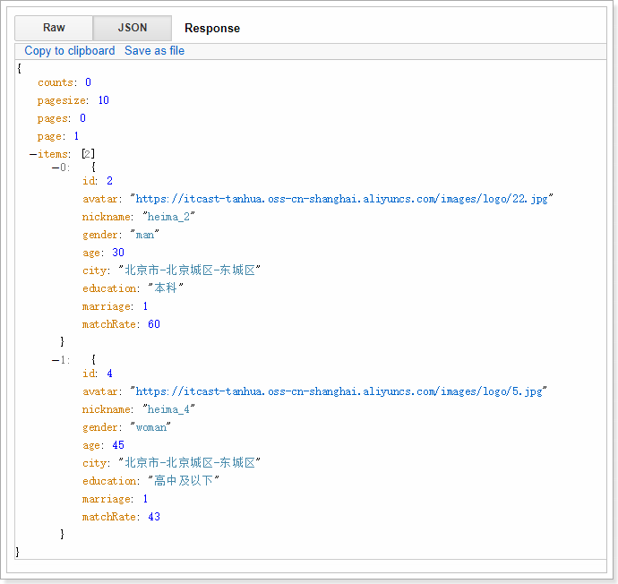

 

 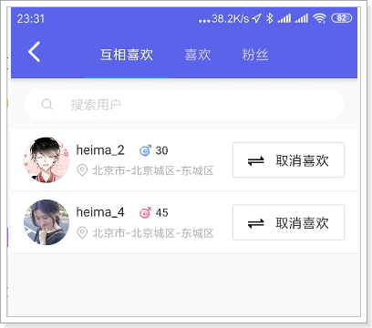

 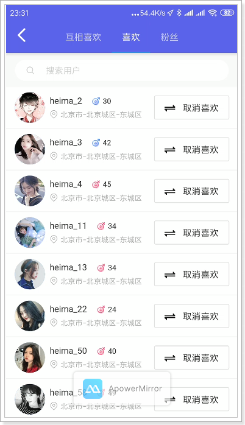

 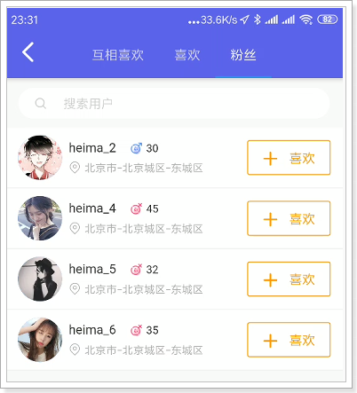

 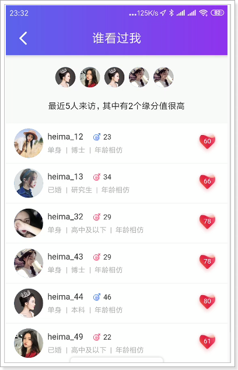

### 1.5 取消喜欢

在列表中可以进行“取消喜欢”操作。

#### 1.5.1 UsersController

~~~java
    /**
     * 取消喜欢
     *
     * @param userId
     * @return
     */
    @DeleteMapping("like/{uid}")
    public ResponseEntity<Void> disLike(@PathVariable("uid") Long userId) {
        try {
            this.usersService.disLike(userId);
            return ResponseEntity.ok(null);
        } catch (Exception e) {
            e.printStackTrace();
        }
        return ResponseEntity.status(HttpStatus.INTERNAL_SERVER_ERROR).build();
    }
~~~

#### 1.5.2 UsersService

~~~java
    public void disLike(Long userId) {
        User user = UserThreadLocal.get();
        this.userLikeApi.deleteUserLike(user.getId(), userId);
        
        //TODO 对方变成粉丝，解除好友关系（双向），以及解除环信中的好友关系
        //在代码中已经实现
    }
~~~

#### 1.5.3 测试
 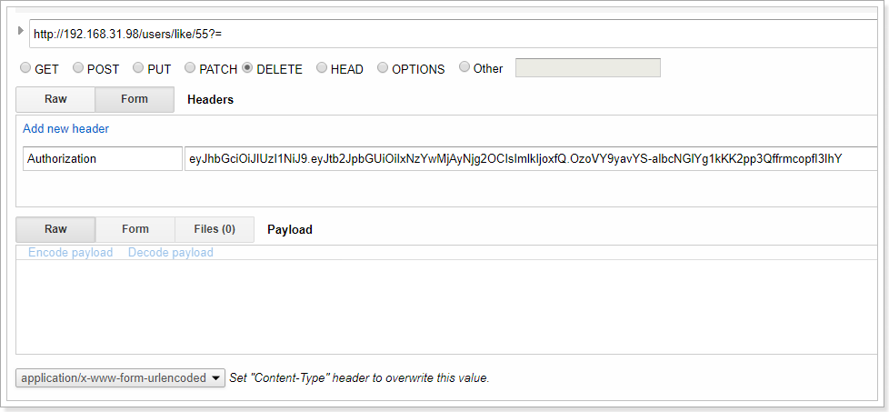

### 1.6 关注粉丝

#### 1.6.1 UsersController

~~~java
    /**
     * 关注粉丝
     *
     * @param userId
     * @return
     */
    @PostMapping("fans/{uid}")
    public ResponseEntity<Void> likeFan(@PathVariable("uid") Long userId){
        try {
            this.usersService.likeFan(userId);
            return ResponseEntity.ok(null);
        } catch (Exception e) {
            e.printStackTrace();
        }
        return ResponseEntity.status(HttpStatus.INTERNAL_SERVER_ERROR).build();
    }
~~~

#### 1.6.2 UsersService

~~~java
    public void likeFan(Long userId) {
        User user = UserThreadLocal.get();
        this.userLikeApi.saveUserLike(user.getId(), userId);
        //TODO 相互喜欢，成为好友，注册到环信
        //在代码中已经实现
    }
~~~

#### 1.6.3 测试

 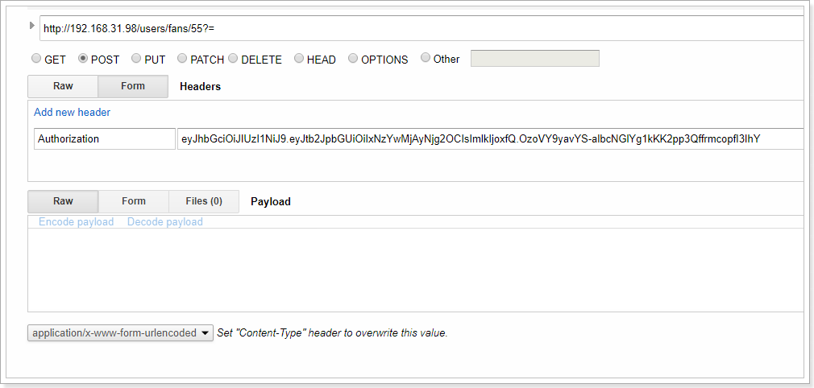

## 2. 用户通用设置

### 2.1 表结构

~~~sql
CREATE TABLE `tb_settings` (
  `id` bigint(20) NOT NULL AUTO_INCREMENT,
  `user_id` bigint(20) DEFAULT NULL,
  `like_notification` tinyint(4) DEFAULT '1' COMMENT '推送喜欢通知',
  `pinglun_notification` tinyint(4) DEFAULT '1' COMMENT '推送评论通知',
  `gonggao_notification` tinyint(4) DEFAULT '1' COMMENT '推送公告通知',
  `created` datetime DEFAULT NULL,
  `updated` datetime DEFAULT NULL,
  PRIMARY KEY (`id`)
) ENGINE=InnoDB DEFAULT CHARSET=utf8 COMMENT='设置表';
~~~

### 2.2 pojo

~~~java
package com.tanhua.server.pojo;

import lombok.AllArgsConstructor;
import lombok.Data;
import lombok.NoArgsConstructor;

@Data
@NoArgsConstructor
@AllArgsConstructor
public class Settings extends BasePojo {

    private Long id;
    private Long userId;
    private Boolean likeNotification = true;
    private Boolean pinglunNotification = true;
    private Boolean gonggaoNotification = true;

}
~~~

### 2.3 SettingsMapper

~~~java
package com.tanhua.server.mapper;

import com.baomidou.mybatisplus.core.mapper.BaseMapper;
import com.tanhua.server.pojo.Settings;

public interface SettingsMapper extends BaseMapper<Settings> {

}

~~~

### 2.4 SettingsService

~~~java
package com.tanhua.server.service;

import com.baomidou.mybatisplus.core.conditions.query.QueryWrapper;
import com.tanhua.server.mapper.SettingsMapper;
import com.tanhua.server.pojo.Settings;
import org.springframework.beans.factory.annotation.Autowired;
import org.springframework.stereotype.Service;

@Service
public class SettingsService {

    @Autowired
    private SettingsMapper settingsMapper;

    /**
     * 根据用户id查询配置
     * 
     * @param userId
     * @return
     */
    public Settings querySettings(Long userId) {
        QueryWrapper<Settings> queryWrapper = new QueryWrapper<>();
        queryWrapper.eq("user_id", userId);
        return this.settingsMapper.selectOne(queryWrapper);
    }
}

~~~

### 2.5 查询配置

#### 2.5.1 mock接口

 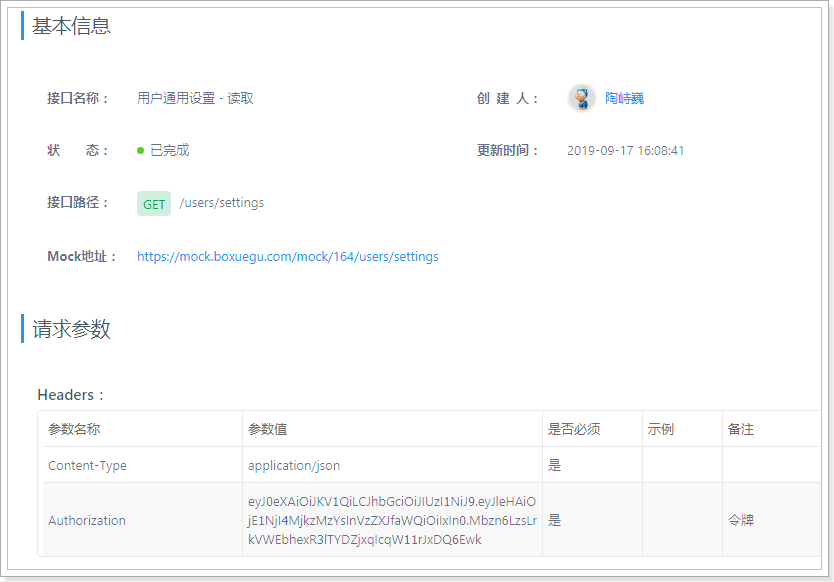

 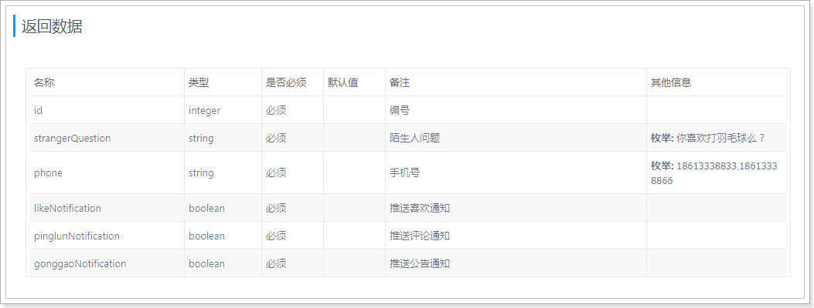

#### 2.5.2 UsersController

~~~java
    /**
     * 查询配置
     *
     * @return
     */
    @GetMapping("settings")
    public ResponseEntity<SettingsVo> querySettings() {
        try {
            SettingsVo settingsVo = this.usersService.querySettings();
            if (null != settingsVo) {
                return ResponseEntity.ok(settingsVo);
            }
        } catch (Exception e) {
            e.printStackTrace();
        }
        return ResponseEntity.status(HttpStatus.INTERNAL_SERVER_ERROR).build();
    }
~~~

~~~java
package com.tanhua.server.vo;

import lombok.AllArgsConstructor;
import lombok.Data;
import lombok.NoArgsConstructor;

@Data
@NoArgsConstructor
@AllArgsConstructor
public class SettingsVo {

    private Long id;
    private String strangerQuestion = "";
    private String phone;
    private Boolean likeNotification = true;
    private Boolean pinglunNotification = true;
    private Boolean gonggaoNotification = true;

}

~~~

#### 2.5.3 UsersService

~~~java
public SettingsVo querySettings() {
        User user = UserThreadLocal.get();

        // 查询配置
        Settings settings = this.settingsService.querySettings(user.getId());
        SettingsVo settingsVo = new SettingsVo();
        settingsVo.setId(user.getId());
        settingsVo.setPhone(user.getMobile());
        if (null != settings) {
            settingsVo.setGonggaoNotification(settings.getGonggaoNotification());
            settingsVo.setLikeNotification(settings.getLikeNotification());
            settingsVo.setPinglunNotification(settings.getPinglunNotification());
        }

        // 查询设置的问题
        Question question = this.questionService.queryQuestion(user.getId());
        if (null != question) {
            settingsVo.setStrangerQuestion(question.getTxt());
        }

        return settingsVo;
    }
~~~

#### 2.5.4 测试

 

 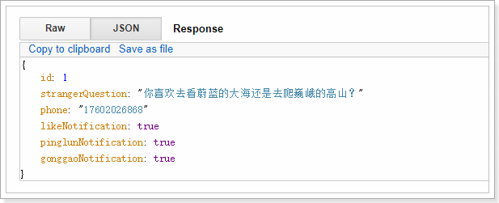

### 2.6 保存陌生人问题

#### 2.6.1 UsersController

~~~java
    /**
     * 设置陌生人问题
     *
     * @return
     */
    @PostMapping("questions")
    public ResponseEntity<Void> saveQuestions(@RequestBody Map<String, String> param) {
        try {
            String content = param.get("content");
            this.usersService.saveQuestions(content);
            return ResponseEntity.ok(null);
        } catch (Exception e) {
            e.printStackTrace();
        }
        return ResponseEntity.status(HttpStatus.INTERNAL_SERVER_ERROR).build();
    }
~~~

#### 2.6.2 UsersService

~~~java
    public void saveQuestions(String content) {
        User user = UserThreadLocal.get();
        this.questionService.save(user.getId(), content);
    }
~~~

#### 2.6.3 QuestionService

~~~java
    public void save(Long userId, String content) {
        Question question = this.queryQuestion(userId);
        if(null != question){
            question.setTxt(content);
            this.questionMapper.updateById(question);
        }else {
            question = new Question();
            question.setUserId(userId);
            question.setTxt(content);
            this.questionMapper.insert(question);
        }
    }
~~~

#### 2.6.4 自动填充

~~~java
package com.tanhua.server.handler;

import com.baomidou.mybatisplus.core.handlers.MetaObjectHandler;
import org.apache.ibatis.reflection.MetaObject;
import org.springframework.stereotype.Component;

import java.util.Date;

@Component
public class MyMetaObjectHandler implements MetaObjectHandler {

    @Override
    public void insertFill(MetaObject metaObject) {
        Object created = getFieldValByName("created", metaObject);
        if (null == created) {
            //字段为空，可以进行填充
            setFieldValByName("created", new Date(), metaObject);
        }

        Object updated = getFieldValByName("updated", metaObject);
        if (null == updated) {
            //字段为空，可以进行填充
            setFieldValByName("updated", new Date(), metaObject);
        }
    }

    @Override
    public void updateFill(MetaObject metaObject) {
        setFieldValByName("updated", new Date(), metaObject);
    }
}

~~~

### 2.7 黑名单列表

#### 2.7.1 表结构

~~~sql
CREATE TABLE `tb_black_list` (
  `id` bigint(20) NOT NULL AUTO_INCREMENT,
  `user_id` bigint(20) DEFAULT NULL,
  `black_user_id` bigint(20) DEFAULT NULL,
  `created` datetime DEFAULT NULL,
  `updated` datetime DEFAULT NULL,
  PRIMARY KEY (`id`),
  KEY `user_id` (`user_id`)
) ENGINE=InnoDB DEFAULT CHARSET=utf8 COMMENT='黑名单';

--测试数据
INSERT INTO `tb_black_list` (`id`, `user_id`, `black_user_id`, `created`, `updated`) VALUES ('1', '1', '22', '2019-11-01 15:47:22', '2019-11-01 15:47:24');
INSERT INTO `tb_black_list` (`id`, `user_id`, `black_user_id`, `created`, `updated`) VALUES ('2', '1', '23', '2019-11-01 15:47:39', '2019-11-01 15:47:42');
INSERT INTO `tb_black_list` (`id`, `user_id`, `black_user_id`, `created`, `updated`) VALUES ('3', '1', '24', '2019-11-01 15:47:51', '2019-11-01 15:47:56');

~~~

#### 2.7.2 pojo

~~~java
package com.tanhua.server.pojo;

import lombok.AllArgsConstructor;
import lombok.Data;
import lombok.NoArgsConstructor;

@Data
@NoArgsConstructor
@AllArgsConstructor
public class BlackList extends BasePojo {

    private Long id;
    private Long userId;
    private Long blackUserId;
}

~~~

#### 2.7.3 BlackListMapper

~~~java
package com.tanhua.server.mapper;

import com.baomidou.mybatisplus.core.mapper.BaseMapper;
import com.tanhua.server.pojo.BlackList;

public interface BlackListMapper extends BaseMapper<BlackList> {
}

~~~

#### 2.7.4 BlackListService

~~~java
package com.tanhua.server.service;

import com.baomidou.mybatisplus.core.conditions.query.QueryWrapper;
import com.baomidou.mybatisplus.core.metadata.IPage;
import com.baomidou.mybatisplus.extension.plugins.pagination.Page;
import com.tanhua.server.mapper.BlackListMapper;
import com.tanhua.server.pojo.BlackList;
import org.springframework.beans.factory.annotation.Autowired;
import org.springframework.stereotype.Service;

@Service
public class BlackListService {

    @Autowired
    private BlackListMapper blackListMapper;

    public IPage<BlackList> queryBlacklist(Long userId, Integer page, Integer pageSize) {
        QueryWrapper<BlackList> wrapper = new QueryWrapper<BlackList>();
        wrapper.eq("user_id", userId);
        wrapper.orderByDesc("created");
        Page<BlackList> pager = new Page<>(page, pageSize);
        return this.blackListMapper.selectPage(pager, wrapper);
    }
}

~~~

配置分页插件：

~~~java
package com.tanhua.server.config;

import com.baomidou.mybatisplus.extension.plugins.PaginationInterceptor;
import org.springframework.context.annotation.Bean;
import org.springframework.context.annotation.Configuration;

@Configuration
public class MybatisPlusConfig {
    /**
     * 分页插件
     */
    @Bean
    public PaginationInterceptor paginationInterceptor() {
        return new PaginationInterceptor();
    }
}
~~~

#### 2.7.5 mock接口

 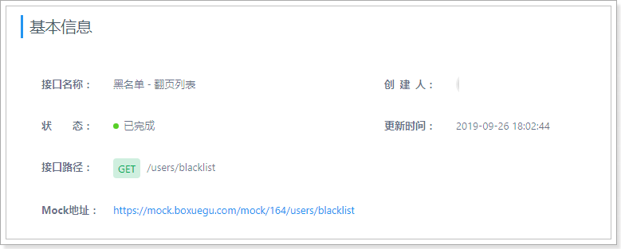

 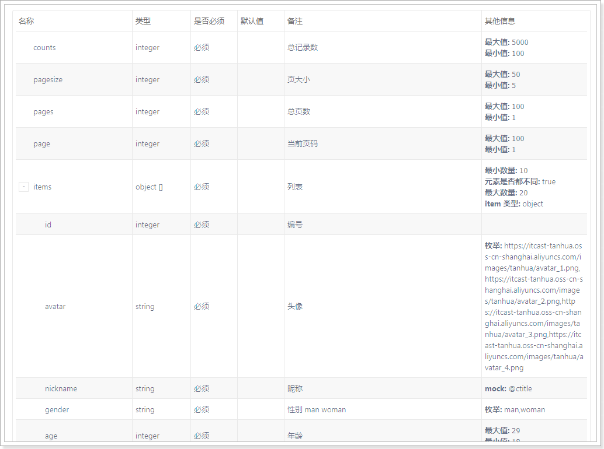

#### 2.7.6 UsersController

~~~java
/**
     * 查询黑名单
     *
     * @param page
     * @param pagesize
     * @return
     */
    @GetMapping("blacklist")
    public ResponseEntity<PageResult> queryBlacklist(@RequestParam(value = "page", defaultValue = "1") Integer page,
                                                                @RequestParam(value = "pagesize", defaultValue = "10") Integer pagesize) {
        try {
            PageResult pageResult = this.usersService.queryBlacklist(page, pagesize);
            return ResponseEntity.ok(pageResult);
        } catch (Exception e) {
            e.printStackTrace();
        }
        return ResponseEntity.status(HttpStatus.INTERNAL_SERVER_ERROR).build();
    }
~~~

~~~java
package com.tanhua.server.vo;

import lombok.AllArgsConstructor;
import lombok.Data;
import lombok.NoArgsConstructor;

@Data
@AllArgsConstructor
@NoArgsConstructor
public class BlackListVo {

    private Long id;
    private String avatar;
    private String nickname;
    private String gender;
    private Integer age;

}

~~~

#### 2.7.7 UsersService

~~~java
	public PageResult queryBlacklist(Integer page, Integer pageSize) {
        User user = UserThreadLocal.get();

        IPage<BlackList> blackListIPage = this.blackListService.queryBlacklist(user.getId(), page, pageSize);

        PageResult pageResult = new PageResult();
        pageResult.setPage(page);
        pageResult.setPagesize(pageSize);
        pageResult.setCounts(new Long(blackListIPage.getTotal()).intValue());
        pageResult.setPages(new Long(blackListIPage.getPages()).intValue());

        List<BlackList> records = blackListIPage.getRecords();
        if(CollectionUtils.isEmpty(records)){
            return pageResult;
        }

        List<Long> userIds = new ArrayList<>();
        for (BlackList record : records) {
            userIds.add(record.getBlackUserId());
        }

        QueryWrapper<UserInfo> queryWrapper = new QueryWrapper<>();
        queryWrapper.in("user_id", userIds);
        List<UserInfo> userInfoList = this.userInfoService.queryList(queryWrapper);

        List<BlackListVo> blackListVos = new ArrayList<>();
        for (UserInfo userInfo : userInfoList) {
            BlackListVo blackListVo = new BlackListVo();
            blackListVo.setAge(userInfo.getAge());
            blackListVo.setAvatar(userInfo.getLogo());
            blackListVo.setGender(userInfo.getSex().name().toLowerCase());
            blackListVo.setId(userInfo.getUserId());
            blackListVo.setNickname(userInfo.getNickName());

            blackListVos.add(blackListVo);
        }

        pageResult.setItems(blackListVos);

        return pageResult;
    }
~~~

#### 2.7.8 测试

 

 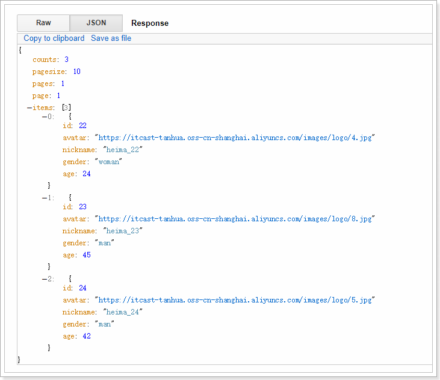

 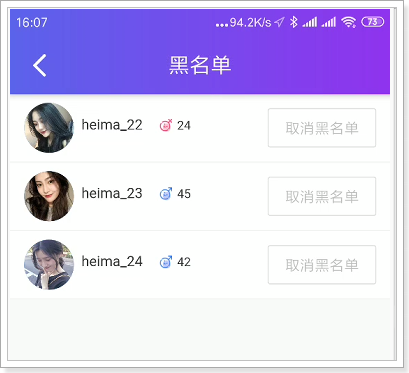

### 2.8 移除黑名单

#### 2.8.1 UsersController

~~~java
    /**
     * 移除黑名单
     *
     * @return
     */
    @DeleteMapping("blacklist/{uid}")
    public ResponseEntity<Void> delBlacklist(@PathVariable("uid") Long userId) {
        try {
            this.usersService.delBlacklist(userId);
            return ResponseEntity.ok(null);
        } catch (Exception e) {
            e.printStackTrace();
        }
        return ResponseEntity.status(HttpStatus.INTERNAL_SERVER_ERROR).build();
    }
~~~

#### 2.8.2 UsersService

~~~java
    public void delBlacklist(Long userId) {
        User user = UserThreadLocal.get();
        this.blackListService.delBlacklist(user.getId(), userId);
    }
~~~

#### 2.8.3 BlackListService

~~~java
    public Boolean delBlacklist(Long userId, Long blackUserId) {
        QueryWrapper<BlackList> wrapper = new QueryWrapper<BlackList>();
        wrapper.eq("user_id", userId).eq("black_user_id", blackUserId);
        return this.blackListMapper.delete(wrapper) > 0;
    }
~~~

### 2.9 更新通知

#### 2.9.1 mock接口

 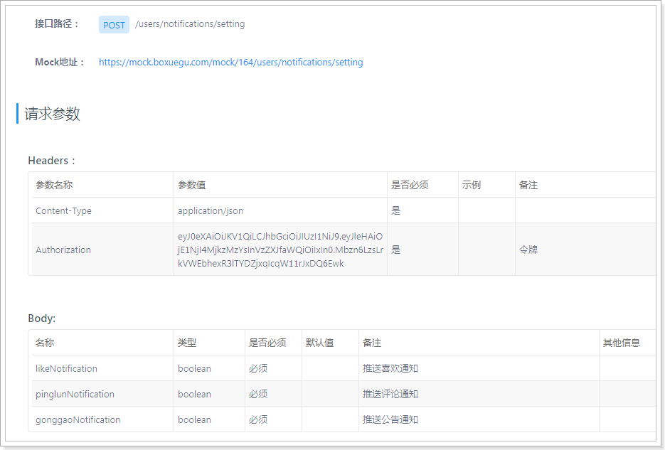

#### 2.9.2 UsersController

~~~java
    /**
     * 更新通知设置
     *
     * @param param
     * @return
     */
    @PostMapping("notifications/setting")
    public ResponseEntity<Void> updateNotification(@RequestBody Map<String, Boolean> param) {
        try {
            Boolean likeNotification = param.get("likeNotification");
            Boolean pinglunNotification = param.get("pinglunNotification");
            Boolean gonggaoNotification = param.get("gonggaoNotification");

            this.usersService.updateNotification(likeNotification, pinglunNotification, gonggaoNotification);
            return ResponseEntity.ok(null);
        } catch (Exception e) {
            e.printStackTrace();
        }
        return ResponseEntity.status(HttpStatus.INTERNAL_SERVER_ERROR).build();
    }
~~~

#### 2.9.3 UsersService

~~~java
    public void updateNotification(Boolean likeNotification, Boolean pinglunNotification, Boolean gonggaoNotification) {
        User user = UserThreadLocal.get();
        this.settingsService.updateNotification(user.getId(), likeNotification, pinglunNotification, gonggaoNotification);
    }
~~~

#### 2.9.4 SettingsService

~~~java
    public void updateNotification(Long userId, Boolean likeNotification, Boolean pinglunNotification, Boolean gonggaoNotification) {
        QueryWrapper<Settings> queryWrapper = new QueryWrapper<>();
        queryWrapper.eq("user_id", userId);

        Settings settings = this.settingsMapper.selectOne(queryWrapper);
        if(null == settings){
            //如果没有数据的话，插入一条数据
            settings = new Settings();
            settings.setUserId(userId);
            this.settingsMapper.insert(settings);
        }else{
            //更新
            settings.setLikeNotification(likeNotification);
            settings.setPinglunNotification(pinglunNotification);
            settings.setGonggaoNotification(gonggaoNotification);
            this.settingsMapper.update(settings, queryWrapper);
        }
    }
~~~

### 2.10 更新手机号

更新手机号的逻辑在sso系统中完成。

配置nginx：

~~~shell
location /users/phone {
	client_max_body_size  300m;
	proxy_connect_timeout 300s;
	proxy_send_timeout 300s;
	proxy_read_timeout 300s;
	proxy_pass   http://127.0.0.1:18080;
}
~~~

#### 2.10.1 发送短信验证码

mock接口：

UsersController:

~~~~java
    /**
     * 发送短信验证码
     *
     * @return
     */
    @PostMapping("phone/sendVerificationCode")
    public ResponseEntity<Void> sendVerificationCode(@RequestHeader("Authorization") String token) {
        try {
            boolean bool = this.usersService.sendVerificationCode(token);
            if (bool) {
                return ResponseEntity.ok(null);
            }
        } catch (Exception e) {
            e.printStackTrace();
        }
        return ResponseEntity.status(HttpStatus.INTERNAL_SERVER_ERROR).build();
    }
~~~~

UsersService:

~~~java
    public boolean sendVerificationCode(String token) {
        User user = this.userService.queryUserByToken(token);
        Map<String, Object> sendCheckCode = this.smsService.sendCheckCode(user.getMobile());
        int code = ((Integer) sendCheckCode.get("code")).intValue();
        return code == 3;
    }
~~~

#### 2.10.2  校验验证码

mock接口：

 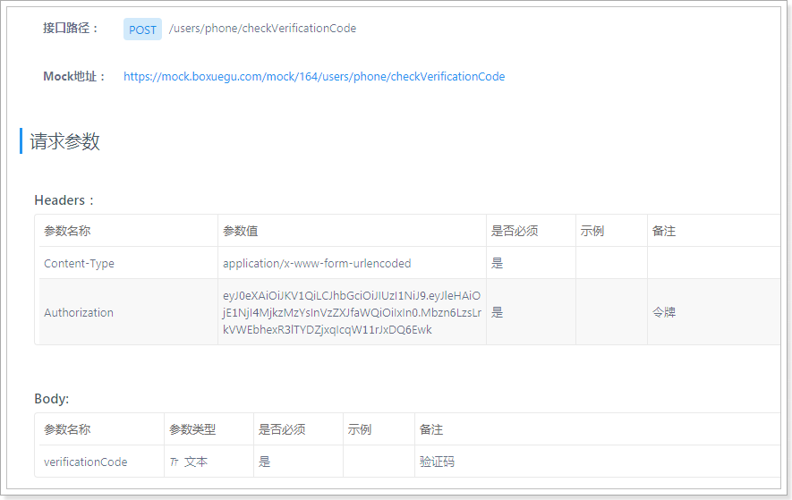

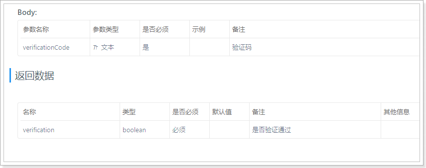

UsersController：

~~~java
/**
     * 校验验证码
     *
     * @param param
     * @param token
     * @return
     */
    @PostMapping("phone/checkVerificationCode")
    public ResponseEntity<Map<String, Object>> checkVerificationCode(@RequestBody Map<String, String> param, @RequestHeader("Authorization") String token) {
        try {
            String code = param.get("verificationCode");
            Boolean bool = this.usersService.checkVerificationCode(code, token);
            Map<String, Object> result = new HashMap<>();
            result.put("verification", bool);
            return ResponseEntity.ok(result);
        } catch (Exception e) {
            e.printStackTrace();
        }
        return ResponseEntity.status(HttpStatus.INTERNAL_SERVER_ERROR).build();
    }
~~~

UsersService：

~~~java
public Boolean checkVerificationCode(String code, String token) {
        //查询到用户的手机号
        User user = this.userService.queryUserByToken(token);
        if (null == user) {
            return false;
        }

        String redisKey = SmsService.REDIS_KEY_PREFIX + user.getMobile();
        String value = this.redisTemplate.opsForValue().get(redisKey);

        if(StringUtils.equals(value, code)){
            //验证码正确
            this.redisTemplate.delete(redisKey);
            return true;
        }

        return false;
    }
~~~

#### 2.10.3 保存新手机号

mock接口：

 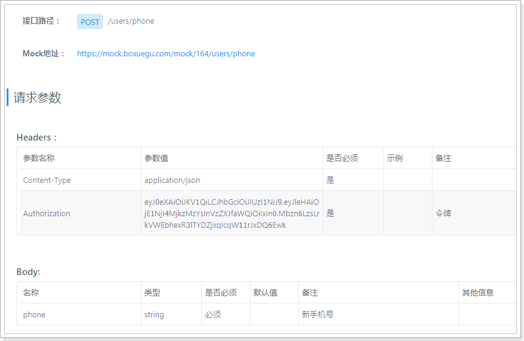

UsersController：

~~~java
/**
     * 保存新手机号
     *
     * @return
     */
    @PostMapping("phone")
    public ResponseEntity<Void> savePhone(@RequestBody Map<String, String> param, @RequestHeader("Authorization") String token) {
        try {
            String newPhone = param.get("phone");
            boolean bool = this.usersService.savePhone(token, newPhone);
            if (bool) {
                return ResponseEntity.ok(null);
            }
        } catch (Exception e) {
            e.printStackTrace();
        }
        return ResponseEntity.status(HttpStatus.INTERNAL_SERVER_ERROR).build();
    }
~~~

UsersService：

~~~java
    public boolean savePhone(String token, String newPhone) {
        User user = this.userService.queryUserByToken(token);
        return this.userService.updatePhone(user.getId(), newPhone);
    }
~~~

UserService：

~~~java
public boolean updatePhone(Long id, String newPhone) {
        QueryWrapper<User> queryWrapper = new QueryWrapper<>();
        queryWrapper.eq("mobile", newPhone);
        User user = this.userMapper.selectOne(queryWrapper);
        if (user != null) {
            // 改手机号已经存在
            return false;
        }
        user = new User();
        user.setId(id);
        user.setMobile(newPhone);
        return this.userMapper.updateById(user) > 0;
    }
~~~

## 3. CDN

### 3.1 什么是CDN？

内容分发网络（Content Delivery Network，简称CDN）将您源站资源缓存至遍布全球的加速节点上。当终端用户请求访问和获取这些资源时，无需回源，系统将就近调用CDN节点上已经缓存的资源。

在不同区域、不同场景下使用CDN加速您网站内容的分发，将有效分担源站压力，避免网络拥塞，提升用户访问资源的速度和体验。

CDN有很多的服务厂商提供服务，如：阿里云、腾讯等。

阿里云： https://www.aliyun.com/product/cdn 

### 3.2 原理

假设您的源站域名为 www.a.com。接入 CDN 开始使用加速服务后，当您的终端用户（北京）发起 HTTP 请求时，实际的处理流程如下：

 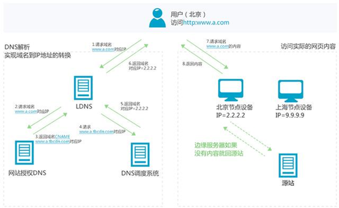 

终端用户（北京） 向 www.a.com下的某资源发起请求，会先向 LDNS 发起域名解析请求。

当 LDNS 解析 www.a.com 时，会发现已经配置了 CNAME www.a.tbcdn.com。

解析请求会发送至DNS调度系统，并为请求分配最佳节点 IP。

LDNS 获取 DNS 返回的解析 IP。

用户获取解析 IP。

用户向获取的 IP 发起对该资源的访问请求。

若该 IP 对应的节点已经缓存了该资源，则会将数据直接返回给用户（如图中步骤7、8），此时请求结束。

若该节点未缓存该资源，则节点会向业务源站发起对该资源的请求。获取资源后，结合用户自定义配置的缓存策略，将资源缓存至节点（如图：北京节点），并返回给用户，此时请求结束。

### 3.3 项目应用

- 图片文件缓存到cdn
- 小视频文件缓存到cdn
- 静态文件缓存到cdn