## 课程说明

- 实现用户管理功能
- 华为内容审核
- 动态消息处理
- 人工审核
- 消息详情

## 1. 用户管理

### 1.1 用于列表

#### 1.1.1 接口

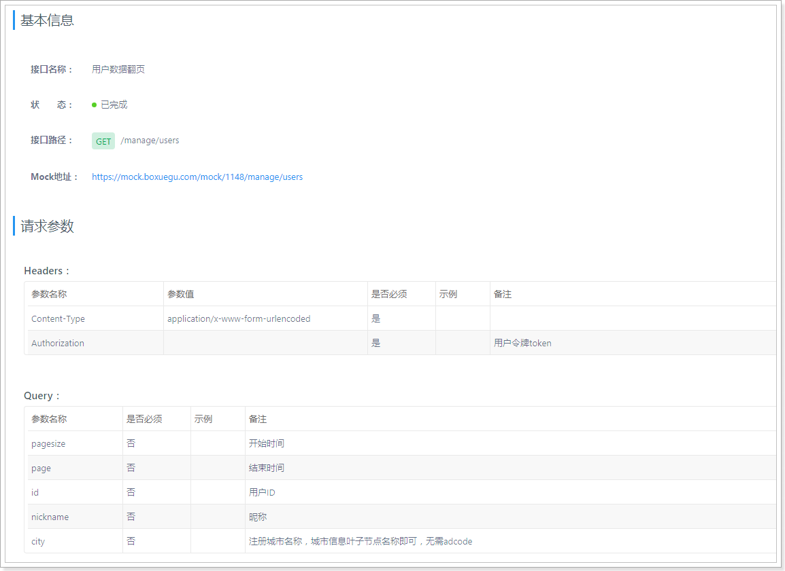

返回数据：

| counts         | integer   | 必须 |      | 总记录数                                           | **最大值:** 5000**最小值:** 100                              |
| -------------- | --------- | ---- | ---- | -------------------------------------------------- | ------------------------------------------------------------ |
| pagesize       | integer   | 必须 |      | 页大小                                             | **最大值:** 50**最小值:** 5                                  |
| pages          | integer   | 必须 |      | 总页数                                             | **最大值:** 100**最小值:** 1                                 |
| page           | integer   | 必须 |      | 当前页码                                           | **最大值:** 100**最小值:** 1                                 |
| items          | object [] | 必须 |      | 列表                                               | **最小数量:** 10**元素是否都不同:** true**最大数量:** 10**item 类型:** object |
| id             | integer   | 必须 |      | 用户id                                             | **最大值:** 9010000**最小值:** 9000001                       |
| logo           | string    | 必须 |      | 头像                                               | **枚举:** https://yjy-oss-files.oss-cn-zhangjiakou.aliyuncs.com/tanhua/header-01.png,https://yjy-oss-files.oss-cn-zhangjiakou.aliyuncs.com/tanhua/header-02.png,https://yjy-oss-files.oss-cn-zhangjiakou.aliyuncs.com/tanhua/header-03.png,https://yjy-oss-files.oss-cn-zhangjiakou.aliyuncs.com/tanhua/header-04.png,https://yjy-oss-files.oss-cn-zhangjiakou.aliyuncs.com/tanhua/header-05.png,https://yjy-oss-files.oss-cn-zhangjiakou.aliyuncs.com/tanhua/header-06.png,https://yjy-oss-files.oss-cn-zhangjiakou.aliyuncs.com/tanhua/header-07.png,https://yjy-oss-files.oss-cn-zhangjiakou.aliyuncs.com/tanhua/header-08.png,https://yjy-oss-files.oss-cn-zhangjiakou.aliyuncs.com/tanhua/header-09.png,https://yjy-oss-files.oss-cn-zhangjiakou.aliyuncs.com/tanhua/header-10.png,https://yjy-oss-files.oss-cn-zhangjiakou.aliyuncs.com/tanhua/header-11.png,https://yjy-oss-files.oss-cn-zhangjiakou.aliyuncs.com/tanhua/header-12.png |
| logoStatus     | string    | 必须 |      | 头像状态 ,1通过，2拒绝                             | **枚举:** 1,2                                                |
| nickname       | string    | 必须 |      | 昵称                                               | **format:** ctitle**mock:** @cname                           |
| mobile         | string    | 必须 |      | 手机号，即用户账号                                 | **format:** ctitle                                           |
| sex            | string    | 必须 |      | 性别                                               | **枚举:** 男,女,未知**format:** ctitle                       |
| age            | integer   | 必须 |      | 年龄                                               | **最大值:** 90**最小值:** 20                                 |
| occupation     | string    | 必须 |      | 职业,暂无该字段                                    | **format:** ctitle**mock:** @ctitle                          |
| userStatus     | string    | 必须 |      | 用户状态,1为正常，2为冻结                          | **枚举:** 1,2**format:** ctitle                              |
| lastActiveTime | integer   | 必须 |      | 最近活跃时间                                       | **枚举:** 1598608534811                                      |
| city           | string    | 必须 |      | 注册城市名称，城市信息叶子节点名称即可，无需adcode | **format:** ctitle**mock:** @city                            |

#### 1.1.2 分页插件

```java
package com.tanhua.manage.config;

import com.baomidou.mybatisplus.extension.plugins.PaginationInterceptor;
import org.springframework.context.annotation.Bean;
import org.springframework.context.annotation.Configuration;

@Configuration
public class MybatisPlusConfig {
    /**
     * 启用分页插件
     * @return
     */
    @Bean
    public PaginationInterceptor paginationInterceptor(){
        return new PaginationInterceptor();
    }
}
```

#### 1.1.3 vo对象

```java
package com.tanhua.manage.vo;

import com.baomidou.mybatisplus.core.metadata.IPage;
import lombok.Data;

import java.io.Serializable;
import java.util.List;

@Data
public class Pager<T> implements Serializable {
    /**
     * 总条数
     */
    private long counts;
    /**
     * 每页条数
     */
    private long pageSize;
    /**
     * 总页数
     */
    private long pages;
    /**
     * 当前页数
     */
    private long page;

    /**
     * 当前页数据
     */
    private List<T> items;

    /**
     * 状态合计
     */
    private List<TotalVo> totals;

    public Pager(IPage page) {
        this.pageSize = page.getSize();
        this.counts = page.getTotal();
        this.page = page.getCurrent();
        this.pages = page.getPages();
        this.items = page.getRecords();
    }

    public Pager() {
    }

    public Pager(long counts, long pageSize, long pages, long page, List<T> items) {
        this.counts = counts;
        this.pageSize = pageSize;
        this.pages = pages;
        this.page = page;
        this.items = items;
    }

    public Pager(long counts, long pageSize, long pages, long page, List<T> items, List<TotalVo> totals) {
        this.counts = counts;
        this.pageSize = pageSize;
        this.pages = pages;
        this.page = page;
        this.items = items;
        this.totals = totals;
    }
}
```
~~~java
package com.tanhua.manage.vo;

import lombok.AllArgsConstructor;
import lombok.Data;
import lombok.NoArgsConstructor;

@Data
@AllArgsConstructor
@NoArgsConstructor
public class TotalVo {
    /**
     * 状态标题
     */
    private String title;
    /**
     * 状态代码
     */
    private String code;
    /**
     * 数量
     */
    private Long value;
}

~~~

```java
package com.tanhua.manage.vo;

import lombok.Data;

@Data
public class UserVo {
    /**
     * 用户id
     */
    private Long id;
    /**
     * 手机号
     */
    private String mobile;
    /**
     * 账号状态
     */
    private String userStatus;
    /**
     * 昵称
     */
    private String nickname;
    /**
     * 用户头像
     */
    private String logo;
    /**
     * 用户标签
     */
    private String tags;
    /**
     * 用户性别
     */
    private String sex;
    /**
     * 学历
     */
    private String edu;
    /**
     * 所在城市
     */
    private String city;
    /**
     * 生日
     */
    private String birthday;
    /**
     * 封面图片
     */
    private String coverPic;
    /**
     * 行业
     */
    private String industry;
    /**
     * 收入
     */
    private String income;
    /**
     * 婚姻状况
     */
    private String marriage;
    /**
     * 注册时间
     */
    private Long created;
    /**
     * 被喜欢人数
     */
    private Long countBeLiked;
    /**
     * 喜欢人数
     */
    private Long countLiked;
    /**
     * 配对人数
     */
    private Long countMatching;
    /**
     * 最近活跃时间
     */
    private Long lastActiveTime;
    /**
     * 最近登录地
     */
    private String lastLoginLocation;
    /**
     * 个性签名
     */
    private String personalSignature;
    /**
     * 年龄
     */
    private Integer age;
}
```

#### 1.1.4 UsersController

```java
package com.tanhua.manage.controller;

import com.tanhua.manage.service.UserService;
import com.tanhua.manage.vo.Pager;
import com.tanhua.manage.vo.UserVo;
import org.springframework.beans.factory.annotation.Autowired;
import org.springframework.web.bind.annotation.GetMapping;
import org.springframework.web.bind.annotation.RequestMapping;
import org.springframework.web.bind.annotation.RequestParam;
import org.springframework.web.bind.annotation.RestController;

@RestController
@RequestMapping("/manage/users")
public class UsersController {

    @Autowired
    private UserService userService;


    /**
     * 用户数据翻页
     */
    @GetMapping
    public Pager<UserVo> queryByPage(@RequestParam(name = "page", defaultValue = "1") Integer page,
                                    @RequestParam(name = "pagesize", defaultValue = "10") Integer pageSize,
                                    @RequestParam(name = "id", required = false) Long id,
                                    @RequestParam(name = "nickname", required = false) String nickname,
                                    @RequestParam(name = "city", required = false) String city) {
        return this.userService.queryByPage(page, pageSize, id, nickname, city);
    }
}
```

#### 1.1.5 UserService

```java
package com.tanhua.manage.service;

import com.baomidou.mybatisplus.core.metadata.IPage;
import com.baomidou.mybatisplus.extension.plugins.pagination.Page;
import com.baomidou.mybatisplus.extension.service.impl.ServiceImpl;
import com.tanhua.manage.enums.SexEnum;
import com.tanhua.manage.mapper.UserMapper;
import com.tanhua.manage.pojo.User;
import com.tanhua.manage.vo.Pager;
import com.tanhua.manage.vo.UserVo;
import lombok.extern.slf4j.Slf4j;
import org.springframework.beans.factory.annotation.Autowired;
import org.springframework.stereotype.Service;

import java.util.stream.Collectors;

@Service
@Slf4j
public class UserService extends ServiceImpl<UserMapper, User> {

    @Autowired
    private UserMapper userMapper;

    @Autowired
    private UserFreezeService userFreezeService;

    /**
     * 根据条件获取用户分页数据
     *
     * @param page     当前页码
     * @param pageSize 页尺寸
     * @param id       用户id
     * @param nickname 昵称
     * @param city     居住城市
     * @return 用户分页数据
     */
    public Pager<UserVo> queryByPage(Integer page, Integer pageSize, Long id, String nickname, String city) {
        IPage<UserVo> pageData = this.userMapper.queryByPage(new Page<>(page, pageSize), id == null ? null : String.valueOf(id), nickname, city);

        //处理性别名称的问题
        pageData.getRecords().forEach(userVo -> {
            userVo.setSex(SexEnum.getSexByValue(Integer.valueOf(userVo.getSex())));
            //查询用户状态
            userVo.setUserStatus(this.userFreezeService.getFreezeStatusByUserId(userVo.getId()) ? "2" : "1");
        });

        return new Pager<>(pageData);
    }
}
```

~~~java
package com.tanhua.manage.service;

@Service
@Slf4j
public class UserFreezeService extends ServiceImpl<UserFreezeMapper, UserFreeze> {

    private static final String CACHE_KEY_FREEZE_PREFIX = "FREEZE_";

    @Autowired
    private RedisTemplate<String, String> redisTemplate;

    /**
     * 获取用户冻结状态
     */
    public Boolean getFreezeStatusByUserId(Long userId) {
        String cacheKey = CACHE_KEY_FREEZE_PREFIX + userId;
        return redisTemplate.hasKey(cacheKey);
    }

}

~~~

#### 1.1.6 UserMapper

```java
package com.tanhua.manage.mapper;

import com.baomidou.mybatisplus.core.mapper.BaseMapper;
import com.baomidou.mybatisplus.core.metadata.IPage;
import com.baomidou.mybatisplus.extension.plugins.pagination.Page;
import com.tanhua.manage.pojo.User;
import com.tanhua.manage.vo.UserVo;
import org.apache.ibatis.annotations.Mapper;

@Mapper
public interface UserMapper extends BaseMapper<User> {

    IPage<UserVo> queryByPage(Page<UserVo> userPage, String id, String nickname, String city);

}
```

UserMapper.xml：

~~~xml
<?xml version="1.0" encoding="UTF-8"?>
<!DOCTYPE mapper PUBLIC "-//mybatis.org//DTD Mapper 3.0//EN" "http://mybatis.org/dtd/mybatis-3-mapper.dtd">
<mapper namespace="com.tanhua.manage.mapper.UserMapper">

    <select id="queryByPage" resultType="com.tanhua.manage.vo.UserVo">
		SELECT
			tu.id,
			tu.mobile,
			tui.nick_name,
			tui.logo,
			tui.tags,
			tui.sex,
			tui.edu,
			tui.city,
			tui.birthday,
			tui.cover_pic,
			tui.industry,
			tui.income,
			tui.marriage,
            UNIX_TIMESTAMP(mtl.created) * 1000 AS last_active_time
		FROM
			tb_user tu
		LEFT JOIN tb_user_info tui ON tu.id = tui.user_id
		LEFT JOIN (
			SELECT
				MAX(tl.log_time) AS log_time,
				user_id,
				created
			FROM
				tb_log tl
			GROUP BY
				tl.user_id
		) AS mtl ON tu.id = mtl.user_id
		<where>
			<if test="id != null">
			    AND CAST(tu.id as CHAR) LIKE "%"#{id}"%"
			</if>
			<if test="nickname !=null and nickname != ''">
			    AND tui.nick_name LIKE "%"#{nickname}"%"
			</if>
			<if test="city !=null and city != ''">
			    AND tui.city LIKE #{city}"%"
			</if>
		</where>
		ORDER BY
			mtl.log_time DESC
	</select>

</mapper>

~~~

#### 1.1.7 测试用例

```java
package com.tanhua.manage.service;

import com.tanhua.manage.vo.Pager;
import com.tanhua.manage.vo.UserVo;
import org.junit.Test;
import org.junit.runner.RunWith;
import org.springframework.beans.factory.annotation.Autowired;
import org.springframework.boot.test.context.SpringBootTest;
import org.springframework.test.context.junit4.SpringRunner;

@SpringBootTest
@RunWith(SpringRunner.class)
public class TestUserService {

    @Autowired
    private UserService userService;

    @Test
    public void testQueryByPage(){
        Pager<UserVo> pager = this.userService.queryByPage(1, 10, null, null, null);
        pager.getItems().forEach(userVo -> System.out.println(userVo));
    }
}
```

#### 1.1.8 整合测试

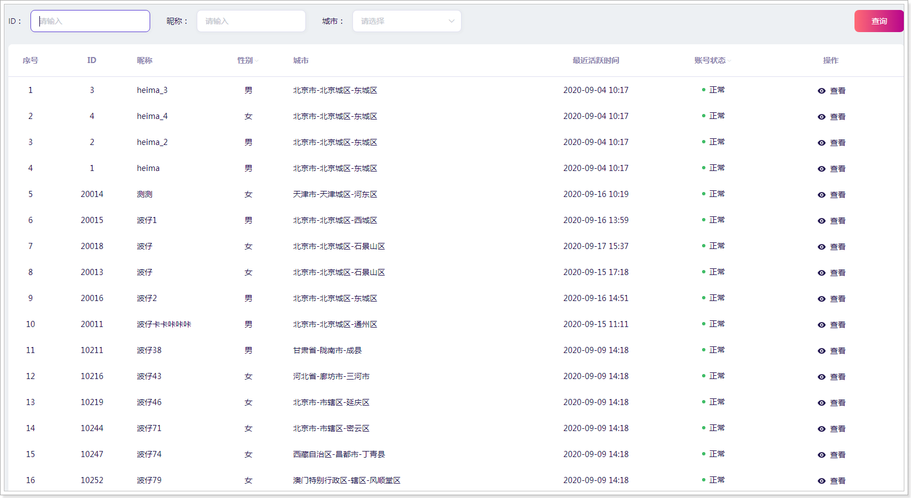

### 1.2 用户基本资料

#### 1.2.1 接口

 

返回的数据：

| 名称              | 类型    | 是否必须 | 默认值 | 备注                       | 其他信息                                                     |
| :---------------- | :------ | :------- | :----- | :------------------------- | :----------------------------------------------------------- |
| id                | integer | 必须     |        | 用户ID                     | **最大值:** 9010000**最小值:** 9000001                       |
| nickname          | string  | 必须     |        | 昵称                       | **format:** ctitle**mock:** @cname                           |
| mobile            | string  | 必须     |        | 手机号，即用户账号         | **最大长度:** 11**最小长度:** 11**mock:** @integer           |
| sex               | string  | 必须     |        | 性别                       | **枚举:** 男,女,未知**format:** ctitle                       |
| personalSignature | string  | 必须     |        | 个性签名                   | **format:** ctitle**mock:** @ctitle                          |
| age               | integer | 必须     |        | 年龄                       | **最大值:** 80**最小值:** 20                                 |
| countBeLiked      | integer | 必须     |        | 被喜欢人数                 | **最大值:** 500**最小值:** 0                                 |
| countLiked        | integer | 必须     |        | 喜欢人数                   | **最大值:** 500**最小值:** 0                                 |
| countMatching     | integer | 必须     |        | 配对人数                   | **最大值:** 500**最小值:** 0                                 |
| income            | integer | 必须     |        | 收入                       | **最大值:** 500**最小值:** 0                                 |
| occupation        | string  | 必须     |        | 职业,暂无该字段            | **format:** ctitle**mock:** @ctitle                          |
| userStatus        | string  | 必须     |        | 用户状态，1为正常，2为冻结 | **枚举:** 1,2**format:** ctitle                              |
| created           | integer | 必须     |        | 注册时间                   | **枚举:** 1598608534811                                      |
| city              | string  | 必须     |        | 注册地区                   | **format:** ctitle**mock:** @city                            |
| lastActiveTime    | integer | 必须     |        | 最近活跃时间               | **枚举:** 1598608534811                                      |
| lastLoginLocation | string  | 必须     |        | 最近登录地                 | **format:** ctitle**mock:** @city                            |
| logo              | string  | 必须     |        | 头像                       | **枚举:** https://yjy-oss-files.oss-cn-zhangjiakou.aliyuncs.com/tanhua/header-01.png,https://yjy-oss-files.oss-cn-zhangjiakou.aliyuncs.com/tanhua/header-02.png,https://yjy-oss-files.oss-cn-zhangjiakou.aliyuncs.com/tanhua/header-03.png,https://yjy-oss-files.oss-cn-zhangjiakou.aliyuncs.com/tanhua/header-04.png,https://yjy-oss-files.oss-cn-zhangjiakou.aliyuncs.com/tanhua/header-05.png,https://yjy-oss-files.oss-cn-zhangjiakou.aliyuncs.com/tanhua/header-06.png,https://yjy-oss-files.oss-cn-zhangjiakou.aliyuncs.com/tanhua/header-07.png,https://yjy-oss-files.oss-cn-zhangjiakou.aliyuncs.com/tanhua/header-08.png,https://yjy-oss-files.oss-cn-zhangjiakou.aliyuncs.com/tanhua/header-09.png,https://yjy-oss-files.oss-cn-zhangjiakou.aliyuncs.com/tanhua/header-10.png,https://yjy-oss-files.oss-cn-zhangjiakou.aliyuncs.com/tanhua/header-11.png,https://yjy-oss-files.oss-cn-zhangjiakou.aliyuncs.com/tanhua/header-12.png**format:** ctitle |
| tags              | string  | 必须     |        | 用户标签                   | **枚举:** 音乐,上班族,麦霸,网瘾少年,手办                     |

#### 1.2.2 UsersController

~~~java
    /**
     * 用户基本资料
     */
    @GetMapping("/{userId}")
    public UserVo queryUserInfo(@PathVariable(name = "userId") Long userId) {
        return this.userService.queryUserInfo(userId);
    }
~~~

#### 1.2.3 UserService

```java
 @Reference(version = "1.0.0")
    private UserLikeApi userLikeApi;

public UserVo queryUserInfo(Long userId) {
    UserVo userVo = new UserVo();

    User user = super.getById(userId);
    if (ObjectUtil.isEmpty(user)) {
        return userVo;
    }

    UserInfo userInfo = this.userInfoMapper.selectOne(Wrappers.<UserInfo>lambdaQuery().eq(UserInfo::getUserId, userId));
    if (ObjectUtil.isEmpty(userInfo)) {
        return userVo;
    }

    //复制属性值
    BeanUtil.copyProperties(userInfo, userVo);
    BeanUtil.copyProperties(user, userVo);
    userVo.setNickname(userInfo.getNickName());

    //用户状态
    userVo.setUserStatus(userFreezeService.getFreezeStatusByUserId(userVo.getId()) ? "2" : "1");

    // 喜欢数、粉丝数、配对数
    userVo.setCountBeLiked(userLikeApi.queryFanCount(user.getId()));
    userVo.setCountLiked(userLikeApi.queryLikeCount(user.getId()));
    userVo.setCountMatching(userLikeApi.queryEachLikeCount(user.getId()));


    // 最近活跃时间
    Log activeLog = this.logService.getOne(Wrappers.<Log>lambdaQuery()
            .eq(Log::getUserId, userId)
            .orderByDesc(Log::getCreated)
            .last("LIMIT 1")
    );
    if (activeLog != null) {
        userVo.setLastActiveTime(activeLog.getCreated().getTime());
    }

    // 最近登陆地点
    Log loginLog = this.logService.getOne(Wrappers.<Log>lambdaQuery()
            .eq(Log::getUserId, userId)
            .eq(Log::getType, LogTypeEnum.LOGIN.getValue())
            .orderByDesc(Log::getCreated)
            .last("LIMIT 1")
    );
    if (loginLog != null) {
        userVo.setLastLoginLocation(loginLog.getPlace());
    }

    return userVo;
}
```

#### 1.2.4 测试

```java
@Test
public void testQueryUserInfo(){
    UserVo userVo = this.userService.queryUserInfo(1L);
    System.out.println(userVo);
}
```

#### 1.2.5 整合测试


### 1.3 冻结用户

#### 1.3.1 接口

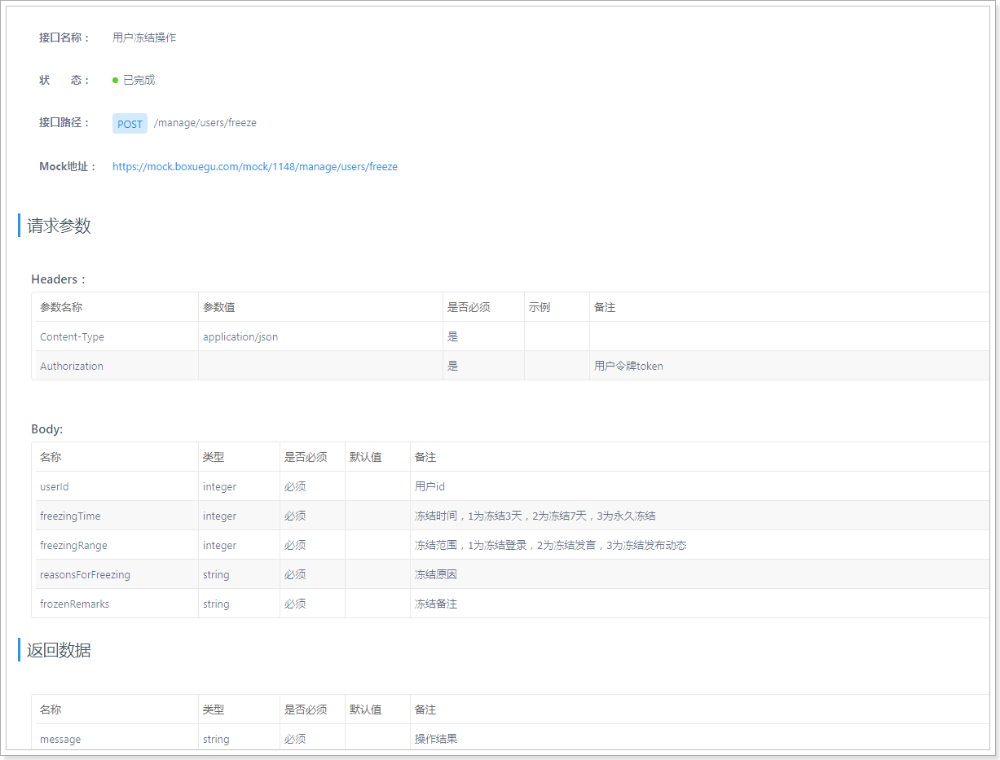

#### 1.3.2 表结构

~~~sql
CREATE TABLE `tb_user_freeze` (
  `id` bigint(20) NOT NULL AUTO_INCREMENT,
  `user_id` bigint(20) NOT NULL COMMENT '用户Id',
  `freezing_time` tinyint(1) NOT NULL COMMENT '冻结时间，1为冻结3天，2为冻结7天，3为永久冻结',
  `freezing_range` tinyint(1) NOT NULL COMMENT '冻结范围，1为冻结登录，2为冻结发言，3为冻结发布动态',
  `reasons_for_freezing` varchar(255) NOT NULL COMMENT '冻结原因',
  `frozen_remarks` varchar(255) DEFAULT NULL COMMENT '备注',
  `created` datetime DEFAULT NULL COMMENT '创建时间',
  `updated` datetime DEFAULT NULL COMMENT '更新时间',
  PRIMARY KEY (`id`) USING BTREE
) ENGINE=InnoDB AUTO_INCREMENT=37 DEFAULT CHARSET=utf8 ROW_FORMAT=DYNAMIC COMMENT='用户冻结表';
~~~

#### 1.3.3 pojo对象

```java
package com.tanhua.manage.pojo;

import lombok.AllArgsConstructor;
import lombok.Data;
import lombok.NoArgsConstructor;

@Data
@NoArgsConstructor
@AllArgsConstructor
public class UserFreeze extends BasePojo{
    /**
     * id
     */
    private Long id;
    /**
     * 用户id
     */
    private Long userId;
    /**
     * 冻结时间，1为冻结3天，2为冻结7天，3为永久冻结
     */
    private Integer freezingTime;
    /**
     * 冻结范围，1为冻结登录，2为冻结发言，3为冻结发布动态
     */
    private Integer freezingRange;
    /**
     * 冻结原因
     */
    private String reasonsForFreezing;
    /**
     * 备注
     */
    private String frozenRemarks;
}
```

#### 1.3.4  vo对象

```java
package com.tanhua.manage.vo;

import lombok.Data;

@Data
public class UserFreezeVo {
    /**
     * id
     */
    private Long id;
    /**
     * 用户id
     */
    private Long userId;
    /**
     * 冻结时间，1为冻结3天，2为冻结7天，3为永久冻结
     */
    private Integer freezingTime;
    /**
     * 冻结范围，1为冻结登录，2为冻结发言，3为冻结发布动态
     */
    private Integer freezingRange;
    /**
     * 冻结原因
     */
    private String reasonsForFreezing;
    /**
     * 备注
     */
    private String frozenRemarks;
    /**
     * 解冻原因
     */
    private String reasonsForThawing;
}
```

#### 1.3.5 UsersController

~~~java
    /**
     * 冻结操作
     *
     * @param vo
     * @return
     */
    @PostMapping("freeze")
    public Boolean freeze(@RequestBody UserFreezeVo vo) {
        return this.userFreezeService.freeze(vo);
    }
~~~

#### 1.3.6 UserFreezeService

~~~java
package com.tanhua.manage.service;

import cn.hutool.core.bean.BeanUtil;
import com.baomidou.mybatisplus.core.toolkit.Wrappers;
import com.baomidou.mybatisplus.extension.service.impl.ServiceImpl;
import com.fasterxml.jackson.databind.ObjectMapper;
import com.tanhua.manage.exception.BusinessException;
import com.tanhua.manage.mapper.UserFreezeMapper;
import com.tanhua.manage.pojo.UserFreeze;
import com.tanhua.manage.vo.UserFreezeVo;
import lombok.extern.slf4j.Slf4j;
import org.springframework.beans.factory.annotation.Autowired;
import org.springframework.data.redis.core.RedisTemplate;
import org.springframework.stereotype.Service;

import java.time.Duration;

@Service
@Slf4j
public class UserFreezeService extends ServiceImpl<UserFreezeMapper, UserFreeze> {

    private static final String CACHE_KEY_FREEZE_PREFIX = "FREEZE_";

    @Autowired
    private RedisTemplate<String, String> redisTemplate;

    /**
     * 获取用户冻结状态
     */
    public Boolean getFreezeStatusByUserId(Long userId) {
        String cacheKey = CACHE_KEY_FREEZE_PREFIX + userId;
        return redisTemplate.hasKey(cacheKey);
    }

    public Boolean freeze(UserFreezeVo freezeVo) {

        if (ObjectUtil.isEmpty(freezeVo.getUserId())) {
            throw new BusinessException("用户id不能为空！");
        }

        //判断之前是否已经被冻结
        UserFreeze oneUserFreeze = super.getOne(Wrappers.<UserFreeze>lambdaQuery()
                .eq(UserFreeze::getUserId, freezeVo.getUserId()));
        if (ObjectUtil.isNotEmpty(oneUserFreeze)) {
            throw new BusinessException("该用户不能重复冻结！");
        }

        UserFreeze userFreeze = BeanUtil.toBean(freezeVo, UserFreeze.class);
        //入库
        super.save(userFreeze);

        //将用户的冻结状态保存到redis中
        int days = 0;
        if (freezeVo.getFreezingTime() == 1) {
            days = 3;
        } else if (freezeVo.getFreezingTime() == 2) {
            days = 7;
        }

        String cacheKey = CACHE_KEY_FREEZE_PREFIX + freezeVo.getUserId();
        if (days > 0) {
            this.redisTemplate.opsForValue().set(cacheKey, "ok", Duration.ofDays(days));
        }else{
            this.redisTemplate.opsForValue().set(cacheKey, "ok");
        }

        return true;
    }

}

~~~

### 1.4 解冻用户

#### 1.4.1 接口

 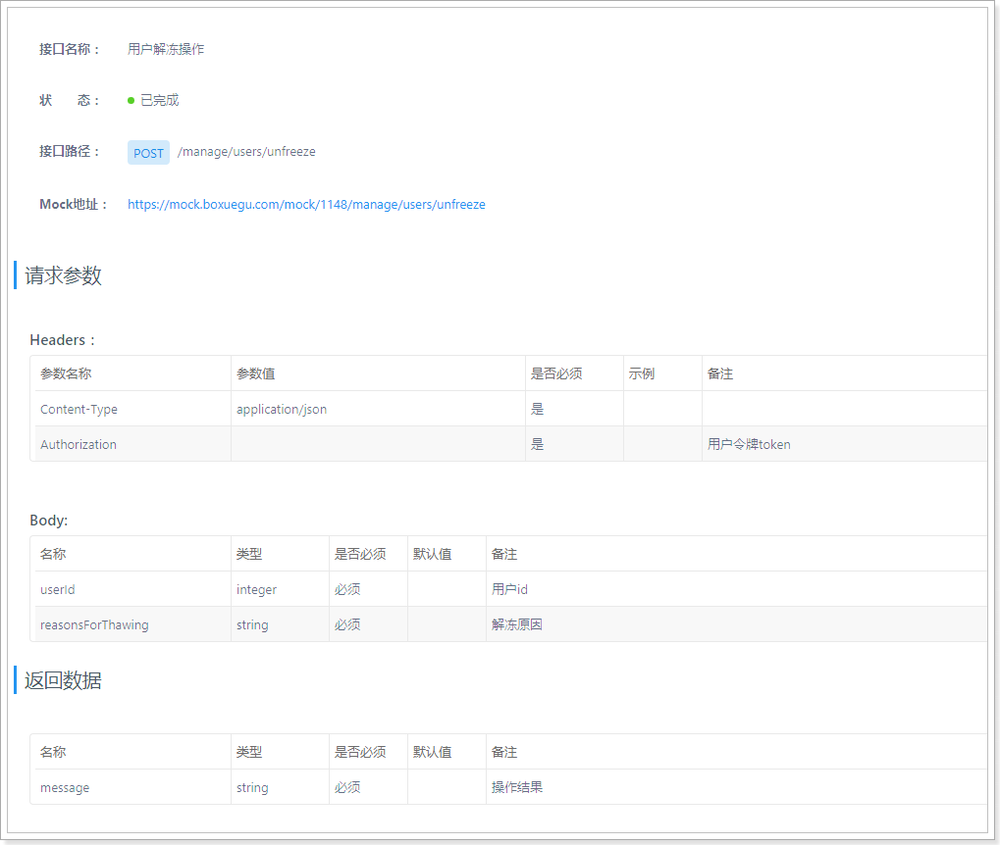

#### 1.4.2 UsersController

```java
/**
 * 解冻操作
 *
 * @param vo
 * @return
 */
@PostMapping("/unfreeze")
public Boolean unfreeze(@RequestBody UserFreezeVo vo) {
    return userFreezeService.unfreeze(vo);
}
```

#### 1.4.3 UserFreezeService

```java
    public Boolean unfreeze(UserFreezeVo freezeVo) {
        if (ObjectUtil.isEmpty(freezeVo.getUserId())) {
            throw new BusinessException("用户id不能为空！");
        }

        //删除数据库中的数据
        super.remove(Wrappers.<UserFreeze>lambdaQuery().eq(UserFreeze::getUserId, freezeVo.getUserId()));

        //删除redis中的数据
        String cacheKey = CACHE_KEY_FREEZE_PREFIX + freezeVo.getUserId();
        this.redisTemplate.delete(cacheKey);

        //TODO 由于解冻原因不进行展现，所以就不保存数据了
        return true;
    }
```

### 1.5 测试

 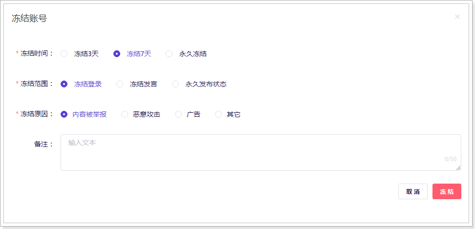


## 2. 华为云内容审核

对于用户发布的动态信息是需要进行审核的，这里我们选择华为云的内容审核服务。

### 2.1 介绍

地址：https://www.huaweicloud.com/product/moderation.html

目前，华为云只需要支付1元，即可享受一年的服务。

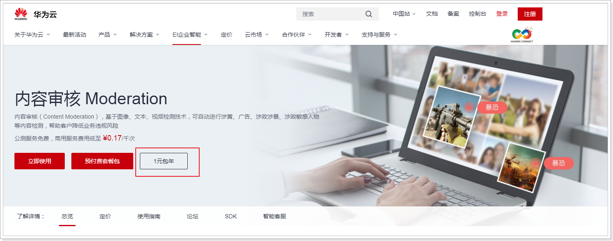

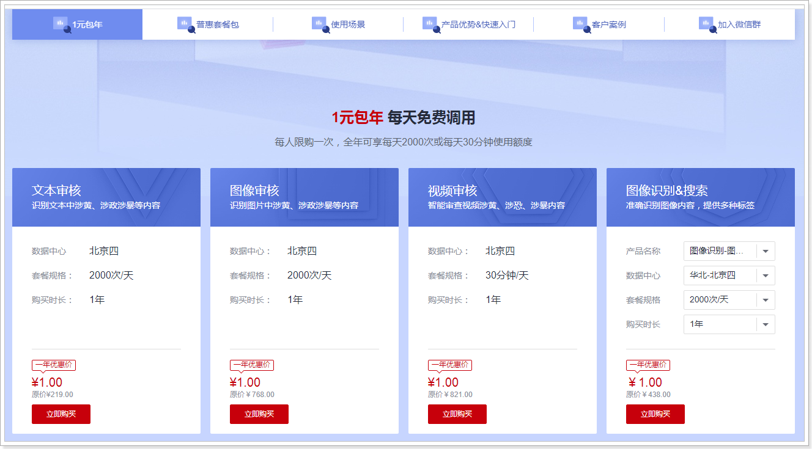

可以看到，文本、图像、视频、图像识别，都可以1元订购，我们暂时只需要订购文本和图像审核即可。

### 2.2 使用说明

快速入门文档：https://support.huaweicloud.com/moderation/index.html

 

> 需要先注册华为云账户并且完成实名认证。

登录并订购成功后，进行内容审核控制台：https://console.huaweicloud.com/moderation/?region=cn-north-1#/moderation/services/textAntispam

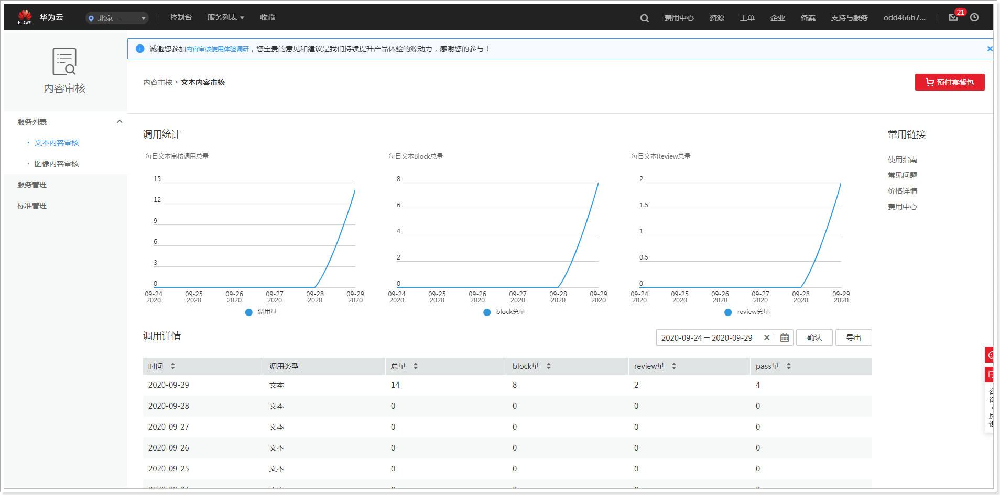

### 2.3 账号管理

在华为云中，需要创建子账号进行获取token，才能调用其他的api。


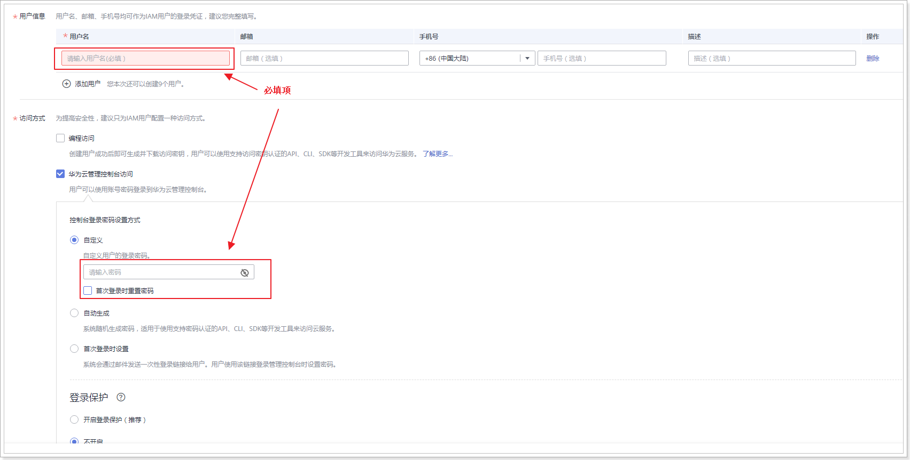

选择组，一般选择power_user即可：

 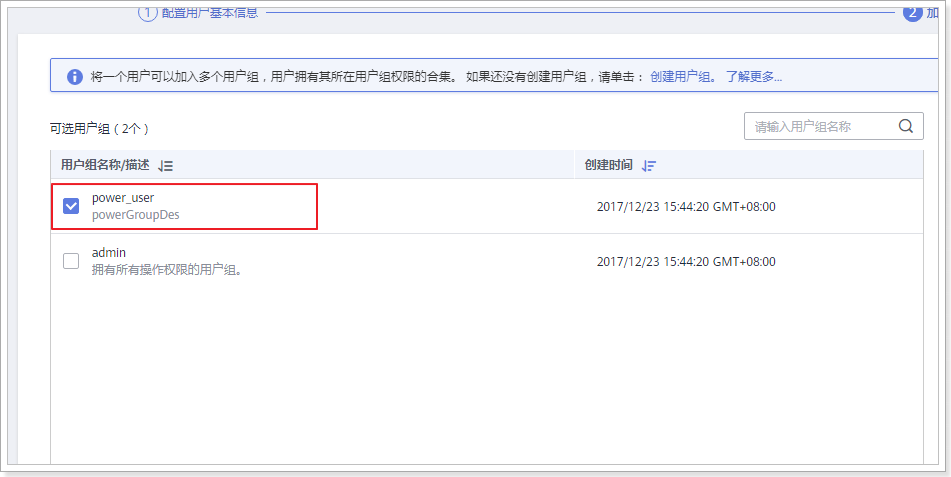

### 2.4 认证

通过账户信息获取token。文档：https://support.huaweicloud.com/api-moderation/moderation_03_0003.html

> token的有效期为24小时。

测试代码：

~~~java
package com.tanhua.manage.huawei;

import cn.hutool.core.collection.ListUtil;
import cn.hutool.core.util.StrUtil;
import cn.hutool.http.HttpRequest;
import cn.hutool.json.JSONObject;
import cn.hutool.json.JSONUtil;
import org.junit.Test;

public class TestHuaweiCloud {

    /**
     * 获取token
     */
    @Test
    public void testGetToken() {
        String url = "https://iam.myhuaweicloud.com/v3/auth/tokens";

        String reqBody = JSONUtil.createObj().set("auth", JSONUtil.createObj()
                .set("identity", JSONUtil.createObj()
                        .set("methods", JSONUtil.createArray().set("password"))
                        .set("password", JSONUtil.createObj()
                                .set("user", JSONUtil.createObj()
                                        .set("domain", JSONUtil.createObj().set("name", "odd466b7514015027768"))
                                        .set("name", "tanhua")
                                        .set("password", "tanhua123")
                                )
                        )
                )
                .set("scope", JSONUtil.createObj()
                    .set("project",JSONUtil.createObj()
                        .set("name", "cn-north-1")
                    )
                )
        ).toString();

        System.out.println(reqBody);

        String token = HttpRequest.post(url)
                .contentType("application/json;charset=utf8")
                .body(reqBody)
                .execute()
                .header("X-Subject-Token");

        System.out.println(token);

    }

}

~~~

测试结果：


### 2.5 内容审核

文档：https://support.huaweicloud.com/api-moderation/moderation_03_0018.html

测试代码：

~~~java
	/**
     * 文本内容审核
     */
    @Test
    public void testTextCheck() {
        String url = "https://moderation.cn-north-1.myhuaweicloud.com/v1.0/moderation/text";
        String token = "MIIaXwYJKoZIhvcNAQcCoII.........";

        String reqBody = JSONUtil.createObj()
                .set("categories", "politics,porn,ad,abuse,contraband,flood".split(","))
                .set("items", JSONUtil.createArray()
                        .set(JSONUtil.createObj()
                                .set("text", "dasdsadsadsa")
                                .set("type", "content")
                        )
                ).toString();

        System.out.println(reqBody);

        String resBody = HttpRequest.post(url)
                .header("X-Auth-Token", token)
                .contentType("application/json;charset=utf8")
                .body(reqBody)
                .execute()
                .body();

        System.out.println(resBody);

    }
~~~

测试结果：


### 2.6 图像审核

文档：https://support.huaweicloud.com/api-moderation/moderation_03_0036.html

测试代码：

~~~java
/**
     * 图片审核
     */
    @Test
    public void testImageCheck() {
        String url = "https://moderation.cn-north-1.myhuaweicloud.com/v1.0/moderation/image/batch";
        String token = "MIIaXwYJKoZIhvcNAQcCoIIaUDCCGkwCAQExDTALBgl.................";

        String reqBody = JSONUtil.createObj()
                .set("categories", "politics,terrorism,porn".split(","))
                .set("urls", ListUtil.of("http://tanhua-dev.oss-cn-zhangjiakou.aliyuncs.com/images/logo/9.jpg","https://bkimg.cdn.bcebos.com/pic/267f9e2f07082838ac3a8f1bb899a9014c08f18e"))
        .toString();

        System.out.println(reqBody);

        String resBody = HttpRequest.post(url)
                .header("X-Auth-Token", token)
                .contentType("application/json;charset=utf8")
                .body(reqBody)
                .execute()
                .body();

        System.out.println(resBody);

    }
~~~

测试结果：

 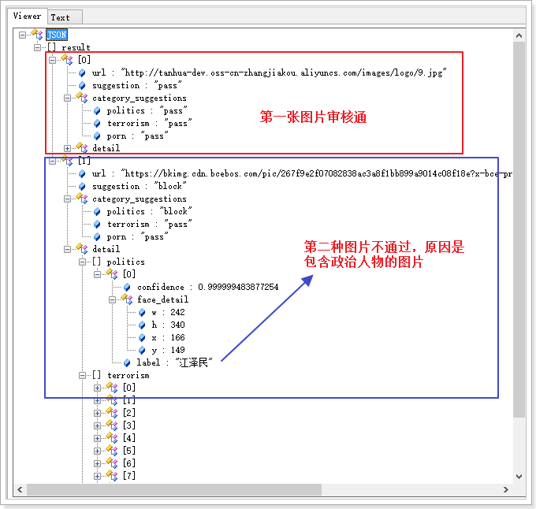

### 2.7 编写服务

#### 2.7.1 AutoAuditStateEnum

```java
package com.tanhua.manage.enums;

public enum AutoAuditStateEnum {
    // 审核状态，2为自动审核通过，3为待人工审核，，6为自动审核拒绝
    PASS("2", "pass"),
    REVIEW("3", "review"),
    BLOCK("6", "block"),
    ;

    private String value;
    private String name;

    AutoAuditStateEnum(String value, String name) {
        this.value = value;
        this.name = name;
    }

    public String getValue() {
        return value;
    }

    public String getName() {
        return name;
    }

    public static String getValueByName(String name) {
        String value = "3";
        for (AutoAuditStateEnum e : values()) {
            if (e.name.equals(name)) {
                value = e.value;
            }
        }
        return value;
    }
}
```

#### 2.7.2 HuaWeiUGCService

```java
package com.tanhua.manage.huawei;

import cn.hutool.core.collection.CollUtil;
import cn.hutool.core.util.ArrayUtil;
import cn.hutool.core.util.StrUtil;
import cn.hutool.http.HttpRequest;
import cn.hutool.json.JSONObject;
import cn.hutool.json.JSONUtil;
import com.tanhua.manage.enums.AutoAuditStateEnum;
import com.tanhua.manage.exception.BusinessException;
import lombok.extern.slf4j.Slf4j;
import org.springframework.beans.factory.annotation.Autowired;
import org.springframework.beans.factory.annotation.Value;
import org.springframework.data.redis.core.RedisTemplate;
import org.springframework.stereotype.Service;

import java.time.Duration;

@Service
@Slf4j
public class HuaWeiUGCService {

    @Value("${huaweicloud.token.url}")
    private String TOKEN_URL;

    @Value("${huaweicloud.token.domain}")
    private String TOKEN_DOMAIN;

    @Value("${huaweicloud.token.name}")
    private String TOKEN_NAME;

    @Value("${huaweicloud.token.password}")
    private String TOKEN_PASSWORD;

    @Value("${huaweicloud.token.project}")
    private String TOKEN_PROJECT;

    @Value("${huaweicloud.moderation.categories.image}")
    private String CATEGORIES_IMAGE;

    @Value("${huaweicloud.moderation.categories.text}")
    private String CATEGORIES_TEXT;

    @Value("${huaweicloud.text.check.url}")
    private String TEXT_CHECK_URL;

    @Value("${huaweicloud.image.check.url}")
    private String IMAGE_CHECK_URL;

    public static int connectionTimeout = 5000; //连接目标url超时限制参数
    public static int socketTimeout = 5000;//获取服务器响应数据超时限制参数

    @Autowired
    private RedisTemplate<String, String> redisTemplate;

    private static final String CACHE_HUAWEI_UGC_TOKEN = "CACHE_HUAWEI_UGC_TOKEN";

    /**
     * 获取token
     *
     * @return
     */
    private String getToken() {
        String token = this.redisTemplate.opsForValue().get(CACHE_HUAWEI_UGC_TOKEN);
        if (StrUtil.isNotEmpty(token)) {
            return token;
        }
        String reqBody = JSONUtil.createObj().set("auth", JSONUtil.createObj()
                .set("identity", JSONUtil.createObj()
                        .set("methods", JSONUtil.createArray().set("password"))
                        .set("password", JSONUtil.createObj()
                                .set("user", JSONUtil.createObj()
                                        .set("domain", JSONUtil.createObj().set("name", TOKEN_DOMAIN))
                                        .set("name", TOKEN_NAME)
                                        .set("password", TOKEN_PASSWORD)
                                )
                        )
                )
                .set("scope", JSONUtil.createObj()
                        .set("project", JSONUtil.createObj()
                                .set("name", TOKEN_PROJECT)
                        )
                )
        ).toString();

        token = HttpRequest.post(TOKEN_URL)
                .contentType("application/json;charset=utf8")
                .setConnectionTimeout(connectionTimeout)
                .setReadTimeout(socketTimeout)
                .body(reqBody)
                .execute()
                .header("X-Subject-Token");

        if (StrUtil.isNotEmpty(token)) {
            this.redisTemplate.opsForValue().set(CACHE_HUAWEI_UGC_TOKEN, token, Duration.ofHours(23));
            return token;
        }
        throw new BusinessException("华为云获取token失败，请检查服务是否已经欠费~");
    }

    /**
     * 文字审核
     *
     * @param textModeration 待审核内容
     * @return 审核结果，block：包含敏感信息，不通过，pass：不包含敏感信息，通过，review：需要人工复查
     */
    public AutoAuditStateEnum textContentCheck(String textModeration) {
        if(StrUtil.isEmpty(textModeration)){
            return AutoAuditStateEnum.REVIEW;
        }
        String reqBody = JSONUtil.createObj()
                .set("categories", StrUtil.split(CATEGORIES_TEXT, ','))
                .set("items", JSONUtil.createArray()
                        .set(JSONUtil.createObj()
                                .set("text", textModeration)
                                .set("type", "content")
                        )
                ).toString();

        log.info("文字审核 ：" + reqBody);

        String resBody = HttpRequest.post(TEXT_CHECK_URL)
                .header("X-Auth-Token", this.getToken())
                .contentType("application/json;charset=utf8")
                .setConnectionTimeout(connectionTimeout)
                .setReadTimeout(socketTimeout)
                .body(reqBody)
                .execute()
                .body();

        JSONObject jsonObject = JSONUtil.parseObj(resBody);
        if (jsonObject.containsKey("result") && jsonObject.getJSONObject("result").containsKey("suggestion")) {
            //获取建议
            return AutoAuditStateEnum.valueOf(jsonObject.getJSONObject("result").getStr("suggestion").toUpperCase());
        }

        //默认人工审核
        return AutoAuditStateEnum.REVIEW;
    }

    /**
     * 图片审核
     *
     * @param urls 图片链接数组
     * @return 审核结果，block：包含敏感信息，不通过，pass：不包含敏感信息，通过，review：需要人工复查
     */
    public AutoAuditStateEnum imageContentCheck(String[] urls) {
        if(ArrayUtil.isEmpty(urls)){
            return AutoAuditStateEnum.REVIEW;
        }
        String reqBody = JSONUtil.createObj()
                .set("categories", CATEGORIES_IMAGE.split(","))
                .set("urls", urls)
                .toString();

        log.info("图片审核 ：" + reqBody);

        String resBody = HttpRequest.post(IMAGE_CHECK_URL)
                .header("X-Auth-Token", this.getToken())
                .contentType("application/json;charset=utf8")
                .setConnectionTimeout(connectionTimeout)
                .setReadTimeout(socketTimeout)
                .body(reqBody)
                .execute()
                .body();

        JSONObject jsonObject = JSONUtil.parseObj(resBody);
        if(jsonObject.containsKey("result")){
            //审核结果中如果出现一个block或review，整体结果就是不通过，如果全部为PASS就是通过
            if(StrUtil.contains(resBody, "\"suggestion\":\"block\"")){
                return AutoAuditStateEnum.BLOCK;
            }else if(StrUtil.contains(resBody, "\"suggestion\":\"review\"")){
                return AutoAuditStateEnum.REVIEW;
            }else{
                return AutoAuditStateEnum.PASS;
            }
        }

        //默认人工审核
        return AutoAuditStateEnum.REVIEW;
    }

}

```

配置参数：

~~~properties
huaweicloud.token.url=https://iam.myhuaweicloud.com/v3/auth/tokens
huaweicloud.token.domain=odd466b7514015027768
huaweicloud.token.name=tanhua
huaweicloud.token.password=tanhua123
huaweicloud.token.project=cn-north-1
# 图片检测内容 politics：是否涉及政治人物的检测，terrorism：是否包含涉政暴恐元素的检测，porn：是否包含涉黄内容元素的检测，ad：是否包含广告的检测（公测特性），all：包含politics、terrorism和porn三种场景的检测
huaweicloud.moderation.categories.image=politics,terrorism,porn
# 文字检测内容 politics：涉政，porn：涉黄，ad：广告，abuse：辱骂，contraband：违禁品，flood：灌水
huaweicloud.moderation.categories.text=politics,porn,ad,abuse,contraband,flood

huaweicloud.text.check.url=https://moderation.cn-north-1.myhuaweicloud.com/v1.0/moderation/text
huaweicloud.image.check.url=https://moderation.cn-north-1.myhuaweicloud.com/v1.0/moderation/image/batch
~~~

#### 2.7.3 测试用例

```java
package com.tanhua.manage.service;

import com.tanhua.manage.enums.AutoAuditStateEnum;
import com.tanhua.manage.huawei.HuaWeiUGCService;
import org.junit.Test;
import org.junit.runner.RunWith;
import org.springframework.beans.factory.annotation.Autowired;
import org.springframework.boot.test.context.SpringBootTest;
import org.springframework.test.context.junit4.SpringRunner;

@SpringBootTest
@RunWith(SpringRunner.class)
public class TestHuaWeiUGCService {

    @Autowired
    private HuaWeiUGCService huaWeiUGCService;

    @Test
    public void testTextContentCheck(){
        AutoAuditStateEnum autoAuditStateEnum = this.huaWeiUGCService.textContentCheck("今天心情很开心");
        System.out.println(autoAuditStateEnum.getValue());
    }

    @Test
    public void testImageContentCheck(){
        String[] urls = new String[]{
                "http://tanhua-dev.oss-cn-zhangjiakou.aliyuncs.com/images/logo/9.jpg",
                "https://bkimg.cdn.bcebos.com/pic/267f9e2f07082838ac3a8f1bb899a9014c08f18e"
        };
        AutoAuditStateEnum autoAuditStateEnum = this.huaWeiUGCService.imageContentCheck(urls);
        System.out.println(autoAuditStateEnum.getValue());
    }
}
```

## 3. 动态消息处理

用户发完动态消息后，需要进行审核处理，首先进行机审，如果审核不通过再通过人工审核。

分析：

- 点赞、发布动态等都需要进行log记录，需要对消息做处理，转发消息到tanhua-log队列
- 用户动态的记录表，保存数据
- 保存机审记录

### 3.1 表结构

~~~sql
CREATE TABLE `tb_publish_info` (
  `id` bigint(20) NOT NULL AUTO_INCREMENT,
  `user_id` bigint(20) NOT NULL COMMENT '用户id',
  `publish_id` varchar(255) NOT NULL COMMENT '发布内容Id',
  `top_state` tinyint(1) NOT NULL DEFAULT '1' COMMENT '置顶状态，1为未置顶，2为置顶',
  `state` varchar(20) NOT NULL DEFAULT '1' COMMENT '审核状态，1为待审核，2为自动审核通过，3为待人工审核，4为人工审核拒绝，5为人工审核通过，6为自动审核拒绝',
  `love_count` int(8) NOT NULL DEFAULT '0' COMMENT '喜欢数',
  `like_count` int(8) NOT NULL DEFAULT '0' COMMENT '点赞数',
  `comment_count` int(8) NOT NULL DEFAULT '0' COMMENT '评论数',
  `report_count` int(8) NOT NULL DEFAULT '0' COMMENT '举报数',
  `forwarding_count` int(8) NOT NULL DEFAULT '0' COMMENT '转发数',
  `create_date` bigint(20) NOT NULL COMMENT '发布时间',
  `created` datetime NOT NULL COMMENT '创建时间',
  `updated` datetime NOT NULL COMMENT '更新时间',
  PRIMARY KEY (`id`) USING BTREE
) ENGINE=InnoDB AUTO_INCREMENT=31999 DEFAULT CHARSET=utf8 ROW_FORMAT=DYNAMIC COMMENT='动态额外信息表';


CREATE TABLE `tb_publish_audit_log` (
  `id` bigint(20) NOT NULL AUTO_INCREMENT,
  `publish_id` varchar(255) NOT NULL COMMENT '发布Id',
  `source_state` varchar(20) NOT NULL COMMENT '原始审核状态，1为待审核，2为自动审核通过，3为待人工审核，4为人工审核拒绝，5为人工审核通过，6为自动审核拒绝',
  `target_state` varchar(20) NOT NULL COMMENT '目标审核状态，1为待审核，2为自动审核通过，3为待人工审核，4为人工审核拒绝，5为人工审核通过，6为自动审核拒绝',
  `created` datetime NOT NULL COMMENT '创建时间',
  `updated` datetime NOT NULL COMMENT '更新时间',
  PRIMARY KEY (`id`) USING BTREE
) ENGINE=InnoDB AUTO_INCREMENT=122 DEFAULT CHARSET=utf8 ROW_FORMAT=DYNAMIC COMMENT='动态审核日志表';
~~~

### 3.2 pojo

```java
package com.tanhua.manage.pojo;

import lombok.AllArgsConstructor;
import lombok.Data;
import lombok.NoArgsConstructor;

@Data
@NoArgsConstructor
@AllArgsConstructor
public class PublishInfo extends BasePojo {

    private Long id;
    /**
     * 用户id
     */
    private Long userId;
    /**
     * 发布内容Id
     */
    private String publishId;
    /**
     * 置顶状态，1为未置顶，2为置顶
     */
    private Integer topState;
    /**
     * 审核状态，1为待审核，2为自动审核通过，3为待人工审核，4为人工审核拒绝，5为人工审核通过，6为自动审核拒绝
     */
    private String state;
    /**
     * 喜欢数
     */
    private Integer loveCount;
    /**
     * 点赞数
     */
    private Integer likeCount;
    /**
     * 评论数
     */
    private Integer commentCount;
    /**
     * 举报数
     */
    private Integer reportCount;
    /**
     * 转发数
     */
    private Integer forwardingCount;
    /**
     * 发布时间
     */
    private Long createDate;
}
```

```java
package com.tanhua.manage.pojo;

import lombok.AllArgsConstructor;
import lombok.Data;
import lombok.NoArgsConstructor;

@Data
@NoArgsConstructor
@AllArgsConstructor
public class PublishAuditLog extends BasePojo {

    private Long id;
    /**
     * 发布内容Id
     */
    private String publishId;

    /**
     * 原审核状态，1为待审核，2为自动审核通过，3为待人工审核，4为人工审核拒绝，5为人工审核通过
     */
    private String sourceState;

    /**
     * 目标审核状态，1为待审核，2为自动审核通过，3为待人工审核，4为人工审核拒绝，5为人工审核通过
     */
    private String targetState;
}
```

### 3.3 Mapper

```java
package com.tanhua.manage.mapper;

import com.baomidou.mybatisplus.core.mapper.BaseMapper;
import com.tanhua.manage.pojo.PublishInfo;
import org.apache.ibatis.annotations.Mapper;

@Mapper
public interface PublishInfoMapper extends BaseMapper<PublishInfo> {
}
```

~~~java
package com.tanhua.manage.mapper;

import com.baomidou.mybatisplus.core.mapper.BaseMapper;
import com.tanhua.manage.pojo.PublishAuditLog;
import org.apache.ibatis.annotations.Mapper;

@Mapper
public interface PublishAuditLogMapper extends BaseMapper<PublishAuditLog> {
}

~~~

### 3.4 状态枚举

```java
package com.tanhua.manage.enums;

public enum PublishAuditStateEnum {
    // 审核状态，1为待审核，2为自动审核通过，3为待人工审核，4为人工审核拒绝，5为人工审核通过，6为自动审核拒绝
    WAIT("1", "待审核"),
    AUTO_PASS("2", "自动审核通过"),
    WAIT_MAUL("3", "待人工审核"),
    MAUL_BLOCK("4", "人工审核拒绝"),
    MAUL_PASS("5", "人工审核通过"),
    AUTO_BLOCK("6", "自动审核拒绝"),
    ;

    private String value;
    private String name;

    PublishAuditStateEnum(String value, String name) {
        this.value = value;
        this.name = name;
    }

    public String getValue() {
        return value;	
    }

    public String getName() {
        return name;
    }
}
```

### 3.5 PublishMsgConsumer

```java
package com.tanhua.manage.msg;

import cn.hutool.core.convert.Convert;
import com.alibaba.dubbo.config.annotation.Reference;
import com.fasterxml.jackson.databind.JsonNode;
import com.fasterxml.jackson.databind.ObjectMapper;
import com.tanhua.dubbo.server.api.QuanZiApi;
import com.tanhua.dubbo.server.pojo.Publish;
import com.tanhua.manage.enums.AutoAuditStateEnum;
import com.tanhua.manage.enums.LogTypeEnum;
import com.tanhua.manage.enums.PublishAuditStateEnum;
import com.tanhua.manage.huawei.HuaWeiUGCService;
import com.tanhua.manage.pojo.PublishAuditLog;
import com.tanhua.manage.pojo.PublishInfo;
import com.tanhua.manage.service.PublishAuditLogService;
import com.tanhua.manage.service.PublishInfoService;
import lombok.extern.slf4j.Slf4j;
import org.apache.rocketmq.spring.annotation.RocketMQMessageListener;
import org.apache.rocketmq.spring.core.RocketMQListener;
import org.apache.rocketmq.spring.core.RocketMQTemplate;
import org.springframework.beans.factory.annotation.Autowired;
import org.springframework.beans.factory.annotation.Value;
import org.springframework.stereotype.Component;

import java.util.HashMap;
import java.util.Map;

@Component
@RocketMQMessageListener(topic = "tanhua-quanzi",
        consumerGroup = "tanhua-quanzi-audit-consumer")
@Slf4j
public class PublishMsgConsumer implements RocketMQListener<String> {

    @Reference(version = "1.0.0")
    private QuanZiApi quanZiApi;
    @Autowired
    private HuaWeiUGCService huaWeiUGCService;
    @Autowired
    private PublishInfoService publishInfoService;
    @Autowired
    private PublishAuditLogService publishAuditLogService;
    @Autowired
    private RocketMQTemplate rocketMQTemplate;

    private static final ObjectMapper MAPPER = new ObjectMapper();
    @Value("${tanhua.auto-audit}")
    private Boolean autoAudit;


    @Override
    public void onMessage(String msg) {
        try {
            JsonNode jsonNode = MAPPER.readTree(msg);
            String publishId = jsonNode.get("publishId").asText();
            //消息类型 1-发动态，2-浏览动态， 3-点赞， 4-喜欢， 5-评论，6-取消点赞，7-取消喜欢
            Integer type = jsonNode.get("type").asInt();
            Long userId = jsonNode.get("userId").asLong();
            Long date = jsonNode.get("date").asLong();
            Publish publish = quanZiApi.queryPublishById(publishId);
            if (publish != null) {
                log.info("收到动态消息，将其转向 tanhua-log topic:" + msg);
                Map<String, Object> msgMap = new HashMap<>();
                msgMap.put("userId", userId);
                msgMap.put("date", date);
                switch (type) {
                    case 1:
                        // 处理发动态
                        processSaveMovements(publish);
                        msgMap.put("type", LogTypeEnum.MOVEMENTS_ADD.getValue());
                        sendLogMessage(msgMap);
                        break;
                    case 3:
                        // 处理点赞
                        processLikeMovements(publish);
                        msgMap.put("type", LogTypeEnum.MOVEMENTS_LIKE.getValue());
                        sendLogMessage(msgMap);
                        break;
                    case 4:
                        // 处理喜欢
                        processLoveMovements(publish);
                        msgMap.put("type", LogTypeEnum.MOVEMENTS_LOVE.getValue());
                        sendLogMessage(msgMap);
                        break;
                    case 5:
                        // 处理评论
                        processCommentMovements(publish);
                        msgMap.put("type", LogTypeEnum.MOVEMENTS_COMMENT.getValue());
                        sendLogMessage(msgMap);
                        break;
                    case 6:
                        // 处理取消点赞
                        processUnlikeMovements(publish);
                        msgMap.put("type", LogTypeEnum.MOVEMENTS_UNLIKE.getValue());
                        sendLogMessage(msgMap);
                        break;
                    case 7:
                        // 处理取消喜欢
                        processUnLoveMovements(publish);
                        msgMap.put("type", LogTypeEnum.MOVEMENTS_UNLOVE.getValue());
                        sendLogMessage(msgMap);
                        break;
                }
            }
        } catch (Exception e) {
            log.error("消息处理失败!" + e.getMessage());
        }
    }

    /**
     * 处理取消喜欢消息
     *
     * @param publish 动态信息
     */
    private void processUnLoveMovements(Publish publish) {
        PublishInfo info = publishInfoService.findInfoByPublishId(publish.getId().toString());
        if (info != null) {
            info.setLoveCount(info.getLoveCount() == 0 ? 0 : info.getLoveCount() - 1);
            publishInfoService.saveOrUpdate(info);
        }
    }

    /**
     * 处理取消点赞消息
     *
     * @param publish 动态信息
     */
    private void processUnlikeMovements(Publish publish) {
        PublishInfo info = publishInfoService.findInfoByPublishId(publish.getId().toString());
        if (info != null) {
            info.setLikeCount(info.getLikeCount() == 0 ? 0 : info.getLikeCount() - 1);
            publishInfoService.saveOrUpdate(info);
        }
    }

    /**
     * 处理评论消息
     *
     * @param publish 动态信息
     */
    private void processCommentMovements(Publish publish) {
        PublishInfo info = publishInfoService.findInfoByPublishId(publish.getId().toString());
        if (info != null) {
            info.setCommentCount(info.getCommentCount() + 1);
            publishInfoService.saveOrUpdate(info);
        }
    }

    /**
     * 处理喜欢消息
     *
     * @param publish 动态信息
     */
    private void processLoveMovements(Publish publish) {
        PublishInfo info = publishInfoService.findInfoByPublishId(publish.getId().toString());
        if (info != null) {
            info.setLoveCount(info.getLoveCount() + 1);
            publishInfoService.saveOrUpdate(info);
        }
    }

    /**
     * 处理点赞消息
     *
     * @param publish 动态信息
     */
    private void processLikeMovements(Publish publish) {
        PublishInfo info = publishInfoService.findInfoByPublishId(publish.getId().toString());
        if (info != null) {
            info.setLikeCount(info.getLikeCount() + 1);
            publishInfoService.saveOrUpdate(info);
        }
    }

    /**
     * 处理发动态消息
     *
     * @param publish 动态信息
     * @throws Exception
     */
    private void processSaveMovements(Publish publish) {
        log.info("处理发动态消息:" + publish);s
        //幂等校验，防止重复消费
        PublishInfo source = publishInfoService.findInfoByPublishId(publish.getId().toString());
        log.info("处理发动态消息source:" + source);
        if (source != null) {
            return;
        }

        // 写入初始化信息
        PublishInfo info = new PublishInfo();
        info.setUserId(publish.getUserId());
        info.setPublishId(publish.getId().toString());
        info.setCreateDate(publish.getCreated());

        if (autoAudit) {  // 机器审核
            AutoAuditStateEnum textAutoAuditStateEnum = this.huaWeiUGCService.textContentCheck(publish.getText());
            AutoAuditStateEnum imageAutoAuditStateEnum = this.huaWeiUGCService.imageContentCheck(Convert.toStrArray(publish.getMedias()));
            if (textAutoAuditStateEnum == AutoAuditStateEnum.REVIEW || imageAutoAuditStateEnum == AutoAuditStateEnum.REVIEW) {
                info.setState(PublishAuditStateEnum.WAIT_MAUL.getValue());
            }else if(textAutoAuditStateEnum == AutoAuditStateEnum.PASS && imageAutoAuditStateEnum == AutoAuditStateEnum.PASS){
                info.setState(PublishAuditStateEnum.AUTO_PASS.getValue());
            }else{
                info.setState(PublishAuditStateEnum.AUTO_BLOCK.getValue());
            }
        } else {
            //不进行机器审核
            info.setState(PublishAuditStateEnum.WAIT_MAUL.getValue());
        }

        publishInfoService.saveOrUpdate(info);

        if(autoAudit){
            //保存自动审核的日志
            PublishAuditLog log = new PublishAuditLog(null, info.getPublishId(), PublishAuditStateEnum.WAIT.getValue(), info.getState());
            publishAuditLogService.save(log);
        }
    }

    private void sendLogMessage(Map<String, Object> msg) {
        rocketMQTemplate.convertAndSend("tanhua-log", msg);
    }

}
```

### 3.6 PublishInfoService

```java
package com.tanhua.manage.service;

import com.baomidou.mybatisplus.core.toolkit.Wrappers;
import com.baomidou.mybatisplus.extension.service.impl.ServiceImpl;
import com.tanhua.manage.mapper.PublishInfoMapper;
import com.tanhua.manage.pojo.PublishInfo;
import org.springframework.stereotype.Service;

@Service
public class PublishInfoService extends ServiceImpl<PublishInfoMapper, PublishInfo> {

    /**
     * 根据发布id查询信息
     *
     * @param publishId
     * @return
     */
    public PublishInfo findInfoByPublishId(String publishId) {
        return super.getOne(Wrappers.<PublishInfo>lambdaQuery()
                .eq(PublishInfo::getPublishId, publishId)
        );
    }
}
```

```java
package com.tanhua.manage.service;

import com.baomidou.mybatisplus.extension.service.impl.ServiceImpl;
import com.tanhua.manage.mapper.PublishAuditLogMapper;
import com.tanhua.manage.pojo.PublishAuditLog;
import org.springframework.stereotype.Service;

@Service
public class PublishAuditLogService extends ServiceImpl<PublishAuditLogMapper, PublishAuditLog> {
}
```

### 3.7 测试用例

```java
package com.tanhua.manage.msg;


import cn.hutool.json.JSONUtil;
import org.junit.Test;
import org.junit.runner.RunWith;
import org.springframework.beans.factory.annotation.Autowired;
import org.springframework.boot.test.context.SpringBootTest;
import org.springframework.test.context.junit4.SpringRunner;

@RunWith(SpringRunner.class)
@SpringBootTest
public class TestPublishMsgConsumer {

    @Autowired
    private PublishMsgConsumer publishMsgConsumer;

    @Test
    public void testMessage(){
        String data = JSONUtil.createObj()
                .set("publishId", "5e82dc3e6401952928c211a3")
                .set("type", 1)
                .set("userId", 1)
                .set("date", System.currentTimeMillis()).toString();
        this.publishMsgConsumer.onMessage(data);
    }

}
```

测试结果：


## 4. 人工审核

### 4.1 查询列表

#### 4.1.1 接口

 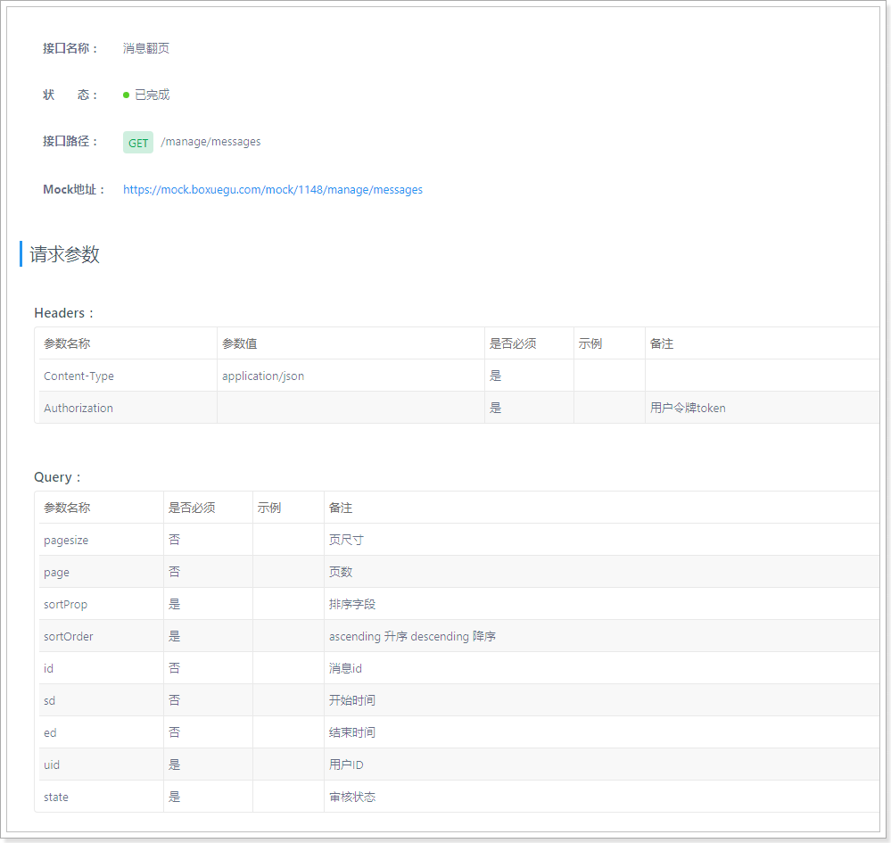

MovementsVo对象：

```java
package com.tanhua.manage.vo;

import lombok.Data;

import java.util.List;

@Data
public class MovementsVo {
    /**
     * 编号
     */
    private String id;
    /**
     * 作者昵称
     */
    private String nickname;
    /**
     * 作者ID
     */
    private Long userId;
    /**
     * 作者头像
     */
    private String userLogo;
    /**
     * 发布日期
     */
    private Long createDate;
    /**
     * 正文
     */
    private String text;
    /**
     * 审核状态，1为待审核，2为自动审核通过，3为待人工审核，4为人工审核拒绝，5为人工审核通过，6为自动审核拒绝
     */
    private String state;
    /**
     * 举报数
     */
    private Integer reportCount;
    /**
     * 点赞数
     */
    private Integer likeCount;
    /**
     * 评论数
     */
    private Integer commentCount;
    /**
     * 转发数
     */
    private Integer forwardingCount;
    /**
     * 图片列表
     */
    private List<String> medias;
    /**
     * 置顶状态，1为未置顶，2为置顶
     */
    private Integer topState;
}
```

#### 4.1.2 MovementsController

```java
package com.tanhua.manage.controller;

import cn.hutool.core.bean.BeanUtil;
import cn.hutool.core.collection.ListUtil;
import com.alibaba.dubbo.config.annotation.Reference;
import com.baomidou.mybatisplus.core.metadata.IPage;
import com.tanhua.dubbo.server.api.QuanZiApi;
import com.tanhua.dubbo.server.pojo.Publish;
import com.tanhua.manage.enums.PublishAuditStateEnum;
import com.tanhua.manage.pojo.PublishInfo;
import com.tanhua.manage.pojo.UserInfo;
import com.tanhua.manage.service.PublishInfoService;
import com.tanhua.manage.service.UserInfoService;
import com.tanhua.manage.service.UserService;
import com.tanhua.manage.vo.MovementsVo;
import com.tanhua.manage.vo.Pager;
import com.tanhua.manage.vo.TotalVo;
import org.springframework.beans.factory.annotation.Autowired;
import org.springframework.web.bind.annotation.GetMapping;
import org.springframework.web.bind.annotation.RequestMapping;
import org.springframework.web.bind.annotation.RequestParam;
import org.springframework.web.bind.annotation.RestController;

import java.util.ArrayList;
import java.util.List;
import java.util.stream.Collectors;

@RestController
@RequestMapping("/manage/messages")
public class MovementsController {

    @Autowired
    private PublishInfoService publishInfoService;

    @Reference(version = "1.0.0")
    private QuanZiApi quanZiApi;

    @Autowired
    private UserService userService;

    @Autowired
    private UserInfoService userInfoService;

    /**
     * 消息翻页
     *
     * @param page      当前页码
     * @param pageSize  页尺寸
     * @param sortProp  排序字段
     * @param sortOrder ascending 升序 descending 降序
     * @param id        消息id
     * @param sd        开始时间
     * @param ed        结束时间
     * @param uid       用户ID
     * @return 消息分页数据
     */
    @GetMapping
    public Pager<MovementsVo> findByPage(@RequestParam(name = "page", defaultValue = "1") Integer page
            , @RequestParam(name = "pagesize", defaultValue = "10") Integer pageSize
            , @RequestParam(name = "sortProp", required = false) String sortProp
            , @RequestParam(name = "sortOrder", required = false) String sortOrder
            , @RequestParam(name = "id", required = false) String id
            , @RequestParam(name = "sd", required = false) Long sd
            , @RequestParam(name = "ed", required = false) Long ed
            , @RequestParam(name = "uid", required = false) Long uid
            , @RequestParam(name = "state", required = false) String state) {

        IPage<PublishInfo> infoPage = publishInfoService.findInfoByPage(page, pageSize, sortProp, sortOrder, id, sd, ed, uid, state);
        //状态合计
        // 当前状态合计 仅包含 3为待人工审核，4为人工审核拒绝，5为人工审核通过 和 3个状态聚合数
        Long num_wait_maul = publishInfoService.countInfo(id, sd, ed, uid, PublishAuditStateEnum.WAIT_MAUL.getValue());
        Long num_maul_block = publishInfoService.countInfo(id, sd, ed, uid, PublishAuditStateEnum.MAUL_BLOCK.getValue());
        Long num_maul_pass = publishInfoService.countInfo(id, sd, ed, uid, PublishAuditStateEnum.MAUL_PASS.getValue());
        Long count = num_wait_maul + num_maul_block + num_maul_pass;

        List<TotalVo> totals = new ArrayList<>();
        totals.add(new TotalVo("全部", "all", count));
        totals.add(new TotalVo("待审核", PublishAuditStateEnum.WAIT_MAUL.getValue(), num_wait_maul));
        totals.add(new TotalVo("已通过", PublishAuditStateEnum.MAUL_PASS.getValue(), num_maul_pass));
        totals.add(new TotalVo("已拒绝", PublishAuditStateEnum.MAUL_BLOCK.getValue(), num_maul_block));

        return new Pager(infoPage.getTotal()
                , infoPage.getSize()
                , infoPage.getPages()
                , infoPage.getCurrent()
                , infoPage.getRecords().stream().map(info -> fillMovements(info)).collect(Collectors.toList())
                , totals);
    }

    /**
     * 填充消息信息
     *
     * @param info 原始消息信息
     * @return 填充后信息
     */
    private MovementsVo fillMovements(PublishInfo info) {
        MovementsVo vo = BeanUtil.toBean(info, MovementsVo.class);
        vo.setId(info.getPublishId());
        Publish publish = quanZiApi.queryPublishById(info.getPublishId());
        if (publish != null) {
            vo.setText(publish.getText());
            vo.setMedias(publish.getMedias());
        } else {
            //TODO 模拟生成测试数据
            vo.setText("动态消息的标题~~~" + info.getUserId());
            vo.setMedias(ListUtil.toList(
                    "https://tanhua-dev.oss-cn-zhangjiakou.aliyuncs.com/images/logo/15.jpg",
                    "https://tanhua-dev.oss-cn-zhangjiakou.aliyuncs.com/images/logo/18.jpg",
                    "https://tanhua-dev.oss-cn-zhangjiakou.aliyuncs.com/images/logo/7.jpg"
            ));
        }
        UserInfo userInfo = this.userInfoService.queryUserInfo(info.getUserId());
        if (userInfo != null) {
            vo.setUserId(userInfo.getUserId());
            vo.setNickname(userInfo.getNickName());
            vo.setUserLogo(userInfo.getLogo());
        }
        return vo;
    }

}

```

#### 4.1.3 PublishInfoService

~~~java
package com.tanhua.manage.service;

import cn.hutool.core.util.StrUtil;
import com.baomidou.mybatisplus.core.conditions.query.LambdaQueryWrapper;
import com.baomidou.mybatisplus.core.metadata.IPage;
import com.baomidou.mybatisplus.core.toolkit.Wrappers;
import com.baomidou.mybatisplus.extension.plugins.pagination.Page;
import com.baomidou.mybatisplus.extension.service.impl.ServiceImpl;
import com.tanhua.manage.enums.PublishAuditStateEnum;
import com.tanhua.manage.mapper.PublishInfoMapper;
import com.tanhua.manage.pojo.PublishInfo;
import org.springframework.stereotype.Service;

@Service
public class PublishInfoService extends ServiceImpl<PublishInfoMapper, PublishInfo> {

    /**
     * 根据发布id查询信息
     *
     * @param publishId
     * @return
     */
    public PublishInfo findInfoByPublishId(String publishId) {
        return super.getOne(Wrappers.<PublishInfo>lambdaQuery()
                .eq(PublishInfo::getPublishId, publishId)
        );
    }

    /**
     * 获取发布内容分页数据
     *
     * @param page      当前页码
     * @param pageSize  页尺寸
     * @param sortProp  排序字段
     * @param sortOrder ascending 升序 descending 降序
     * @param id        消息id
     * @param sd        开始时间
     * @param ed        结束时间
     * @param uid       用户ID
     * @return 发布内容分页数据
     */
    public IPage<PublishInfo> findInfoByPage(Integer page, Integer pageSize, String sortProp, String sortOrder, String id, Long sd, Long ed, Long uid, String state) {
        Page<PublishInfo> infoPage = new Page<>(page, pageSize);
        if (StrUtil.isNotEmpty(sortProp) && StrUtil.isNotEmpty(sortOrder)) {
            //设置排序
            sortProp = StrUtil.toUnderlineCase(sortProp);
            if ("ascending".equals(sortOrder)) {
                infoPage.setAsc(sortProp);
            } else {
                infoPage.setDesc(sortProp);
            }
        }
        LambdaQueryWrapper<PublishInfo> lambdaQueryWrapper = new LambdaQueryWrapper<>();
        if (StrUtil.isNotEmpty(id)) {
            lambdaQueryWrapper.like(PublishInfo::getUserId, id);
        }
        if (sd != null && ed != null && sd != -1 && sd.equals(ed)) {
            // 当 开始时间 和 结束时间 为相同时，即同一天。结束时间+1天毫秒数
            ed = ed + 86400000;
        }
        if (sd != null && sd > 0) {
            lambdaQueryWrapper.ge(PublishInfo::getCreateDate, sd);
        }
        if (ed != null && ed > 0) {
            lambdaQueryWrapper.le(PublishInfo::getCreateDate, ed);
        }
        if (uid != null) {
            lambdaQueryWrapper.eq(PublishInfo::getUserId, uid);
        } else {
            lambdaQueryWrapper.notIn(PublishInfo::getState, PublishAuditStateEnum.AUTO_BLOCK.getValue(), PublishAuditStateEnum.AUTO_PASS.getValue(), PublishAuditStateEnum.WAIT.getValue());
        }
        if (StrUtil.isNotEmpty(state) && !StrUtil.equals("all", state)) {
            lambdaQueryWrapper.eq(PublishInfo::getState, state);
        }
        return super.getBaseMapper().selectPage(infoPage, lambdaQueryWrapper);
    }

    /**
     * 统计发布内容
     *
     * @param id    消息id
     * @param sd    开始时间
     * @param ed    结束时间
     * @param uid   用户ID
     * @param state 审核类型
     * @return 统计数
     */
    public Long countInfo(String id, Long sd, Long ed, Long uid, String state) {
        LambdaQueryWrapper<PublishInfo> lambdaQueryWrapper = new LambdaQueryWrapper<>();
        if (StrUtil.isNotEmpty(id)) {
            lambdaQueryWrapper.like(PublishInfo::getUserId, id);
        }
        if (sd != null && ed != null && sd != -1 && sd.equals(ed)) {
            // 当 开始时间 和 结束时间 为相同时，即同一天。结束时间+1天毫秒数
            ed = ed + 86400000;
        }
        if (sd != null && sd > 0) {
            lambdaQueryWrapper.ge(PublishInfo::getCreateDate, sd);
        }
        if (ed != null && ed > 0) {
            lambdaQueryWrapper.le(PublishInfo::getCreateDate, ed);
        }
        if (uid != null) {
            lambdaQueryWrapper.eq(PublishInfo::getUserId, uid);
        }
        if (StrUtil.isNotEmpty(state)) {
            lambdaQueryWrapper.eq(PublishInfo::getState, state);
        }
        return super.getBaseMapper().selectCount(lambdaQueryWrapper).longValue();
    }
}
~~~

#### 4.1.4 UserInfoService

```java
package com.tanhua.manage.service;

import com.baomidou.mybatisplus.core.toolkit.Wrappers;
import com.baomidou.mybatisplus.extension.service.impl.ServiceImpl;
import com.tanhua.manage.mapper.UserInfoMapper;
import com.tanhua.manage.pojo.UserInfo;
import org.springframework.stereotype.Service;

@Service
public class UserInfoService extends ServiceImpl<UserInfoMapper, UserInfo> {

    public UserInfo queryUserInfo(Long userId) {
        return super.getOne(Wrappers.<UserInfo>lambdaQuery()
                .eq(UserInfo::getUserId, userId));
    }
}
```

#### 4.1.5 测试

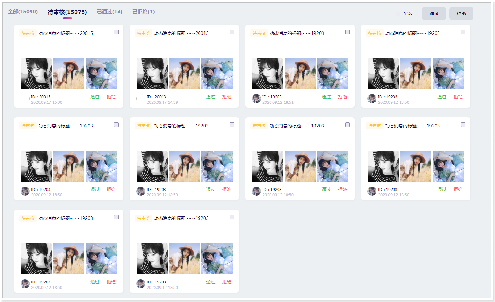

### 4.2 通过、拒绝、撤销

#### 4.2.1 接口

 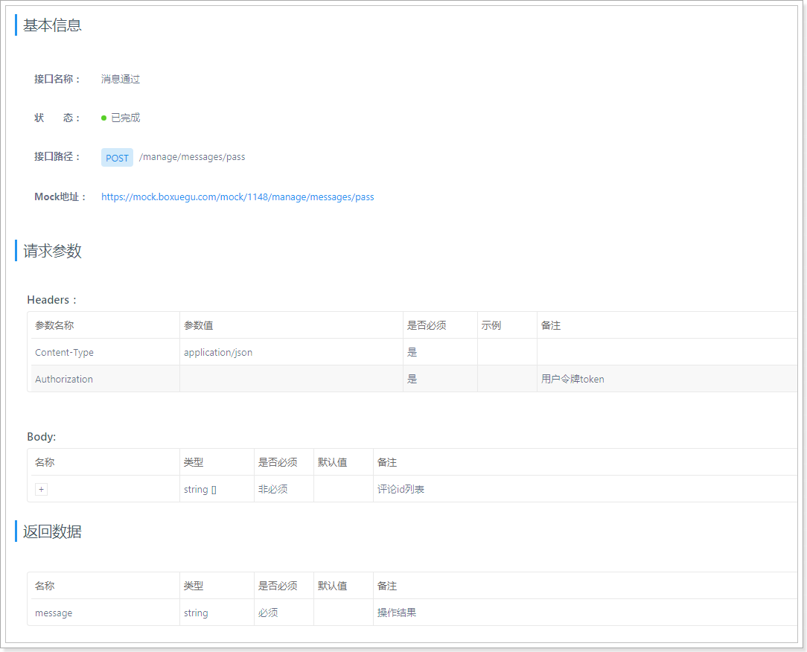

 

 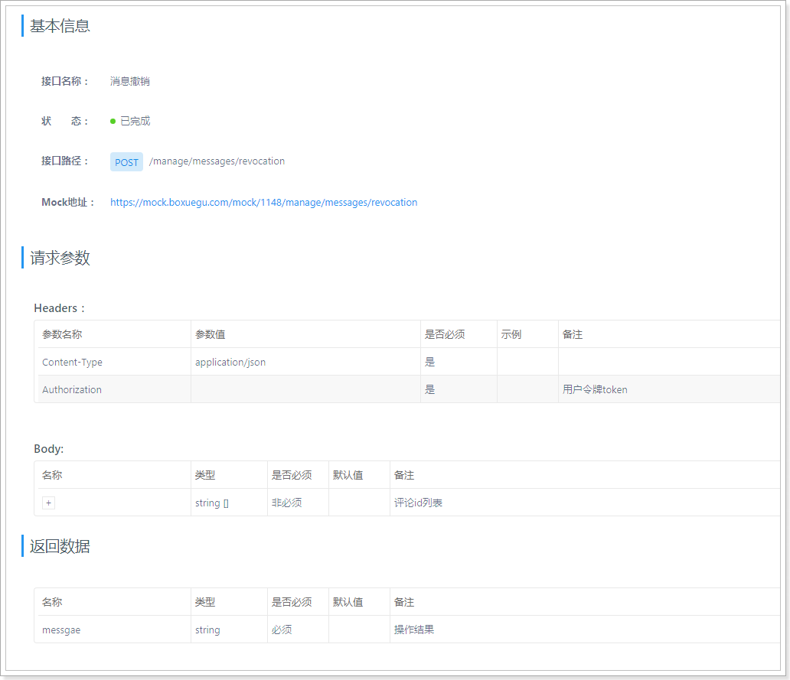

#### 4.2.2 MovementsController

```java
/**
 * 消息通过
 *
 * @param ids 消息id集合
 * @return 操作结果
 */
@PostMapping("/pass")
public Boolean pass(@RequestBody List<String> ids) {
    ids.forEach(id -> {
        PublishInfo info = publishInfoService.findInfoByPublishId(id);
        if (info != null) {
            if (!info.getState().equals(PublishAuditStateEnum.WAIT_MAUL.getValue())) {
                throw new BusinessException("当前状态有误，请检查后操作");
            }
            // 当前消息状态为 待人工审核时才可操作
            info.setState(PublishAuditStateEnum.MAUL_PASS.getValue());
            PublishAuditLog log = new PublishAuditLog(null, info.getPublishId(), info.getState(), PublishAuditStateEnum.MAUL_PASS.getValue());
            publishInfoService.saveOrUpdate(info);
            publishAuditLogService.save(log);
        }
    });
    return true;
}

/**
 * 消息拒绝
 *
 * @param ids 消息id集合
 * @return 操作结果
 */
@PostMapping("/reject")
public Boolean reject(@RequestBody List<String> ids) {
    ids.forEach(id -> {
        PublishInfo info = publishInfoService.findInfoByPublishId(id);
        if (info != null) {
            if (!info.getState().equals(PublishAuditStateEnum.WAIT_MAUL.getValue())) {
                throw new BusinessException("当前状态有误，请检查后操作");
            }
            // 当前消息状态为 待人工审核时才可操作
            PublishAuditLog log = new PublishAuditLog(null, info.getPublishId(), info.getState(), PublishAuditStateEnum.MAUL_BLOCK.getValue());
            info.setState(PublishAuditStateEnum.MAUL_BLOCK.getValue());
            publishInfoService.saveOrUpdate(info);
            publishAuditLogService.save(log);
        }
    });
    return true;
}

/**
 * 消息撤销
 *
 * @param ids 消息id集合
 * @return 操作结果
 */
@PostMapping("/revocation")
public Boolean revocation(@RequestBody List<String> ids) {
    ids.forEach(id -> {
        PublishInfo info = publishInfoService.findInfoByPublishId(id);
        if (info != null) {
            if (!info.getState().equals(PublishAuditStateEnum.MAUL_BLOCK.getValue()) && !info.getState().equals(PublishAuditStateEnum.MAUL_PASS.getValue())) {
                throw new BusinessException("当前状态有误，请检查后操作");
            }
            // 当前消息状态为 人工审核通过或拒绝 时才可操作
            PublishAuditLog log = new PublishAuditLog(null, info.getPublishId(), info.getState(), PublishAuditStateEnum.WAIT_MAUL.getValue());
            info.setState(PublishAuditStateEnum.WAIT_MAUL.getValue());
            publishInfoService.saveOrUpdate(info);
            publishAuditLogService.save(log);
        }
    });
    return true;
}
```

## 5. 消息详情

在用户详情中，需要查询动态消息详情信息，所以需要提供接口支持。

### 5.1 消息详情

MovementsController：

```java
/**
 * 消息详情
 *
 * @param id 消息id
 * @return 消息信息
 */
@GetMapping("/{id}")
public MovementsVo findById(@PathVariable(name = "id") String id) {
    PublishInfo info = publishInfoService.findInfoByPublishId(id);
    if (info == null) {
        throw new BusinessException("查询的对象不存在");
    }
    return fillMovements(info);
}
```

测试：

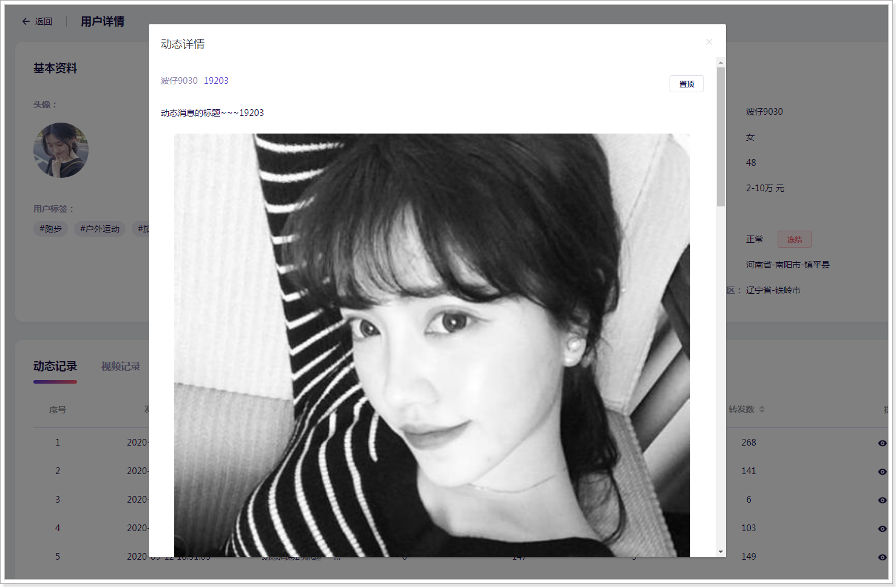

### 5.2 置顶操作

MovementsController：

~~~java
/**
     * 消息置顶
     *
     * @param id 消息id
     * @return 操作结果
     */
    @PostMapping("/{id}/top")
    public Boolean top(@PathVariable(name = "id") String id) {
        PublishInfo info = publishInfoService.findInfoByPublishId(id);
        if (info == null) {
            throw new BusinessException("操作的对象不存在");
        }
        info.setTopState(2);
        publishInfoService.saveOrUpdate(info);
        return true;
    }

    /**
     * 消息取消置顶
     *
     * @param id 消息id
     * @return 操作结果
     */
    @PostMapping("/{id}/untop")
    public Boolean untop(@PathVariable(name = "id") String id) {
        PublishInfo info = publishInfoService.findInfoByPublishId(id);
        if (info == null) {
            throw new BusinessException("操作的对象不存在");
        }
        info.setTopState(1);
        publishInfoService.saveOrUpdate(info);
        return true;
    }
~~~

