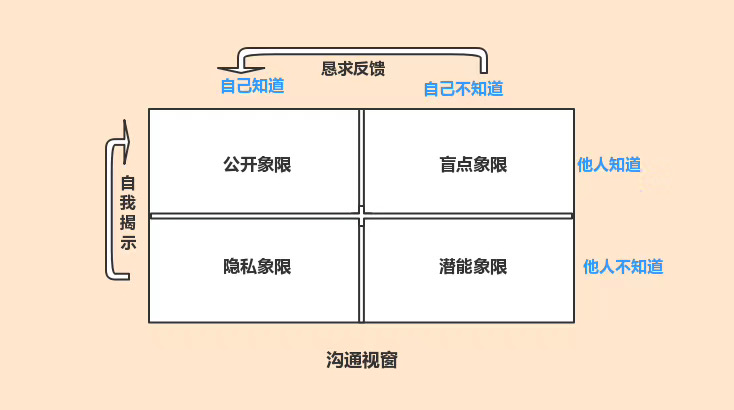

# 可复制的领导力

## 1. 什么是可复制的领导力

* 领导力是可以学会的

* 每个人都可以具备领导力

  * 复制的关键在于==工具化==。掌握工具，人人可以具备领导力。
  * 工具可以复制，轻松的传递给下一个人，实现领导力的永恒发展
  * 掌握了领导力的工具，实现了领导力的自我发展，就不用担心某一个高管离开导致业务停滞不前，因为有新员工会快速补上

* 员工的领导力等于领导的领导力

  * 只有领导提升了领导力，才可能带来员工在执行层面的高效表现

  * 日本企业中领导给员工交代工作任务的==五遍法==

    * 第一遍，交代清楚事项
    * 第二遍，要求员工重复
    * 第三遍，和员工探讨此时项的目的
    * 第四遍，和员工探讨应急预案，什么情况自己决定，什么情况需要回报
    * 第五遍，要求员工提出个人见解，好的建议和方法

    相比日本企业，中国企业布置任务的常见方式是领导只说一遍，剩下全靠员工自己去悟，员工如果做错就会造成企业成本浪费

    ==企业最大的非必要成本在于重做==

## 2. 领导和管理的区别

* 领导和管理的区别在于核心驱动力不同。
  * 管理的核心驱动力是==怕==。长期以往是工作交付差、团队没有创造性、员工没有责任感、团队不和谐。
  * 领导的核心驱动力是==尊敬和信任==。员工的执行力很高。
* 游戏改变领导力
  * 特征一：==共同目标==
    * 要给团队设置一个宏大的目标，使得大家集体项目表前进，形成凝聚力
  * 特征二：==及时反馈==
    * 要对员工的行为作出灵活、准确的有效反馈，让员工有参与感，进而产生价值感。
  * 特征三：==清晰明确的规则==
    * 要为工作设置明确的规则，让所有人有规可循、有章可依、打造公平环境
  * 特征四：==自愿参与==
    * 要尊重员工的意愿，培养员工参与工作的自觉意识，推动工作进程。

## 3. 沟通视窗

沟通视窗又叫做“乔哈里视窗”，是一种分析模板，把人工作、生活中的事情分成四块，代表四个不同的种类，在一起构成了一个“视窗”

沟通视窗的四个象限代表了我们遇到的四种不同情况，需要分别处理，各有其特色。

### 1）公开象限

我们知道，别人也知道的内容。公开象限越大，名气越大。

* 名人
* 明星
* 发表演讲、出席仪式

### 2）隐私象限

自己知道，别人不知道的事情。

分为三层：

* **DDS：**又黑又深的秘密。
* **不好意思说：**自己知道却不好意思说。
* **忘了说：**“忘了说”比“不好意思说”更为严重。==知识的诅咒==

### 3）盲点象限

自己不知道的，别人知道的。

布置庐山真面目，只缘身在此山中。

消除盲点象限，需要借助他人的帮助，由他人说出我们自己没有注意或者无法发现的盲点。

### 4）潜能象限

自己和他人都不知道的区域。

潜能象限是四个象限中最大的一部分，每个人的潜能都值得去努力挖掘。

### 5）象限转换

* 隐私象限转化为公开象限
  * 自我揭示，主动向他人袒露自己的故事、自己的想法，让别人多了解自己
* 盲点象限转化为公开象限
  * 恳求反馈，请求他人指出自己的问题

无论如何，象限转换的目的都是尽量扩大我们的公开象限，更好的发挥自己的影响力。

## 4. 管理者角色

管理者的三个角色：==领导者、管理者、执行者==。发挥好这三个角色，才能提到领导力。

### 1）领导者

领导者是通过==营造氛围==来提升绩效的。氛围好的团队凝聚力强，工作效果好。

举例：

* 《亮剑》—李云龙

### 2）管理者

管理者==通过别人==来完成工作的人。凡是不要总亲力亲为，给员工空间成长，激发员工的创造力和活力。

### 3）执行者

执行的核心是==给出结果==。没有产出的工作是无效的。

1. 认真执行
2. 给出结果
3. 对工作的内容本身进行反馈，形成自己的认识和见解。

## 5. 领导力技术

### 1）倾听和提问

* 倾听他人是交流的开始
  * ==倾听的最高境界是反映情感、学会反馈。反馈是塑造员工行为的最重要工具。==
* 多提问开放式的问题，而不是封闭式的问题
  * 封闭式问题，限制了对方的思考和回答，往往会引起对方情绪上的抵触，举例：
    * 是不是
    * 对不对
    * 好不好
  * 开放性的问题即不留预设的问题，没有引导的倾向，引导对方思考，让对方感受到尊重和被重视，举例：
    * ==你觉得怎么样？==
    * ==你有什么想法？==

### 2）及时反馈

* 反馈的种类
  * 正面反馈：员工做对事，我们进行表扬
  * 负面反馈：员工出现失误，我们给予批评和指正。
* 反馈层级
  * 零级反馈：领导对于员工的表现没有给出反馈
  * 一级反馈：领导给了反馈，但是不够具体，比较简单。举例：小张，干得不错！
  * 二级反馈：领导要给出对员工的评价，还要给出理由。举例：小张，干得不错！到底好在哪里要说清楚...

### 3）BIC工具

负面反馈要做到==对事不对人==。

负面反馈要遵循==BIC原则：==

* B：代表行为，==要说事实而不是观点。==
  * 关于迟到的举例
    * 不能说“你又迟到了吧”，而应该说“==九点上班，你是九点十分才到的吧==”
* I：代表影响，和员工谈及他的行为对团队造成的损失
* C：代表后果，不光谈公司（团队的影响），更要和员工本人的长期发展挂钩，让对方清楚这些关乎自己的核心利益。

BIC共不仅适用于团队管理，也可以用在家庭领域，用来教导孩子。

使用好BIC工具，才能实现真正有效的反馈，真正提升领导力。